# FPGA 音频系统模块总览

更新时间：2026-10-06 <br />
仓库：[huangAngel730/fpga-electronic-piano](https://github.com/huangAngel730/fpga-electronic-piano) <br />
分析基线：`develop` / `f92b19500687f21e967e171875b4ffdd1edfc658`，本轮已刷新远端并核对HEAD与origin/develop一致。 <br />
接口基线：**v1.6**；D028 幅度定标、D031 逐帧音频交付、CC64 延音合同及 D037 阶段安排。

> 本次为 L0 文档/源码静态核对，未重新运行仿真、综合、PnR 或上板。下文 PASS 均引用仓库既有记录，并注明版本与范围。顶层旧注释、模块旧 README 与较新实例连接/验收记录冲突时，以当前连接和最新记录为准。

## 1. 系统总览

FPGA 原生合成演奏音频，电脑承担开发、参考模型、采集与观测。正式核心已有四声部、DDS/ADSR、力度、混音、CC64 和真实 STAT；正式顶层已启用Program0 V1/1三角动态选择。Pitch/Mod、效果器、面板与音画新组合仍属分别验证的候选。


> 上图保留 2026-09-19 框图作为功能分层示意。图中旧进度文字不再代表现状：四声部与包络/混音已正式集成；延迟效果已有独立 RTL 和接线候选，尚未正式集成；可视化属于独立候选工程。以本文实际通路和证据表为准。

### 1.1 硬件连接拓扑

下图按实际设备和接口展示演奏输入、开发调试、供电、板载音频输出与显示候选之间的连接；彩色线表示信号或供电关系，不是等比例接线图。可查看[可编辑 SVG](项目硬件连接拓扑图.svg)和[接线明细及依据](项目硬件连接拓扑图.md)。


X4 III 的 DIN MIDI OUT 经 U187 光耦隔离后，由白线 UART_TX 接 FPGA `midi_rx`（R17；J9-8 / J14-5，31250 baud、8N1）。U187 红线使用稳定 5 V，黑线与底板逻辑侧共地；DIN 电流环不可直接接 GPIO。正式音频由板载 PT8211-S DAC、NS4263 功放送至 Speaker / 耳机接口。电脑负责 USB/JTAG 下载、UART 状态观测及开发期 USB MIDI 采集，不承担正式音频合成。底板供电方式需按实际配置选择；HDMI 仍属独立显示候选，完整音画联调未验收。

**138K迁移边界（2026-10-06）：** 本图保留60K已记录连接，不是138K可直接照接的施工图。138K L已L5、尚无L6；M3须确认实际板型、Dock、Bank/电平与接线。本文不自行将旧R17/J9/J14映射批准为138K接线。

### 1.2 当前正式顶层的实际通路

```text
板载按键 -> 同步/去抖 -> 按键事件本地 FIFO
X4 III DIN -> 隔离整形 -> R17 -> MIDI 字节/事件解析及本地调度
  -> 双源轮转仲裁 + 32 项公共事件 FIFO
  -> polyphonic_event_router + voice_allocator_4 + sustain_controller
  -> 四槽 DDS/V1 波表 + ADSR + 力度定标
  -> 双声道四路 PCM24 混音/饱和
  -> 请求代次/结果保持 -> pcm_frame_buffer
  -> i2s_tx（PT8211 16 位 LSBJ，WS 低右/高左）-> DAC/功放

完整输出帧边界 -> frame_tick -> sample_req / req_id -> 一组 PCM 结果
真实活跃数/削波/队列/欠载/耗时 -> UART STAT -> U15 -> 上位机/CSV
SOURCE_MODE=1 保留固定测试音诊断路径与 DIAG
```

`polyphonic_audio_core`模块的`DYNAMIC_TIMBRE_ENABLE`默认仍为0，但正式`electronic_piano_top`已显式传入1。Program0选择V1、Program1选择三角，按来源/通道保存，在下一次NoteOn锁槽；旧音不跟随，其他程序号忽略。V0184正式数字/L5通过，尚无新L6。

### 1.3 目标完整通路

在已实现的四声部和运行时音色选择基础上，逐步加入实际表情 FCW 消费、可选效果和音画集成。T052 独立正弦自证与报告材料单独推进。更大复音数仍需真实资源、吞吐及时序证明。

### 1.4 文档组织与接口标记

按“工具链→FPGA 公共基础→输入→事件处理→合成→混音/效果→PCM/串行→状态/显示→硬件”组织。每个模块列职责、流程、接口、代码、状态、术语和文件作用。路径相对于源码仓库；现有端口与规划接口分别标明。60K正式回退音频为50MHz，138K L候选为40MHz、48kHz音频；视频候选另有像素/串行域，使用 CDC。


既有详细设计最初基于 `50e496e`，本轮对照 `f92b195` 更新受影响模块状态，按 3.2.2 的说明深度扩展其余 34 个模块。软件章节按函数/文件格式定义接口，RTL 章节按信号位宽和交接时序定义接口，板级章节按连接和电气条件定义接口；候选或未冻结接口明确标注，不据此新增验收结论。

### 1.5 双平台版本与最新验收

| 范围 | 最新证据与结果 | 当前边界 |
|---|---|---|
| 138K L 精确工程 | V0196/V0197，3615ce1/a0cb805/5d5b6ac：56输入冻结，9份RTL副本仅适配路径；Gowin完整构建400.923秒退出0 | 🟢 L5；Setup+1.279、Hold0、Recovery+0.706、Removal+0.331 ns，违例端点0；18823 Logic/8669 Reg/46 DSP/20 BSRAM。不是L6 |
| PCM串行与启动 | V0195，128ed89/51cf4b7：5848完整立体声帧、11696左右比较、正常零欠载；3帧注入欠载及恢复、启动/失锁场景已复核 | 🟢 L2/限定L3；不是PT8211模拟输出实测；T055整体未关闭 |
| 音画联合子系统 | V0199，189c489/bf7f296：504万像素、6300行、9676 PCM；正常6/6事件，溢出音频36/视频33/丢3，符合队列合同 | 🟢 L2/限定L3；DVI边界stub、125MHz未参与判定，无真实TMDS/实屏/板测 |
| SRAM发布准备 | V0200，e3a29ca/f92b195：14受控文件、目录与ZIP独立复验；默认只验证，SRAM operation2，不含Flash操作 | 🟠 仅准备完成；programmed/jtag_scanned/flash_modified均false，发布包在原构建机忽略目录，Git拉取不等于本机已有该包 |
| M1音频数学验收 | V0198，c28d046：2488请求/2487提交、ADSR±2LSB及PCM范围通过 | 🔴 整包未签收；MODEL_DIR、缺文件反例失败，23损坏样例仅拒绝15个；DDS/phase等仍漏检 |
| T033第二版 | V0190：7自检可运行，但deadline只查II、状态量/混音位宽/ROM端口与容量估算有缺口 | 🟠 原范围返修；不授权更大声部RTL或将预算视为实测资源 |
| 60K有限优化 | V0188/V0189/V0191/V0192及route A/B：联合与深流水功能有通过证据，但PnR/综合限时未完成；route改善仅0.028ns | 🟠 候选未采用，保留60K回退；不重复宣称优化成功 |

## 2. 上位机与开发工具链

### 2.1 串口状态上位机

| 项目 | 内容 |
|---|---|
| 模块职责 / 介绍 | 解析 FPGA 状态并显示、保存 CSV。 |
| 设计要点 / 流程 | 串口行→严格格式校验→StatusSnapshot→CLI/GUI/CSV；错误行与断线分开处理。 |
| 输入输出 / 接口定义 | `parse_status_line(line) -> StatusSnapshot`；STAT 含七个 uint32；串口 115200 8N1，硬件约 250 ms 快照。 |
| 代码位置 | `code/software/uart_test/uart_status_monitor.py`、`code/software/uart_test/uart_status_gui.py`、`code/software/tests/test_uart_status_monitor.py`、`code/scripts/run_t026_tests.ps1`、`code/scripts/run_t026_gui.ps1`、`code/scripts/resolve_t026_python.ps1`、`code/software/uart_test/requirements.txt` |
| 当前状态 | T026 限定完成；V0125 真实 525 行 CSV/28 项软件测试及 3 组模拟通过。该批 max_processing_cycles=0 的硬件问题另由 V0126 修复，不能用旧数据证明修复生效。额外补验暂停。 |

**模块设计框图**

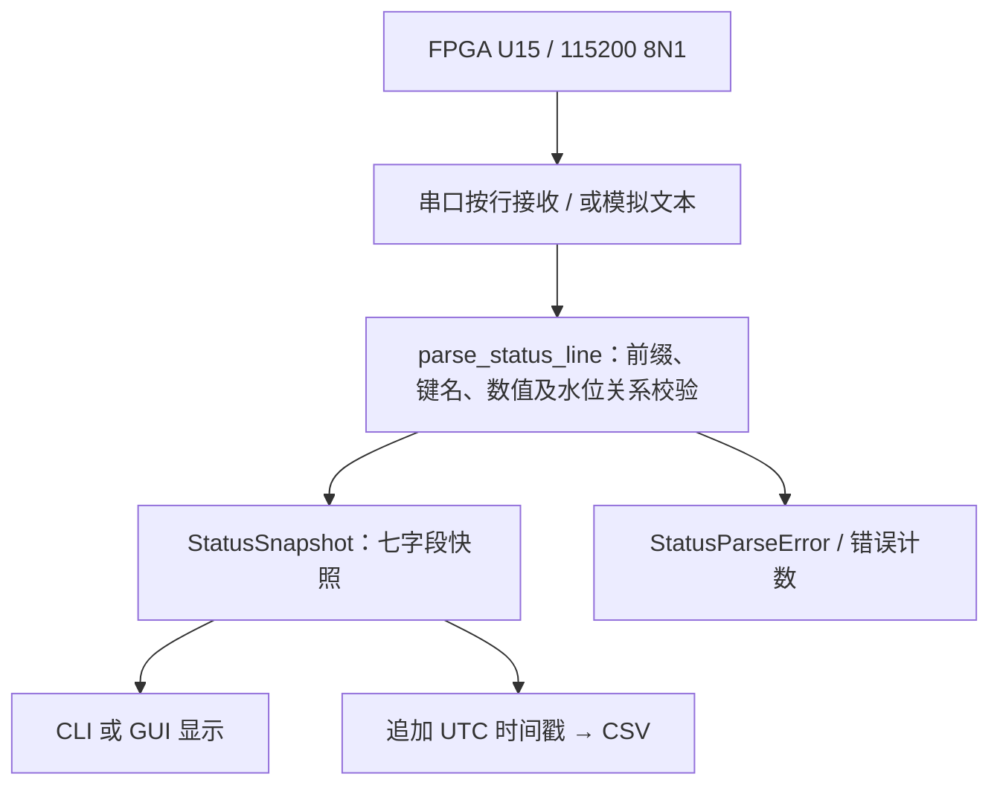
```mermaid
flowchart TD
    A["FPGA U15 / 115200 8N1"] --> B["串口按行接收 / 或模拟文本"]
    B --> C["parse_status_line：前缀、键名、数值及水位关系校验"]
    C --> D["StatusSnapshot：七字段快照"]
    C --> E["StatusParseError / 错误计数"]
    D --> F["CLI 或 GUI 显示"]
    D --> G["追加 UTC 时间戳 → CSV"]
```

**输入输出格式定义**

| 接口 / 数据 | 格式、含义与边界 |
|---|---|
| 串口输入 | 115200 baud、8N1；按完整文本行解释，串口超时不等于收到一条合法状态。 |
| 文本协议 | `STAT key=value ...`；七个键必须齐全、唯一且无未知键，键的顺序可变。数值接受十进制或 `0x` 前缀十六进制。 |
| Python 接口 | `parse_status_line(line: str) -> StatusSnapshot`；非法输入抛出 `StatusParseError`，各值限制为 uint32。 |
| 一致性约束 | `event_fifo_level <= event_fifo_high_watermark`；解析器验证格式及此关系，不凭文本判断音频是否真实可闻。 |
| CSV 输出 | `timestamp_utc` 后跟下文七个状态字段；时间为电脑记录时间，不是 FPGA 采样时刻。 |
| 诊断输入 | `DIAG` 不满足 `STAT` 前缀；不能把诊断占位值补零后当正式数据。 |

**设计流程与交接约束**

示例完整行如下，空格分隔键值，等号连接键和值；GUI 与 CLI 应使用同一解析结果，避免两套字段定义漂移。

```text
STAT active_voice_count=4 clip_count=0 event_fifo_level=2 event_fifo_high_watermark=8 event_fifo_overflow=0 audio_underrun=0 max_processing_cycles=900
```

先区分端口打不开、串口断开、行格式错误和硬件报告错误，再定位故障；“能显示数值”只证明采集路径工作。七字段的量纲和计数范围见本节末表。

**术语与概念解释**

| 名词 / 概念 | 含义与注意事项 |
|---|---|
| 状态快照 | 上报时刻的一组字段，不是逐拍波形。 |
| CSV | 状态日志表格；与 MIDI 消息 CSV 的采集对象不同。 |
| `STAT` / 键值协议 | `STAT` 标识正式状态行；`key=value` 用字段名识别数据，不依赖固定字符偏移。 |
| `uint32` | 无符号 32 位整数，范围 0～4294967295；不是浮点时间值。 |
| `timestamp_utc` | 电脑写入 CSV 的 UTC 时间，便于合并日志，但包含串口传输及软件调度延迟。 |
| 解析错误 / 设备错误 | 前者表示文本不符合协议，后者表示串口访问失败；两者不能合并为硬件计数器故障。 |

**代码文件作用简介**

| 文件（仓库相对路径） | 作用 |
|---|---|
| `code/software/uart_test/uart_status_monitor.py` | 解析七字段、串口/模拟数据源、状态快照和 CSV/CLI。 |
| `code/software/uart_test/uart_status_gui.py` | Tkinter 参数输入、状态显示、连接控制及错误提示。 |
| `code/software/tests/test_uart_status_monitor.py` | 解析、串口异常、GUI 控制逻辑及 CSV 追加的自动测试。 |
| `code/scripts/run_t026_tests.ps1` | 选择 Python 并运行临时副本的语法、单元测试和模拟冒烟。 |
| `code/scripts/run_t026_gui.ps1` | 选择 Python 并启动 GUI。 |
| `code/scripts/resolve_t026_python.ps1` | 供测试与 GUI 共用的 Python 解释器发现函数。 |
| `code/software/uart_test/requirements.txt` | 声明真实串口读写所需的 pyserial 依赖。 |

#### 七个状态字段的含义

`uint32` 范围为 0～4,294,967,295；计数类字段按实现饱和，复位清零。

| 字段 | 含义 | 使用方法与边界 |
|---|---|---|
| `active_voice_count` | 当前占用的声部槽数，正式核心 0～4。 | 含仍占用的 Release/延音槽，不必等于按住的琴键数，也不能单独证明可闻频谱。 |
| `clip_count` | 混音结果执行饱和限幅且成功提交时的累计次数。 | 左右同时削波只计一组 PCM；保持/重试不重复计数。PCM24 超过 +8388607 被限幅。 |
| `event_fifo_level` | 公共演奏事件队列当前积压。 | 统计事件，不是音频样本；接近深度 32 表示处理压力。 |
| `event_fifo_high_watermark` | 复位后公共队列的历史最高水位。 | 当前为 0、最高为 12 表示曾积压 12 项。 |
| `event_fifo_overflow` | 输入本地事件丢失计数的饱和汇总。 | 不应只理解为公共 FIFO 的满标志；丢失 NoteOff 可能挂音。 |
| `audio_underrun` | 开始播放后缺少及时有效 PCM 的帧数。 | 逐缺样帧加 1 并保持上一组样本；首个有效样本前静音不计入。 |
| `max_processing_cycles` | 有效请求到成功提交的最大周期数。 | 50 MHz 一拍 20 ns，900 拍=18 μs；48 kHz 帧约 20.83 μs。新请求取消旧代次；不是 MIDI 到模拟输出总延迟。 |

例如 `4、0、2、8、0、0、900` 表示四槽占用、两项积压、最高八项，未记录削波/溢出/欠载，处理峰值 18 μs。正常演奏模式已有真实 STAT；固定测试音诊断模式仍可输出 DIAG，不应将后者视为七字段完整数据。

### 2.2 Python 黄金参考模型

| 项目 | 内容 |
|---|---|
| 模块职责 / 介绍 | 定义音高、包络、声部分配和混音的期望行为。 |
| 设计要点 / 流程 | 统一采样/定点口径→模型样本→真实 RTL 对照；负向篡改必须失败。 |
| 输入输出 / 接口定义 | DDS 输入 FCW/波表输出样本；包络输出 Q1.15；混音输出 PCM 和 clipped；Pitch/Mod 模型输出修正 FCW。 |
| 代码位置 | `code/model/dds_model.py`、`code/model/audio_defs.py`、`code/model/adsr.py`、`code/model/voice_manager.py`、`code/model/mixer.py`、`code/model/delay_effect.py`、`code/model/adsr_piano.py`、`code/model/tests/test_adsr_piano.py`、`code/model/test_polyphony_integration.py`、`code/model/tests/test_rtl_verifier.py`、`code/model/test_adsr_release_retrigger.py`、`code/model/tests/test_adsr_piano_unittest.py`、`code/model/generate_complete_reference.py`、`code/model/generate_true_4voice.py`、`code/model/pitch_mod_model.py`、`code/model/test_pitch_mod.py` |
| 当前状态 | V0121/V0132 已有正式链路参考对照，包络最大差 1、PCM24 最大差 512（对应记录范围）；V0152/V0155 为独立表情路径。模型声音不替代 FPGA 上板。 |

**模块设计框图**

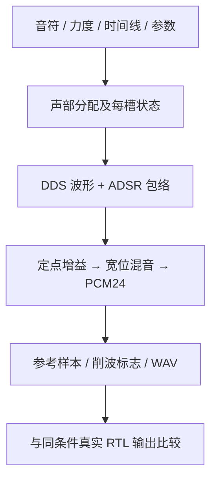
```mermaid
flowchart TD
    A["音符 / 力度 / 时间线 / 参数"] --> B["声部分配及每槽状态"]
    B --> C["DDS 波形 + ADSR 包络"]
    C --> D["定点增益 → 宽位混音 → PCM24"]
    D --> E["参考样本 / 削波标志 / WAV"]
    E --> F["与同条件真实 RTL 输出比较"]
```

**输入输出格式定义**

| 接口 / 数据 | 格式、含义与边界 |
|---|---|
| 音高输入 | `midi_note_to_freq(note, a4_hz)`、`freq_to_fcw(...)` 等函数；音符号 0～127，项目采样基线 48000 Hz。 |
| 波形输入/输出 | 波表为有符号整数数组；`WavetableOscillator` 维护相位，每步产生一个采样值。表深与幅度必须与被测 RTL 相同。 |
| 包络与力度 | 10 位力度和 Note On/Off 时间线参与包络计算；Q1.15 包络用整数表示，不直接将浮点 0～1 喂给 RTL。 |
| PCM 接口 | `wt16_to_pcm24(sample, gain_q15)` 返回样本及削波标志；不同参考入口的舍入规则必须分别核对。 |
| 参考文件 | HEX/MEM/带帧号样本或 WAV；逐样本比较必须明确样本编码、帧索引、初始化状态与允许误差。 |

**设计流程与交接约束**

先锁定与 DUT 一致的 ROM、采样率和初始相位，再施加相同事件序列。算法模型通常按“一个音频样本一步”运行，不自动模拟 50 MHz 下的背压、取消或流水线延迟；这些事务行为需由专门 RTL testbench 覆盖。已有误差上限只适用于记录注明的版本和比较路径，不应对所有模型统一放宽容差。

**术语与概念解释**

| 名词 / 概念 | 含义与注意事项 |
|---|---|
| 黄金模型 | 明确数学与定点规则的参考实现，不能只与同一段错误代码互证。 |
| Q1.15 | 以 32768 为单位缩放，32767 约等于 1；容差需要按量纲解释。 |
| 位精确模型 | 在对应运算点采用相同位宽、符号和截断方式；浮点波形相似不等于定点结果一致。 |
| 样本索引 | 序列中的第几个采样点；必须先对齐启动延迟，再判断幅度误差。 |
| 容差 | 允许的最大偏差，单位可以是包络整数 LSB 或 PCM 整数 LSB，不能混用。 |
| 模型 WAV | Python 计算样本保存的声音文件，可试听算法；不包含 FPGA 实物电气链路证据。 |

**代码文件作用简介**

| 文件（仓库相对路径） | 作用 |
|---|---|
| `code/model/dds_model.py` | 音符/频率/FCW 换算、波表振荡器及 PCM 参考渲染。 |
| `code/model/audio_defs.py` | 模型采样率、幅度、位宽和定点常量定义。 |
| `code/model/adsr.py` | 五状态 ADSR 软件模型及包络乘法。 |
| `code/model/voice_manager.py` | 声部分配、同音重触发、抢占和释放参考模型。 |
| `code/model/mixer.py` | 混音饱和、削波标志及余量计算参考模型。 |
| `code/model/delay_effect.py` | 循环延迟、干湿混合与反馈模型。 |
| `code/model/adsr_piano.py` | 钢琴式包络参考模型，供正式幅度和重触发比对。 |
| `code/model/tests/test_adsr_piano.py` | 原包络独立脚本自检；新增test_adsr_piano_unittest.py提供统一unittest入口。 |
| `code/model/test_polyphony_integration.py` | 多声部模型集成用例；具体覆盖以该入口实际结果为准。 |
| `code/model/tests/test_rtl_verifier.py` | RTL 比较工具的输入、边界及错误行为回归。 |
| `code/model/test_adsr_release_retrigger.py` | Release重触发模型诊断入口。 |
| `code/model/tests/test_adsr_piano_unittest.py` | 将钢琴包络行为纳入unittest的回归入口；不以旧测试发现缺口描述新版。 |
| `code/model/generate_complete_reference.py` | 生成含演奏事件的模型参考；是否覆盖完整握手需以专用整链用例确认。 |
| `code/model/generate_true_4voice.py` | 生成真实四槽同时活跃的24000帧参考。 |
| `code/model/pitch_mod_model.py` | Pitch/Mod 的频率比例、定点 LUT 和 FCW 数学参考。 |
| `code/model/test_pitch_mod.py` | 表情控制算法的边界和参考检查。 |

### 2.3 波表、FCW 与参考向量生成

| 项目 | 内容 |
|---|---|
| 模块职责 / 介绍 | 生成可追溯 ROM、音高控制字和模型测试数据。 |
| 设计要点 / 流程 | 确定位宽/表深/幅度→确定性生成→清单/哈希→硬件读取及逐样本比对。 |
| 输入输出 / 接口定义 | 32 位相位、48 kHz：FCW=round(f×2^32/48000)；生成 HEX/MEM/参考文本。 |
| 代码位置 | `code/model/wavetable_gen.py`、`code/model/generate_test_mode_reference.py`、`code/model/generate_timbre_demo.py`、`code/scripts/gen_sine_table.py`、`code/rtl/common/sine_table.svh`、`code/model/generate_dds_test_vectors.py`、`code/model/generate_indexed_reference.py`、`code/model/update_manifest.py`、`code/model/generate_pitch_mod_luts.py`、`code/model/generate_pitch_mod_vectors.py` |
| 当前状态 | 正式正弦 ROM 使用 1024 点/峰值 8192；V1 使用四组 256 点谐波表。旧峰值 32767 的独立实验不可直接替代正式 ROM。V1 生成一致性与数学签收见 V0142。 |

**模块设计框图**

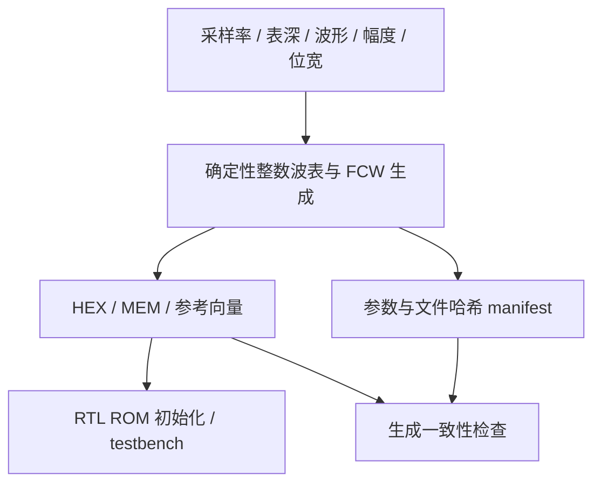
```mermaid
flowchart TD
    A["采样率 / 表深 / 波形 / 幅度 / 位宽"] --> B["确定性整数波表与 FCW 生成"]
    B --> C["HEX / MEM / 参考向量"]
    B --> D["参数与文件哈希 manifest"]
    C --> E["RTL ROM 初始化 / testbench"]
    D --> F["生成一致性检查"]
    C --> F
```

**输入输出格式定义**

| 接口 / 数据 | 格式、含义与边界 |
|---|---|
| 频率换算 | `f = 440 × 2^((note−69)/12)`；32 位采样相位采用 `FCW=round(f×2^32/48000)`，A4 约 39370534。 |
| ROM 内容 | N 个有符号整数；16 位负数在 HEX/MEM 中按 16 位补码表示，例如 −1 为 `FFFF`，零为 `0000`。 |
| 地址与深度 | 1024 点使用 10 位地址；256 点使用 8 位地址。四组 256 点表还需要表组选择。 |
| 正式幅度口径 | 正弦参考峰值 8192；V1 文件为四组 256 点、峰值口径 8191。独立 32767 峰值表不能只改文件名后代入。 |
| 生成 API | `build_artifacts()` 生成文件字节映射；`write_artifacts(output_dir)` 写文件，`check_artifacts(output_dir)` 比较可复现结果。 |
| 清单输出 | 参数、生成文件及哈希；修改 ROM 内容后需同步身份信息，否则“相同源码”可能读到不同声音数据。 |

**设计流程与交接约束**

波表描述一周期波形，FCW 决定读取相位每个采样推进多少。相位累加并回绕，高位选择 ROM 地址；表深影响相位量化，幅度影响混音余量。生成器是离线工具，不在 FPGA 上实时计算三角函数；测试向量还应包含输入条件、预期样本顺序和边界场景。

**术语与概念解释**

| 名词 / 概念 | 含义与注意事项 |
|---|---|
| 波表 | 存一周期的离散幅度；表有 256/1024 点不表示采样率。 |
| FCW | 每个音频采样的相位步长；A4 440 Hz 约为 39370534。 |
| 相位回绕 | 32 位相位加法绕过最大值回到低位，不保证新表索引恰好为 0。 |
| 带限谐波表 | 高音减少谐波以控制超过奈奎斯特频率的分量；并非所有瞬态都无混叠。 |
| manifest | 生成参数和文件哈希清单；源码、ROM 与构建身份应一致。 |
| ROM / MEM / HEX | ROM 是查表存储；MEM/HEX 是初始化文本文件，其行数和每行位宽须匹配声明。 |
| 补码 | 有符号整数的位编码；读取 `FFFF` 时按 16 位解释为 −1，不能按正数 65535 混音。 |
| 相位高位寻址 | 32 位相位截取高位作为地址；低位继续累加，保留细粒度音高分辨率。 |
| SHA-256 | 文件内容指纹，用于确认本次仿真/构建读取的 ROM 身份，不代表该内容已经通过算法验收。 |

**代码文件作用简介**

| 文件（仓库相对路径） | 作用 |
|---|---|
| `code/model/wavetable_gen.py` | 生成波表、FCW、PCM 和 manifest，检查登记文件可复现性。 |
| `code/model/generate_test_mode_reference.py` | 生成四路固定正弦的参考 HEX、WAV 和频谱。 |
| `code/model/generate_timbre_demo.py` | 生成不同波形的离线音色演示与对比。 |
| `code/scripts/gen_sine_table.py` | 生成固定测试音/历史 simple_voice 使用的 256 点正弦表，不是正式 V1 表。 |
| `code/rtl/common/sine_table.svh` | 保存供 RTL include 的整数正弦表常量。 |
| `code/model/generate_dds_test_vectors.py` | 生成 A4、MIDI 范围、相位连续性与边界测试数据。 |
| `code/model/generate_indexed_reference.py` | 生成带帧号的固定正弦/混音参考；尚不覆盖完整包络和 PCM 代次握手。 |
| `code/model/update_manifest.py` | 更新生成数据清单和校验信息。 |
| `code/model/generate_pitch_mod_luts.py` | 生成表情 FCW 的比例查找表与低频正弦表。 |
| `code/model/generate_pitch_mod_vectors.py` | 生成 Pitch/Mod 数学比对向量。 |

### 2.4 音频分析与 RTL 对照工具

| 项目 | 内容 |
|---|---|
| 模块职责 / 介绍 | 验证样本、频谱、延迟与测试门禁真实性。 |
| 设计要点 / 流程 | 真实 RTL 输出→长度/编码/代次校验→模型/谱峰比较；缺文件、错误输出和篡改应非零退出。 |
| 输入输出 / 接口定义 | PCM/日志/向量输入，输出差异、FFT、WAV、检查结果。 |
| 代码位置 | `code/model/analysis.py`、`code/model/analysis_tool.py`、`code/model/rtl_verifier.py`、`code/model/benchmark.py`、`code/model/adsr_sweep.py`、`code/tb/board/check_polyphony_vectors.py`、`code/tb/board/test_check_polyphony_vectors.py`、`code/scripts/check_audio_delivery.py`、`code/tb/board/test_audio_delivery_gate.py`、`code/tb/board/check_t009_envelope_transition.py`、`code/tb/board/test_check_t009_envelope_transition.py`、`code/tb/board/run_t010_allocator_review.py`、`code/tb/board/tb_t010_allocator_review.sv`、`code/scripts/run_t010_allocator_review.ps1`、`code/scripts/run_t031_digital_latency.py`、`code/scripts/check_t031_digital_latency.py` |
| 当前状态 | V0091/V0092 为已被后续修复与正式集成覆盖的历史失败，不能作为当前总阻塞。V0141 数字延迟最大约 1.125 ms；T052 自证未完成，复杂独立 GUI 已暂缓，必要最小分析继续。 |

**模块设计框图**

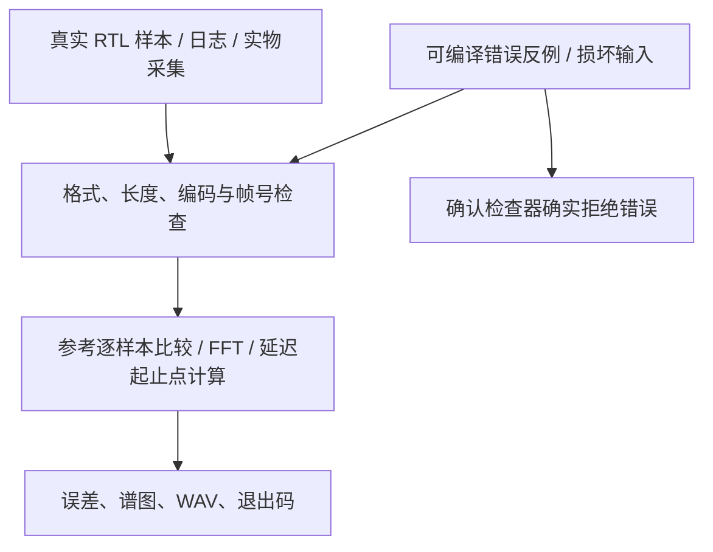
```mermaid
flowchart TD
    A["真实 RTL 样本 / 日志 / 实物采集"] --> B["格式、长度、编码与帧号检查"]
    B --> C["参考逐样本比较 / FFT / 延迟起止点计算"]
    C --> D["误差、谱图、WAV、退出码"]
    E["可编译错误反例 / 损坏输入"] --> B
    E --> F["确认检查器确实拒绝错误"]
```

**输入输出格式定义**

| 接口 / 数据 | 格式、含义与边界 |
|---|---|
| 样本输入 | HEX/PCM 列表或专项带索引文件；先按指定有符号位宽还原，不能把 PCM24 负数当大正数。 |
| 比较函数 | `compare_samples(reference, rtl_output, ...)`；长度、样本差及专项标志按各入口合同检查。 |
| 频谱输入 | 采样序列和真实采样率；`analyze_spectrum(samples, sample_rate)` 返回频率和幅度数据。 |
| WAV 输出 | `pcm_to_wav(pcm_samples, output_path, sample_rate, bits)`；位宽/缩放要注明，不能归一化后掩盖原始削波。 |
| 数字延迟 | 专项工具使用规定输入动作和完整数字输出字的时间差；输出单位和测试条件必须随结果保留。 |
| 检查结论 | 差异/日志与进程退出码；缺数据、无 PASS 标志或反例逃逸均不能当成功。 |

**设计流程与交接约束**

先验证“输入文件真的来自被测 RTL”，再看误差是否满足合同。频谱多个峰可能来自单音谐波，因此复音检查需要已知独立基频及声部/PCM 联合证据。Python 运行速度只描述电脑执行效率，不用于估算 FPGA 的时序余量。

**术语与概念解释**

| 名词 / 概念 | 含义与注意事项 |
|---|---|
| FFT/谱峰 | 时域转换到频率；一声部的谐波会产生多个峰。 |
| 数字延迟 | 起止点是数字输入和串行字输出，未包括模拟 DAC/功放等响应。 |
| 反例门禁 | 故意注入可编译错误，检查测试是否确实拒绝错误。 |
| LSB 误差 | 样本整数相差的最小量化单位；PCM24 的 1 LSB 与 DAC16 的 1 LSB 不等量。 |
| 频谱分辨率 | 对 N 点、Fs 采样率，FFT 频点间距为 Fs/N；较短记录难区分相近频率。 |
| 数字起止点 | 用哪些跳变或帧边界计时，必须明确；输入消息末字节与首字节是不同起点。 |
| 阴性用例 | 刻意制造错误且预期失败，用于证明检查器不是只检查文件存在或打印 PASS。 |

**代码文件作用简介**

| 文件（仓库相对路径） | 作用 |
|---|---|
| `code/model/analysis.py` | 使用标准库进行频率、SINAD 和谐波失真等分析。 |
| `code/model/analysis_tool.py` | PCM 转 WAV、频谱计算及绘图。 |
| `code/model/rtl_verifier.py` | 参考与 RTL 输出比较工具；已加入失败退出码和削波标志校验；不能替代正式 RTL 逐样本验收。 |
| `code/model/benchmark.py` | 测量 Python 模型运行性能，不能推算 FPGA 性能。 |
| `code/model/adsr_sweep.py` | 运行包络采样与相关检查。 |
| `code/tb/board/check_polyphony_vectors.py` | 检查四声部证据、帧号、PCM 编码和削波标志，不满足时非零退出。 |
| `code/tb/board/test_check_polyphony_vectors.py` | 6 项检查器自检，覆盖三声部、全静音、错误编码等异常。 |
| `code/scripts/check_audio_delivery.py` | 音频专项门禁入口；当前结论需绑定本次运行，不能沿用旧 V0092 失败作为现状。 |
| `code/tb/board/test_audio_delivery_gate.py` | 总门禁5项工具自检。 |
| `code/tb/board/check_t009_envelope_transition.py` | 检查包络重触发/释放的连续性和跳变量。 |
| `code/tb/board/test_check_t009_envelope_transition.py` | 连续性检查器的正反例测试。 |
| `code/tb/board/run_t010_allocator_review.py` | 运行声部分配身份/释放/抢占回归并检查失败状态。 |
| `code/tb/board/tb_t010_allocator_review.sv` | 身份、Release、LRU回绕六场景复核。 |
| `code/scripts/run_t010_allocator_review.ps1` | T010独立复核启动脚本。 |
| `code/scripts/run_t031_digital_latency.py` | 运行真实波特率/时钟下的数字 NoteOn 延迟场景。 |
| `code/scripts/check_t031_digital_latency.py` | 核对串行字解码与数字延迟结果，不输出未经测量的模拟延迟。 |

**新增验收工具**

| 文件 | 作用与边界 |
|---|---|
| `code/scripts/run_m3_midi_pcm_acceptance.py` | F：真实 UART 到四声部候选 PCM 的联合验收入口。 |
| `code/tb/board/m3_midi_pcm_acceptance/scoreboard.py` | 独立检查 FCW、DDS 相位、ROM、Q15 混音和代次；不冒称新的完整包络模型。 |
| `code/scripts/run_m3_integration_provenance_audit.py` | 构建来源、ROM/隐式依赖与哈希只读审计；加密 IP 内部不可见时保留失败边界。 |
| `code/tb/common/formal_audio_patch_rehearsal/tb_formal_patch_rehearsal.sv` | V0175 正式 top 副本的 UART/Bend/CC1/CC64/重触发/复位短回归，补丁未实际应用。 |

**2026-10-06 状态与版本补充：** V0198 的40MHz验收正例可复现，ADSR±2LSB和提交一致性通过，但DDS FCW/相位/表值/包络等损坏输入仍有误收，整体验收工具未签收。M1按原范围修复，不能把正例通过视为完整数学验证。

### 2.5 仿真、Gowin 构建与下载

| 项目 | 内容 |
|---|---|
| 模块职责 / 介绍 | 把源文件转为仿真结论、实现报告及码流。 |
| 设计要点 / 流程 | 自检→综合→PnR/时序→码流→下载→实物操作；研究候选使用隔离输出和输入哈希。 |
| 输入输出 / 接口定义 | RTL/TB/GPRJ/CST/SDC 输入；日志、资源、时序报告和 .fs 输出。 |
| 代码位置 | `code/scripts/check_repo.ps1`、`code/scripts/run_t005_sim.ps1`、`code/scripts/run_t007_sim.ps1`、`code/scripts/run_t019_sim.ps1`、`code/scripts/build_electronic_piano.ps1`、`code/scripts/program_electronic_piano.ps1`、`code/scripts/enter_fpga_env.ps1`、`code/build/electronic_piano.gprj`、`code/scripts/run_t025_sim.ps1`、`code/scripts/run_t025_checks.ps1`、`code/scripts/run_visual_m2_sim.ps1` |
| 当前状态 | 正式四声部和 V1+CC64 已有各自 L5；新音画组合 V0154 仅隔离候选。此次文档更新不运行构建或下载。 |

**模块设计框图**

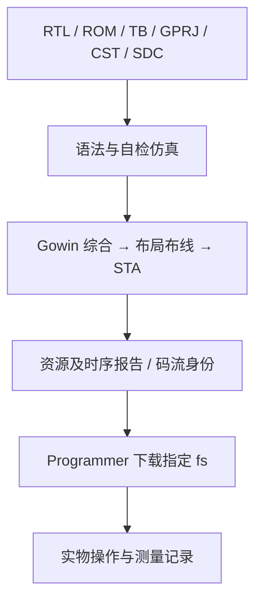
```mermaid
flowchart TD
    A["RTL / ROM / TB / GPRJ / CST / SDC"] --> B["语法与自检仿真"]
    B --> C["Gowin 综合 → 布局布线 → STA"]
    C --> D["资源及时序报告 / 码流身份"]
    D --> E["Programmer 下载指定 fs"]
    E --> F["实物操作与测量记录"]
```

**输入输出格式定义**

| 接口 / 数据 | 格式、含义与边界 |
|---|---|
| 仿真输入 | RTL、公共包、testbench 和向量/ROM；编译顺序、顶层和工具路径由实际脚本确定。 |
| 工程输入 | GPRJ 列源与器件；CST 给引脚/电平；SDC 给时钟和时序条件。三者应属于同一构建版本。 |
| 流程输出 | 编译/运行日志、综合资源、PnR/STA 报告、`.fs`；每个结果记录源码、ROM、器件和工具版本。 |
| 下载输入 | 已确认的 `.fs` 与器件扫描结果；SRAM 下载只更换运行配置，不等于已经固化 Flash。 |
| 成功判据 | 按实际脚本检查退出码、断言和报告；生成 `.fs` 不足以单独证明时序收敛或上板通过。 |

**设计流程与交接约束**

源码到实物分级验证，不能跳过功能检查只追求 Fmax。监督角色仅核查这些入口与既有报告；本次文档扩充不执行源码修改、构建或烧录。测试涉及生成目录时应保留对应日志身份，避免新旧报告混用。

**术语与概念解释**

| 名词 / 概念 | 含义与注意事项 |
|---|---|
| L2/L3 | RTL 仿真/与模型对照，均不能代替上板。 |
| L4/L5/L6 | 综合/布局布线时序/实物验证；通过须限定测试范围。 |
| Fmax/Slack | 对应约束与实现版本的频率估计/余量；不同工程不能相加或移用。 |
| GPRJ | 高云工程清单；决定参与本次综合的源文件、器件和选项，目录中存在的文件未必进入工程。 |
| CST / SDC | 前者定义物理引脚及电气属性，后者定义时钟和时序要求；二者用途不同。 |
| Setup / Hold | 数据分别须在采样沿之前/之后保持稳定的要求；正余量需绑定完整约束。 |
| PnR / STA | 布局布线确定物理实现，静态时序分析检查路径；综合资源通过不等于这两步通过。 |

**代码文件作用简介**

| 文件（仓库相对路径） | 作用 |
|---|---|
| `code/scripts/check_repo.ps1` | 执行仓库结构、脚本与既有仿真等本地检查。 |
| `code/scripts/run_t005_sim.ps1` | 运行 LSBJ、PCM 缓冲和逐帧链路自检。 |
| `code/scripts/run_t007_sim.ps1` | 运行顶层与按键到音频集成回归。 |
| `code/scripts/run_t019_sim.ps1` | 运行公共包、复位和旧独立节拍模块自检。 |
| `code/scripts/build_electronic_piano.ps1` | 调用 Gowin 完成指定工程与流程。 |
| `code/scripts/program_electronic_piano.ps1` | 器件扫描和指定码流下载。 |
| `code/scripts/enter_fpga_env.ps1` | 发现 Gowin IDE/Programmer 并准备工具路径。 |
| `code/build/electronic_piano.gprj` | 登记 Gowin 工程源文件和选项。 |
| `code/scripts/run_t025_sim.ps1` | 运行 UART 状态、波特率、DIAG、计数器等相关自检。 |
| `code/scripts/run_t025_checks.ps1` | 汇集 T025 模块检查与上位机解析验证。 |
| `code/scripts/run_visual_m2_sim.ps1` | 独立显示扫描和事件桥仿真，未构建 HDMI 整机。 |

**2026-10-06 状态与版本补充：** T056精确138K L工程已按V0197完成一次完整构建并独立验收。V0200仅完成SRAM发布准备，默认校验，不扫描JTAG、不下载。发布文件位于原机器Git忽略目录，本地拉取仅获得脚本及证据；用户授权并确认板型/接线后才能由开发成员实施下载。

**138K平台新增代码文件作用简介**

| 文件（仓库相对路径） | 作用 |
|---|---|
| `code/scripts/prepare_138k_l_project.py` | 从签收包核对56输入，机械适配工程/ROM/include路径并生成冻结收据。 |
| `code/scripts/run_138k_l_build_once.py` | 在全新目录执行有时限、一次性的Gowin完整构建。 |
| `code/scripts/check_138k_l_build.py` | 检查完整STA、TNS、器件、资源、CDC、引脚与约束生效情况。 |
| `code/scripts/prepare_138k_l_sram_release.py` | 组装SRAM发布目录和ZIP，保存受控输入、码流及恢复资料。 |
| `code/scripts/check_138k_l_sram_release.py` | 核对发布包文件/哈希及SRAM发布条件。 |
| `code/scripts/program_138k_l_sram.py` | 默认验证；显式scan/program及confirm-sram-only控制扫描/下载，不提供Flash操作。 |
| `code/scripts/platform_profiles.py` | 集中定义平台参数与来源身份。 |
| `code/scripts/check_platform_timing.py` | 核对平台时钟、CDC及相关报告门禁。 |
| `code/scripts/run_platform_audio_capture.py` | 生成用于独立音频数学验收的真实链路捕获。 |
| `code/scripts/review_m1_138k40_audio_delivery.py` | 复核M1交付、正例和损坏反例，记录漏检与签收边界。 |
| `code/scripts/review_m3_138k_delivery.py` | 复核M3 138K交付来源和启动证据。 |
| `code/scripts/run_clock40_startup.py` | 验证40MHz启动、复位和失锁恢复场景。 |
| `code/scripts/run_m3_clock40_pcm_serial_acceptance.py` | 串行PCM捕获、数学对照及错误实现拒收入口。 |
| `code/scripts/run_m3_clock40_audio_visual_acceptance.py` | 音画正常/溢出联合捕获与独立复算入口。 |

**接口格式：** 工程适配输入为签收ZIP及其SHA/56项清单，输出staged工程和冻结收据；构建输出为报告与候选码流，发布输出为manifest/ZIP。下载器输入`--release <目录>`，默认校验，`--scan`与`--program --confirm-sram-only`为显式动作；本文仅描述接口，不执行硬件操作。

**概念：** SRAM下载为易失配置，与持久Flash编程不同；冻结输入表示同一组有哈希身份的源码/ROM/约束，不等于最终竞赛冻结；L5是综合/PnR/STA证据，L6需要真实板卡。

### 2.6 USB MIDI 监视与消息采集

| 项目 | 内容 |
|---|---|
| 模块职责 / 介绍 | 采集键盘 USB MIDI 原始消息与解析字段。 |
| 设计要点 / 流程 | 端口选择→接收消息→记录原始值/时间→CSV 复核。 |
| 输入输出 / 接口定义 | USB MIDI 消息输入；Note、Pitch、CC1、CC64 等文本/CSV 输出。 |
| 代码位置 | `code/software/midi_monitor/midi_monitor.py`、`code/software/midi_monitor/midi_monitor_gui.py`、`code/software/midi_monitor/midi_input_worker.py`、`code/software/tests/test_midi_monitor.py` |
| 当前状态 | V0090 的 530 条 USB 记录保留；随后 DIN/FPGA 的力度、CC64 实物成果须引用 V0137/V0138/V0145，不能用 USB 数据替代。 |

**模块设计框图**

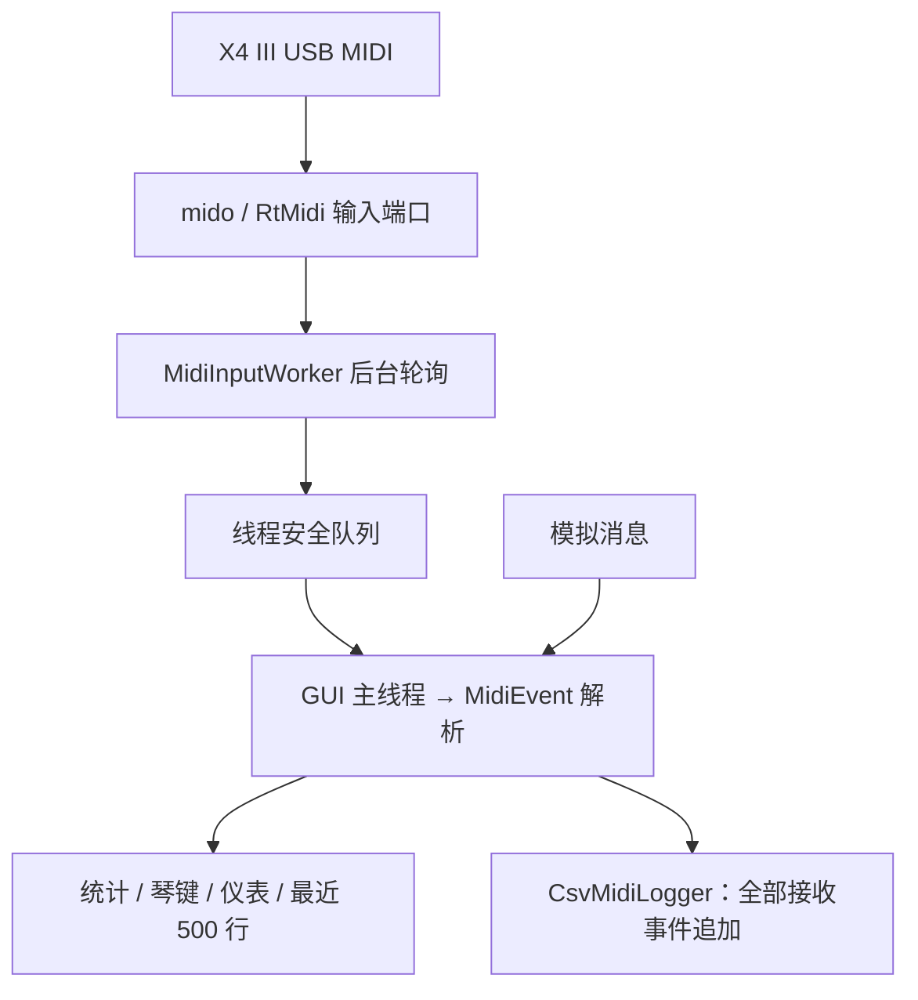
```mermaid
flowchart TD
    A["X4 III USB MIDI"] --> B["mido / RtMidi 输入端口"]
    B --> C["MidiInputWorker 后台轮询"]
    C --> D["线程安全队列"]
    D --> E["GUI 主线程 → MidiEvent 解析"]
    E --> F["统计 / 琴键 / 仪表 / 最近 500 行"]
    E --> G["CsvMidiLogger：全部接收事件追加"]
    H["模拟消息"] --> E
```

**输入输出格式定义**

| 接口 / 数据 | 格式、含义与边界 |
|---|---|
| 设备输入 | 操作系统枚举的 USB MIDI 端口；没有 COM 波特率参数，不是直接读取 DIN 电流环。 |
| 软件解析接口 | `describe_midi_message(message, timestamp=None) -> MidiEvent`；接收 mido 兼容对象，Note On 力度 0 归一为 Note Off。 |
| 数值口径 | 显示通道为 1～16，音符 0～127、力度/CC 为 0～127；`pitch` 是 mido 已转换的 −8192～8191，中心 0。 |
| CSV 格式 | `timestamp,event_type,channel,note,note_name,velocity,controller,controller_name,value,pitch,raw_hex,description`。无关字段为空；UTF-8 BOM，追加写入。 |
| 原始消息示例 | `90 3C 64` 表示通道 1、C4、力度 100；状态字节高低 4 位解释见 3.2.2。`raw_hex` 是 MIDI 消息字节，不是 USB 总线数据包。 |
| 队列交接 | worker 发送连接、消息、心跳、错误和停止事件；主线程只接受当前 worker 身份的消息，避免旧连接残留覆盖新状态。 |

**设计流程与交接约束**

后台空闲轮询间隔 5 ms；GUI 通常每 50 ms 取队列，每轮最多处理 100 项，仍有积压时约 1 ms 后继续。端口停止后按 1 秒延迟尝试重连。表格过滤不影响 CSV 和统计；时间戳在软件解释时生成，不能用来测 FPGA 端到端延迟。队列本身未设容量上限，长时间高负载需单独验证。

**术语与概念解释**

| 名词 / 概念 | 含义与注意事项 |
|---|---|
| DIN 与 USB | 同一键盘的不同传输路径；一种路径正常不证明另一种接线。 |
| 原始值 | Pitch 线缆原始 14 位中心 8192；本 USB 工具显示 mido signed 值中心 0，RTL 则另映射为 signed12。 |
| mido / RtMidi | 前者提供 MIDI 消息对象，后者访问系统 MIDI 设备；不承担 FPGA 内部 MIDI 解析。 |
| `raw_hex` | 用十六进制显示消息字节，例如 `E0 00 40` 是弯音中心；不是示波器原始采样波形。 |
| `active_notes` | 已收到起音但尚未收到松音的通道/音符集合，不模拟踏板延音后的声部占用。 |
| 软件 Pitch / 线缆 Pitch | 软件 signed 值中心 0；线缆 14 位无符号值中心 8192，两种表示相差 8192。 |
| 队列与心跳 | 队列跨线程交接数据；心跳表明线程有活动，不是键盘消息完整性或时延保证。 |

**代码文件作用简介**

| 文件（仓库相对路径） | 作用 |
|---|---|
| `code/software/midi_monitor/midi_monitor.py` | MIDI 消息解析、值转换与 CSV 记录。 |
| `code/software/midi_monitor/midi_monitor_gui.py` | MIDI 端口选择、实时消息和采集界面。 |
| `code/software/midi_monitor/midi_input_worker.py` | 后台 MIDI 输入线程及队列交接。 |
| `code/software/tests/test_midi_monitor.py` | 解析、采集和异常行为的软件回归。 |

## 3. FPGA 实时数字处理

### 3.1 公共基础：时钟、复位与顶层集成

#### 3.1.1 系统时钟与复位

| 项目 | 内容 |
|---|---|
| 模块职责 / 介绍 | 提供音频主域时钟和可靠复位。 |
| 设计要点 / 流程 | 50 MHz 晶振→异步拉低/同步释放；音频时序用使能，视频候选单独跨域。 |
| 输入输出 / 接口定义 | sys_clk、sys_rst_n→rst_sync_n；功放复位关闭。 |
| 代码位置 | `code/rtl/common/reset_sync.sv`、`code/rtl/common/audio_defs_pkg.sv`、`code/constraints/audio_timing.sdc`、`code/rtl/board/electronic_piano_top.sv` |
| 当前状态 | 正式音频单系统时钟域；音画候选增加 25/125 MHz 域，约束和 CDC 必须来自对应工程。 |

**模块设计框图**

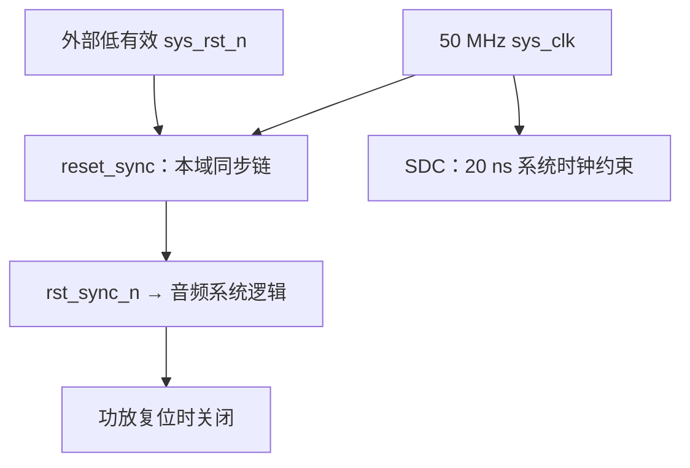
```mermaid
flowchart TD
    A["50 MHz sys_clk"] --> C["reset_sync：本域同步链"]
    B["外部低有效 sys_rst_n"] --> C
    C --> D["rst_sync_n → 音频系统逻辑"]
    D --> E["功放复位时关闭"]
    A --> F["SDC：20 ns 系统时钟约束"]
```

**输入输出格式定义**

| 接口 / 数据 | 格式、含义与边界 |
|---|---|
| 时钟 | `sys_clk` 为 50 MHz，周期 20 ns；正式音频算术和事件逻辑在该域运行。 |
| 外部复位 | `reset_sync.rst_n` 低有效，异步拉低清同步链；不是经过按键去抖的普通演奏事件。 |
| 内部复位 | `rst_sync_n` 默认经过 `STAGES=2` 同步释放；下游具体采用同步还是异步断言，以模块 always_ff 敏感表为准。 |
| 功放控制 | 顶层 `pa_en` 低有效，复位阶段关闭；恢复后按顶层逻辑使能。 |
| 候选视频时钟 | 25/125 MHz 属独立候选的像素/串行时钟，必须分别约束和复位同步，不能借用音频单域结论。 |

**设计流程与交接约束**

异步输入复位可立即让同步链进入复位；撤销后等待系统时钟逐级传播，再让本域恢复运行。所有采样脉冲仍是 50 MHz 域的一拍使能，不应当作新时钟驱动普通逻辑。复位链降低撤销时的亚稳态传播风险，不会代替跨域数据握手。

**术语与概念解释**

| 名词 / 概念 | 含义与注意事项 |
|---|---|
| 同步释放 | 复位撤销经本域寄存器，避免各状态机不同拍恢复。 |
| 时钟使能 | 只决定寄存器本拍是否更新，不产生新时钟。 |
| `rst_n` | 后缀 n 表示低有效；0 进入复位，1 允许运行，不能仅按信号名推断异步/同步。 |
| 异步断言 | 不等待时钟沿即可置入复位；解除时仍需按目标域同步。 |
| 两级同步链 | 用两个或更多寄存器逐级传递异步状态，降低亚稳态向功能逻辑传播的概率。 |
| 时钟域 | 由同一时钟采样的一组逻辑；50 MHz 与像素时钟之间即使来自同一板卡也不能裸跨总线。 |

**代码文件作用简介**

| 文件（仓库相对路径） | 作用 |
|---|---|
| `code/rtl/common/reset_sync.sv` | 异步断言、同步释放的复位同步链。 |
| `code/rtl/common/audio_defs_pkg.sv` | 公共事件类型、构造函数、控制编码和音频参数。 |
| `code/constraints/audio_timing.sdc` | 系统时钟与相关音频时序约束。 |
| `code/rtl/board/electronic_piano_top.sv` | 集成按键/MIDI、公共 FIFO、正式四声部、帧请求、PCM 缓冲、状态诊断及板级端口；另保留固定音诊断。 |

**2026-10-06 状态与版本补充：** 60K正式回退仍50MHz；138K L候选系统40MHz、像素25MHz、视频串行125MHz，音频48kHz不变。V0197为精确工程新L5，PR1014仍保留；V0195启动/失锁仅仿真，不能代替真实电源恢复。不得将旧50MHz参数直接套入40MHz候选。

#### 3.1.2 采样节拍发生器

| 项目 | 内容 |
|---|---|
| 模块职责 / 介绍 | 协调 48 kHz 音频样本处理。 |
| 设计要点 / 流程 | 正式输出完整帧边界产生请求；计算用同域使能，不用独立近似节拍驱动另一条采样链。 |
| 输入输出 / 接口定义 | frame_tick→sample_req/req_id→PCM 提交。 |
| 代码位置 | `code/rtl/audio_out/i2s_tx.sv`、`code/rtl/audio_out/pcm_frame_buffer.sv`、`code/rtl/board/electronic_piano_top.sv`、`code/rtl/common/sample_tick_gen.sv`、`code/tb/common/tb_sample_tick_gen.sv` |
| 当前状态 | D031 已进入正式多声部链路；sample_tick_gen 保留独立模块与回归用途。 |

**模块设计框图**

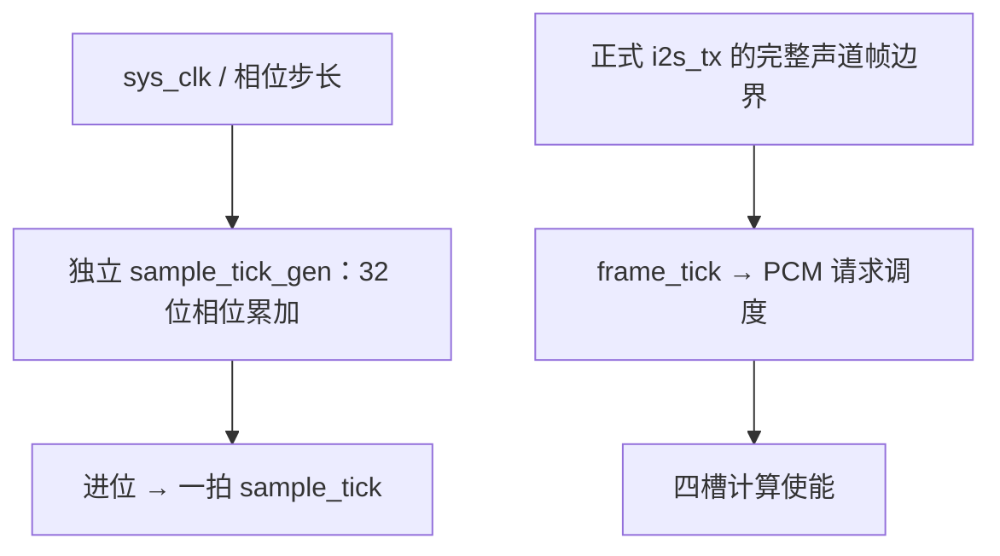
```mermaid
flowchart TD
    A["sys_clk / 相位步长"] --> B["独立 sample_tick_gen：32 位相位累加"]
    B --> C["进位 → 一拍 sample_tick"]
    D["正式 i2s_tx 的完整声道帧边界"] --> E["frame_tick → PCM 请求调度"]
    E --> F["四槽计算使能"]
```

**输入输出格式定义**

| 接口 / 数据 | 格式、含义与边界 |
|---|---|
| 独立发生器输入 | `clk`、低有效 `rst_n`；参数 `ACC_BITS=32`、`PHASE_STEP=4123169`，输出单拍 `sample_tick`。 |
| 数学格式 | 平均节拍率约为 `50_000_000 × PHASE_STEP / 2^32`，默认约 48000.004608 Hz。 |
| 正式音频时基 | 以 `i2s_tx.frame_tick` 为完整双声道帧边界，由帧缓存产生 `sample_req/sample_req_id`；不能把另一个自由运行节拍当作同一时刻。 |
| 使用条件 | 消费者在时钟上升沿且使能为 1 时推进一个样本；该脉冲没有独立时钟引脚或异步握手语义。 |

**设计流程与交接约束**

分数分频通过长短整数间隔取得目标平均频率。48 kHz 在 50 MHz 下不是整数分频，不能要求每帧固定相同拍数；必须以实际帧边界作为截止期限。独立节拍工具保留用于模块验证，正式交付链路用帧请求协调采样、结果和播放。

**术语与概念解释**

| 名词 / 概念 | 含义与注意事项 |
|---|---|
| frame_tick | 输出一组左右声道完成的帧边界。 |
| 请求代次 | 每组样本的身份，防止超期旧结果被下一帧误收。 |
| 相位累加进位 | 累加超过位宽时产生一次进位，用它作为节拍；不是把累加值直接当音频幅度。 |
| 分数分频 | 交替采用邻近整数时钟间隔，使长期平均频率接近目标，单次间隔仍有一拍量级变化。 |
| `frame_tick` | 完整左右声道音频帧边界，不能与视频 `frame_start` 或单声道 WS 半帧混淆。 |
| 截止期限 | 本次样本必须在播放所需边界前可用；平均计算够快不保证最坏帧不欠载。 |

**代码文件作用简介**

| 文件（仓库相对路径） | 作用 |
|---|---|
| `code/rtl/audio_out/i2s_tx.sv` | PCM 舍入/饱和、LSBJ 发送与完整帧边界输出。 |
| `code/rtl/audio_out/pcm_frame_buffer.sv` | 帧请求、代次校验、待发送/上一样本缓存及欠载计数。 |
| `code/rtl/board/electronic_piano_top.sv` | 集成按键/MIDI、公共 FIFO、正式四声部、帧请求、PCM 缓冲、状态诊断及板级端口；另保留固定音诊断。 |
| `code/rtl/common/sample_tick_gen.sv` | 独立 NCO 节拍模块；不再驱动正式音频采样。 |
| `code/tb/common/tb_sample_tick_gen.sv` | 检查旧独立节拍发生器的频率与复位。 |

**2026-10-06 状态与版本补充：** 138K候选通过PLL/NCO适配保持48kHz，40MHz域的时钟拍不能沿用50MHz换算。V0195已有串行帧证据；实际采样率与板上PLL仍需同版实物确认。

#### 3.1.3 正式顶层集成

| 项目 | 内容 |
|---|---|
| 模块职责 / 介绍 | 连接输入、合成、状态和板级音频输出。 |
| 设计要点 / 流程 | SOURCE_MODE=0→公共事件/四声部；SOURCE_MODE=1→固定测试音诊断；正常模式真实 STAT。 |
| 输入输出 / 接口定义 | 两板载键、R17 MIDI 输入；LSBJ 三线、功放使能与 U15 UART 输出。 |
| 代码位置 | `code/rtl/board/electronic_piano_top.sv`、`code/rtl/board/polyphonic_audio_core.sv` |
| 当前状态 | 四声部正式 L5 和指定版本 L6 已有；默认 V1+CC64。顶层头部旧“延音待实现”注释不覆盖 core→router→sustain_controller 的实际实例连接。 |

**模块设计框图**

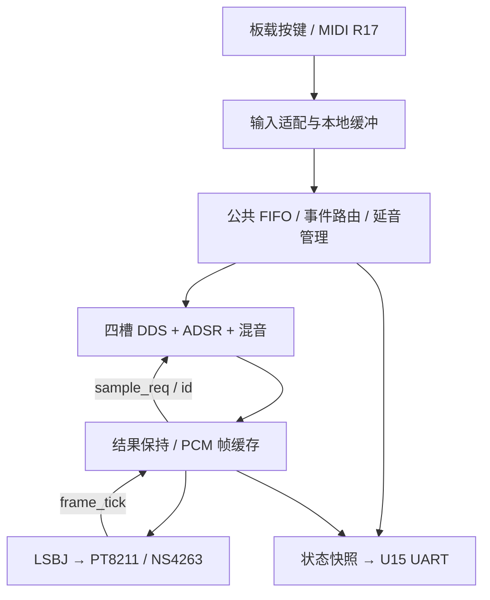
```mermaid
flowchart TD
    A["板载按键 / MIDI R17"] --> B["输入适配与本地缓冲"]
    B --> C["公共 FIFO / 事件路由 / 延音管理"]
    C --> D["四槽 DDS + ADSR + 混音"]
    D --> E["结果保持 / PCM 帧缓存"]
    E --> F["LSBJ → PT8211 / NS4263"]
    F -->|"frame_tick"| E
    E -->|"sample_req / id"| D
    C --> G["状态快照 → U15 UART"]
    E --> G
```

**输入输出格式定义**

| 接口 / 数据 | 格式、含义与边界 |
|---|---|
| 物理输入 | `sys_clk`、低有效复位、两个演奏按键及 `midi_rx`；位置和电平见第 5 章 CST 索引。 |
| 事件总线 | 64 位 `performance_event_t`，每次 valid/ready 握手消费一项；MIDI 来源 0，板载按键来源 1。 |
| 样本总线 | 左右各 signed PCM24、32 位请求代次、valid/ready、削波标志；左右必须来自同一请求。 |
| 物理输出 | BCLK、LRCK、DIN、低有效 `pa_en`、115200 状态 `uart_tx`；没有把电脑 USB 音频送入 FPGA 的输入端口。 |
| 模式参数 | `SOURCE_MODE=0` 为正式事件/四声部路径，`SOURCE_MODE=1` 保留固定音诊断；正式 core 显式启用动态音色。 |

**设计流程与交接约束**

顶层负责把各模块的身份、复位、参数与时基接到一起，单个模块通过不代表顶层连线正确。正式音频、固定音诊断和独立音画候选需分别绑定工程及码流；状态字段还要确认其实际生产者，不能用占位常量冒充统计。

**术语与概念解释**

| 名词 / 概念 | 含义与注意事项 |
|---|---|
| 编译期选择 | 构建时决定参数，运行中不能靠 MIDI 更改。 |
| 候选工程 | 为定向集成建立的另一套 top/约束，不能自动当作正式顶层。 |
| 顶层例化 | 把模块实例与真实端口连接；文件存在或独立自检通过不等于已进入正式工程。 |
| 参数覆盖 | 顶层显式传值可改变子模块默认行为，例如动态音色使能；审阅时必须看实例参数。 |
| 双单声道 | 左右通道输出相同混音内容；有两条数据通路不自动构成独立声像。 |
| 构建身份 | 顶层、源码提交、ROM、约束和 fs 的对应关系，决定一条实物结论能覆盖哪版设计。 |

**代码文件作用简介**

| 文件（仓库相对路径） | 作用 |
|---|---|
| `code/rtl/board/electronic_piano_top.sv` | 板级正式顶层：两输入源、公共 FIFO、四声部核心、LSBJ 和 UART。 |
| `code/rtl/board/polyphonic_audio_core.sv` | 四槽波形/包络经增益、混音提交与真实处理周期计数。 |

**2026-10-06 状态与版本补充：** 区分60K electronic_piano_top与138K L的audio_visual_coexistence_top。后者来自56冻结输入的隔离候选，经路径适配和完整构建达L5；不能把前者Program0/1策略或未集成Delay自动算入后者。V0200发布准备尚无L6。

### 3.2 输入适配：板载按键与 MIDI 接收

#### 3.2.1 板载按键同步与去抖

| 项目 | 内容 |
|---|---|
| 模块职责 / 介绍 | 把机械按键转换为稳定按下/松开状态。 |
| 设计要点 / 流程 | 同步→连续稳定计数→状态/边沿；正式顶层门限 3 ms，模块复用默认 20 ms。 |
| 输入输出 / 接口定义 | 异步低有效按键输入；同步状态/边沿输出，进入事件转换器。 |
| 代码位置 | `code/rtl/input/button_debouncer/button_debouncer.sv` |
| 当前状态 | 已用于正式顶层；实际引脚为 1.5 V 域，两个键用于基础输入/诊断。 |

**模块设计框图**

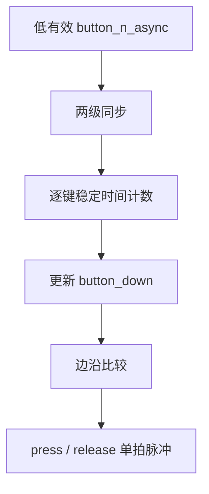
```mermaid
flowchart TD
    A["低有效 button_n_async"] --> B["两级同步"]
    B --> C["逐键稳定时间计数"]
    C --> D["更新 button_down"]
    D --> E["边沿比较"]
    E --> F["press / release 单拍脉冲"]
```

**输入输出格式定义**

| 接口 / 数据 | 格式、含义与边界 |
|---|---|
| 异步输入 | `button_n_async[BUTTON_COUNT-1:0]`，默认两键，低为按下。 |
| 时钟/复位 | `clk`、低有效 `rst_n`；同步链和每键计数在同一时钟域。 |
| 状态输出 | `button_down` 每位 1 表示已确认按下；与原始引脚低有效电平相反。 |
| 事件输出 | `button_press_pulse`、`button_release_pulse` 每位为单拍边沿，持续按住不重复起音。 |
| 时间参数 | 模块声明默认 `DEBOUNCE_TIME_MS=20`；正式顶层以 `DEBOUNCE_CNT=150000`、50 MHz 换算并覆盖为 3 ms。 |

**设计流程与交接约束**

只有同步后输入连续满足稳定条件才改变已确认状态，输入反复跳变则重新等待。去抖带来明确输入延迟，不能把这段延迟归给音频算法。复位恢复、短于门限的毛刺、同时按键及按住不重复触发是必要边界；仿真缩短计数参数的结果不能当真实 3 ms 测量。

**术语与概念解释**

| 名词 / 概念 | 含义与注意事项 |
|---|---|
| 去抖 | 过滤机械触点来回跳变，会引入检测时间。 |
| 亚稳态 | 异步输入在采样边沿附近变化造成不确定性，同步器降低传播风险。 |
| 机械抖动 | 触点接通/断开时短时间反复变化，若直接边沿检测会把一次按键当作多次。 |
| 低有效 / 逻辑按下 | 引脚 0 表示按下，而 `button_down=1` 表示模块确认按下；编码转换只发生在输入解释层。 |
| 单拍脉冲 | 在 50 MHz 下持续一个时钟周期的事件通知；消费者不能等待它保持到 ready。 |
| 参数默认与实例值 | 默认 20 ms 是模块复用设置，正式实例 3 ms 才是当前整机配置。 |

**代码文件作用简介**

| 文件（仓库相对路径） | 作用 |
|---|---|
| `code/rtl/input/button_debouncer/button_debouncer.sv` | 同步按键并产生稳定状态及按下/松开脉冲。 |

#### 3.2.2 MIDI 串行接收适配

| 项目 | 内容 |
|---|---|
| 模块职责 / 介绍 | 将 DIN 隔离后的 UART 字节转为统一演奏事件。 |
| 设计要点 / 流程 | R17→uart_rx 31250 8N1→Running Status/Realtime 解析→离散 FIFO 或连续控制待发送槽。 |
| 输入输出 / 接口定义 | NoteOn/Off、CC64、Pitch、CC1、Program Change→64 位事件；同时输出帧错误/解析错误/溢出计数。 |
| 代码位置 | `code/rtl/input/midi_input/midi_input.sv`、`code/rtl/common/uart_rx.sv`、`code/scripts/run_midi_program_change_sim.ps1`、`code/scripts/run_midi_scheduler_sim.ps1` |
| 当前状态 | 10 月 3 日 3d6430e 增加 Program Change，2fdc313 增加有界调度；输入侧成果保留；后续V0184已完成Program正式数字/L5，Pitch/Mod仍是候选。 |

**模块设计框图**

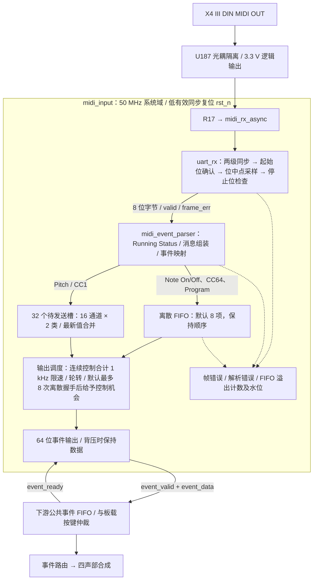
```mermaid
flowchart TD
    K["X4 III DIN MIDI OUT"] --> I["U187 光耦隔离 / 3.3 V 逻辑输出"]
    I --> R["R17 → midi_rx_async"]
    subgraph MIDI["midi_input：50 MHz 系统域 / 低有效同步复位 rst_n"]
        R --> U["uart_rx：两级同步 → 起始位确认 → 位中点采样 → 停止位检查"]
        U -->|"8 位字节 / valid / frame_err"| P["midi_event_parser：Running Status / 消息组装 / 事件映射"]
        P -->|"Note On/Off、CC64、Program"| F["离散 FIFO：默认 8 项，保持顺序"]
        P -->|"Pitch / CC1"| C["32 个待发送槽：16 通道 × 2 类 / 最新值合并"]
        F --> A["输出调度：连续控制合计 1 kHz 限速 / 轮转 / 默认最多 8 次离散握手后给予控制机会"]
        C --> A
        A --> L["64 位事件输出 / 背压时保持数据"]
        U -.-> E["帧错误 / 解析错误 / FIFO 溢出计数及水位"]
        P -.-> E
        F -.-> E
    end
    L -->|"event_valid + event_data"| Q["下游公共事件 FIFO / 与板载按键仲裁"]
    Q -->|"event_ready"| L
    Q --> S["事件路由 → 四声部合成"]
```

外部 DIN 电流环必须先隔离并确认逻辑侧电平，不能直接接 FPGA GPIO。模块只生成事件，音色选择、延音行为、弯音和颤音由下游消费事件后实现；图中的输入解析能力不等于这些音频效果均已验收。

**输入格式：物理串行帧与 MIDI 消息**

输入为 31250 baud、8N1：空闲高电平，1 位低电平起始位、8 位数据（bit 0 先发送）、1 位高电平停止位，无校验位。50 MHz 下每位 1600 拍，每字节约 320 μs；包含状态字节的三字节消息约 960 μs，尚未计入后续处理和音频输出延迟。

MIDI 状态字节的最高位为 1，普通数据字节的最高位为 0，数据值范围为 0～127。对 `80`～`EF` 的通道状态字节，高 4 位表示消息类型、低 4 位 `n` 表示通道。`n` 是占位符，取十六进制 `0～F`，对应用户所见的通道 1～16；系统消息 `F0`～`FF` 不按这一通道规则解释。

```text
状态字节：bit 7              bit 4  bit 3              bit 0
          ┌─────────────────────┬────────────────────────┐
          │ 高 4 位：消息类型   │ 低 4 位 n：通道 0～15 │
          └─────────────────────┴────────────────────────┘
0x92 =      1001                  0010
            Note On              编码 2 → 用户通道 3
```

下表字节均为十六进制；`note`、`velocity`、`value` 和 `program` 均为 7 位数据。

| 输入格式 | 含义与实例 | 本模块处理 |
|---|---|---|
| `8n note velocity` | Note Off；`80 3C 00`：通道 1 释放音符 60（C4） | 输出 Note Off，保留音符与释放力度映射值。 |
| `9n note velocity` | Note On；`90 3C 64`：通道 1 按下 C4，力度为十进制 100 | 非零力度输出 Note On；力度 0 转为 Note Off。 |
| `Bn 40 value` | CC64 延音；`B0 40 7F`：通道 1 的 CC64=127 | 输出 `EVENT_CONTROL_CHANGE` / `CTRL_SUSTAIN=6`；原值 ≥64 表示开启。 |
| `Bn 01 value` | CC1 调制；`B0 01 7F`：调制值 127 | 输出 `EVENT_CONTROL_CHANGE` / `CTRL_MODULATION=1`，进入连续控制槽。 |
| `Cn program` | Program Change；`C0 01`：通道 1 选择程序号 1 | 输出 `EVENT_CONTROL_CHANGE` / `CTRL_VOICE_SELECT=5`；原样保留 0～127，不加 1、不缩放。 |
| `En LSB MSB` | Pitch Bend；`E0 00 40`：原始 14 位值 8192，处于中心 | 原值为 `LSB + 128 × MSB`；映射为 12 位补码 −2048～2047，中心为 0，输出 `EVENT_PITCH_BEND` / `CTRL_PITCH_BEND=0`。 |

`3C`=60、`64`=100、`40`=64、`7F`=127。例如 `90 3C 64` 与 `92 3C 64` 只有通道不同，分别属于用户通道 1 和 3。

Running Status 允许连续同类通道消息省略重复状态字节，例如 `90 3C 64 40 50` 表示两个 Note On。`F8`～`FF` 可穿插而不破坏半条消息；本模块不使用其内容。其他 CC、触后压力和 SysEx 等不生成上述演奏事件，但仍按消息长度消费或跳过，以维持后续解析对齐。坏 UART 帧会清除未完成的解析上下文。

**输出格式：统一 64 位演奏事件**

`event_data` 使用公共包 `audio_defs_pkg::performance_event_t`；位区间由 packed struct 的声明顺序确定，首字段位于高位。它是 FPGA 内部并行总线，不是直接发送到串口的 8 字节报文。

| 字段 | 位区间 / 位宽 | 定义 |
|---|---|---|
| `event_type` | `[63:61]` / 3 | 本模块输出 Note On=0、Note Off=1、Pitch Bend=3、Control Change=4。 |
| `source_id` | `[60:57]` / 4 | 输入来源标识，由实例参数 `SOURCE_ID` 指定；当前正式 MIDI 实例为 0。 |
| `channel` | `[56:53]` / 4 | MIDI 通道编码 0～15，对应用户通道 1～16。 |
| `note_number` | `[52:46]` / 7 | MIDI 音符编号 0～127；非音符事件为 0。 |
| `velocity` | `[45:36]` / 10 | 音符力度由 `{v[6:0], v[6:4]}` 扩展，0～1023；控制事件为 0。 |
| `expression` | `[35:26]` / 10 | 公共事件预留的表情字段；本模块当前输出 0。 |
| `control_id` | `[25:18]` / 8 | 公共控制编号：Pitch=0、Modulation=1、Voice Select=5、Sustain=6；不是 MIDI 原始 CC 编号。 |
| `control_value` | `[17:6]` / 12 | Pitch 使用有符号补码；CC1/CC64 按 `{v[6:0], v[6:2]}` 扩展为 0～4095；Program 为零扩展的 0～127。 |
| `reserved` | `[5:0]` / 6 | 保留位，置 0。 |

音符事件的 `control_id/control_value` 均为 0。CC64 的 12 位阈值为 2048，对应原始 MIDI 值 64；输入模块传递数值，具体延音状态由下游控制器维护。

**模块端口、参数与交接约束**

| 端口 | 方向 / 位宽 | 定义 |
|---|---|---|
| `clk`、`rst_n` | 输入 / 各 1 | 系统时钟；低有效同步复位。 |
| `midi_rx_async` | 输入 / 1 | 隔离后的异步串行输入，在 `uart_rx` 内同步。 |
| `event_valid`、`event_data` | 输出 / 1、64 | 有效事件及数据。 |
| `event_ready` | 输入 / 1 | 下游接收能力；`valid && ready` 在上升沿同时成立时传输一次。 |
| `event_fifo_level`、`event_fifo_high_watermark` | 输出 / 各 16 | 本地离散 FIFO 当前水位、复位以来最高水位，不含连续控制槽。 |
| `uart_frame_error_count` | 输出 / 32 | UART 停止位错误次数。 |
| `parser_error_count` | 输出 / 32 | 非法或被后续字节打断的残缺 MIDI 消息次数，不是消息超时计时器。 |
| `event_fifo_overflow_count` | 输出 / 32 | 离散 FIFO 无可用空间时丢弃新事件的次数。 |
| `midi_rx_busy` | 输出 / 1 | UART 正在接收一帧。 |

默认参数为 `CLK_HZ=50_000_000`、`MIDI_BAUD=31_250`、`LOCAL_FIFO_DEPTH=8`、`SOURCE_ID=0`、`MAX_DISCRETE_BURST=8`。错误计数均饱和于 `0xFFFFFFFF`，复位清零。正式顶层目前接出了 MIDI 溢出计数，其他本地诊断端口未全部接入系统状态输出；公共 FIFO 的状态水位不等于本模块的本地水位。

`event_valid=1` 且 `event_ready=0` 时，当前事件保持稳定。离散 FIFO 保持 Note、CC64 和 Program 之间的到达顺序；Pitch/CC1 则合并未发送的更新、轮转选择并限速，**不保证与离散事件之间的严格原始到达顺序**。默认的 8 次上界只在连续控制已有待发值且冷却结束时成立，并按成功的离散握手计数；下游长期背压时不承诺固定时间内送达。FIFO 深度表示缓存容量，不表示支持的复音数。

**术语与概念解释**

| 名词 / 概念 | 含义与注意事项 |
|---|---|
| `midi_rx_async` | FPGA 从 U187 `UART_TX` 接收的原始串行输入；相对 50 MHz 系统时钟异步，须先在 `uart_rx` 内同步并按 31250 baud、8N1 还原为字节。 |
| Pitch | Pitch Bend（弯音）控制；键盘发送 14 位数，中心值为 0，向上/下改变正在发声音符的音高。 |
| CC1 | Continuous Controller 1，即 Modulation（调制）；原始值 0～127，通常用于控制颤音深度等连续表情。 |
| Note On / Off | 按下琴键发送 Note On，其中包含音符号和力度；松开琴键发送 Note Off，表示该音符应开始释放。 |
| CC64 | Continuous Controller 64，即延音踏板；项目以原始值 ≥64 视为踩下，<64 视为松开。 |
| Running Status | 重复通道消息可省略状态字节，Program Change 每条只有一个数据字节。 |
| Program | Program Change，音色选择消息；`Cn program` 的原始值 0～127 映射为 `CTRL_VOICE_SELECT`，不加 1、不缩放。正式工程中 Program 0 选 V1 钢琴音色、Program 1 选三角音色，在下一次 Note On 时锁定到该声部。 |
| Realtime | F8～FF 可插入消息中间且不破坏解析上下文。 |

**代码文件作用简介**

| 文件（仓库相对路径） | 作用 |
|---|---|
| `code/rtl/input/midi_input/midi_input.sv` | 组合 MIDI UART 接收、事件解析与错误计数。 |
| `code/rtl/input/midi_input/midi_event_parser.sv` | 组装 MIDI 消息、构造统一事件，管理离散 FIFO、连续控制合并与有界调度。 |
| `code/rtl/common/audio_defs_pkg.sv` | 定义 64 位事件布局、类型/控制编号和力度、CC、Pitch 映射函数。 |
| `code/rtl/common/uart_rx.sv` | 参数化 UART 字节接收与忙/帧错报告。 |
| `code/scripts/run_midi_program_change_sim.ps1` | 运行程序切换解析、顺序、异常、FIFO 和真实 UART 自检。 |
| `code/scripts/run_midi_scheduler_sim.ps1` | 验证连续控制公平性、有界机会、限速及三种故障反例。 |

### 3.3 事件处理：统一事件、音符/力度/开关、缓存与仲裁

#### 3.3.1 统一演奏事件与握手

| 项目 | 内容 |
|---|---|
| 模块职责 / 介绍 | 解耦物理输入与合成消费者。 |
| 设计要点 / 流程 | 输入填充事件→valid/ready 握手→公共 FIFO→路由；只有真实握手才算消费。 |
| 输入输出 / 接口定义 | 64 位 performance_event_t；来源/通道/音符/力度/控制字段按公共包定义。 |
| 代码位置 | `code/rtl/common/audio_defs_pkg.sv` |
| 当前状态 | 接口 v1.6 已冻结，当前增量保持字段和顶层端口；控制编号不能直接用原始 MIDI CC 值代替。 |

**模块设计框图**


```mermaid
flowchart LR
    A["按键 / MIDI 输入适配"] --> B["构造统一 64 位事件"]
    B --> C["valid / ready 成功握手"]
    C --> D["公共 FIFO"]
    D --> E["路由至音符 / 延音 / 音色消费者"]
```

**输入输出格式定义**

| 接口 / 数据 | 格式、含义与边界 |
|---|---|
| 事件布局 | `[63:61] type`、`[60:57] source`、`[56:53] channel`、`[52:46] note`、`[45:36] velocity`、`[35:26] expression`、`[25:18] control_id`、`[17:6] control_value`、`[5:0] reserved`；详细位表见 3.2.2。 |
| 公共事件类型 | NoteOn=0、NoteOff=1、Aftertouch=2、PitchBend=3、ControlChange=4、AllNotesOff=5；定义某类型不等于所有输入适配器都会产生它。 |
| 握手信号 | `event_valid`、`event_ready` 各 1 位，`event_data` 64 位；同一时钟上升沿同时为 1 才传输一次。 |
| 数据约束 | 保留位置零；NoteOn 力度非零，零力度在入口转为 NoteOff；控制编号使用公共枚举。 |
| 身份 | 音符用 source/channel/note 联合识别；通道控制按 source/channel 保存状态，不应全局共享一个踏板位。 |

**设计流程与交接约束**

生产者先稳定数据再置 valid，下游 ready 拉低时不能撤销或替换当前事件。握手完成后才允许前进；未握手的输入值不能更新“已接受控制状态”。同拍发送与接收不要求事件先经历空闲拍，因此计数和状态推进都应以握手为准。

**术语与概念解释**

| 名词 / 概念 | 含义与注意事项 |
|---|---|
| valid/ready | 两者同拍为 1 才完成传输；反压期间 valid 和 data 保持。 |
| source/channel/note | 来源、通道、音符联合身份，防止不同键盘/通道互相松音。 |
| `performance_event_t` | 公共 packed struct，将不同物理输入映射到统一语义，避免消费者解析原始 MIDI 字节。 |
| `control_id` | 项目内控制编号，例如 MIDI CC64 映射到 Sustain=6；把原始 64 直接写入会路由错误。 |
| 反压 | 下游暂时拉低 ready，要求上游保持当前事件；不能对已经发出的 DIN 串行比特反压。 |
| 已接受事件 | 某接口完成 valid/ready 交接的事件；“解析出来”“入本地 FIFO”“被核心接受”是不同时间点。 |

**代码文件作用简介**

| 文件（仓库相对路径） | 作用 |
|---|---|
| `code/rtl/common/audio_defs_pkg.sv` | 公共事件类型、构造函数、控制编码和音频参数。 |

#### 3.3.2 音符、力度与开关事件转换

| 项目 | 内容 |
|---|---|
| 模块职责 / 介绍 | 把按键与 MIDI 音符转为统一 NoteOn/Off。 |
| 设计要点 / 流程 | NoteOn velocity=0→NoteOff；7 位力度扩为 10 位；板载键采用配置力度。 |
| 输入输出 / 接口定义 | MIDI velocity[6:0]→{velocity,velocity[6:4]}，0～1023；按键边沿→事件 FIFO。 |
| 代码位置 | `code/rtl/input/button_event_converter/button_event_converter.sv`、`code/rtl/input/midi_input/midi_event_parser.sv`、`code/rtl/common/audio_defs_pkg.sv` |
| 当前状态 | 力度正式映射与独立释音已有 V0137/V0145 指定版本结果。V0156 按键溢出计数并行饱和修复为模块交付，不代表新的整机 L5/L6。 |

**模块设计框图**

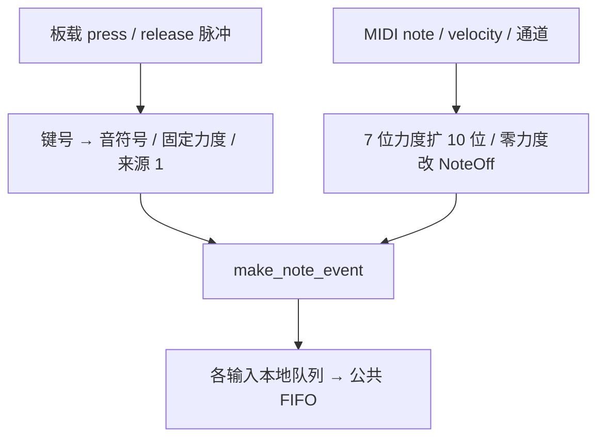
```mermaid
flowchart TD
    A["板载 press / release 脉冲"] --> B["键号 → 音符号 / 固定力度 / 来源 1"]
    C["MIDI note / velocity / 通道"] --> D["7 位力度扩 10 位 / 零力度改 NoteOff"]
    B --> E["make_note_event"]
    D --> E
    E --> F["各输入本地队列 → 公共 FIFO"]
```

**输入输出格式定义**

| 接口 / 数据 | 格式、含义与边界 |
|---|---|
| 按键输入 | `button_press_pulse`、`button_release_pulse` 位图；脉冲不能重发，适配器立即生成并排队。 |
| 按键参数 | 默认 `BUTTON_COUNT=2`、`LOCAL_FIFO_DEPTH=4`、`BASE_NOTE_NUMBER=60`、`NOTE_STEP=2`、`NOTE_ON_VELOCITY=512`；正式顶层显式 `SOURCE_ID=1`。 |
| 音符映射 | 键索引 i 对应 `BASE_NOTE_NUMBER+i×NOTE_STEP`；MIDI 输入则直接保留收到的 7 位音符号。 |
| MIDI 力度 | `velocity10={velocity7,velocity7[6:4]}`；例 100 映射为 806，127 映射为 1023；不是简单乘 8。 |
| 输出 | 64 位事件及 valid/ready；`overflow_count[31:0]` 记录按键本地队列未能容纳的事件。 |

**设计流程与交接约束**

两个适配器复用相同事件构造函数，但输入性质不同：板载键只有开关边沿，无法测击键速度，因此采用固定配置力度；MIDI 键盘已有力度测量。零力度 NoteOn 在公共队列前转为 NoteOff，避免下游创建无声但仍占用的声部。多键同拍可能产生多项，须按实现顺序入队并对丢失数饱和累计。

**术语与概念解释**

| 名词 / 概念 | 含义与注意事项 |
|---|---|
| Velocity | 起音力度，不直接等于最终音量；经增益表和包络转换。 |
| 饱和计数 | 达到最大值后保持，避免回绕掩盖错误。 |
| Note Number | MIDI 音高编号，例如 60 为项目约定的 C4；不是 FPGA 槽号或 GPIO 编号。 |
| 起音力度 / 释放力度 | 分别随 NoteOn/NoteOff 到达；最终释放曲线由包络合同决定，并非自动按释放力度调节。 |
| 固定力度 | 板载开关缺少速度传感，使用参数 512；不能用此路径证明键盘 Velocity 动态范围。 |
| 位复制扩展 | 复制高位到低位来填满目标范围，7 位最大值 127 正好映射到 10 位最大值 1023。 |

**代码文件作用简介**

| 文件（仓库相对路径） | 作用 |
|---|---|
| `code/rtl/input/button_event_converter/button_event_converter.sv` | 按键边沿到统一事件的转换及本地缓存。 |
| `code/rtl/input/midi_input/midi_event_parser.sv` | 解析 MIDI 字节/running status，生成 Note 事件并缓存。 |
| `code/rtl/common/audio_defs_pkg.sv` | 公共事件类型、构造函数、控制编码和音频参数。 |

#### 3.3.3 连续控制与延音事件处理

| 项目 | 内容 |
|---|---|
| 模块职责 / 介绍 | 管理 Pitch/Mod 更新和 CC64 的离散顺序/释放行为。 |
| 设计要点 / 流程 | Pitch/CC1 合并最新未发值并限速；CC64 与 Note/Program 共离散 FIFO。已接受 CC64→踏板状态→推迟/触发 Release。 |
| 输入输出 / 接口定义 | Pitch 为 signed12 −2048～2047；CC1 为 0～4095；CC64 阈值 2048（原始值 64）。控制器 cmd_valid/ready→release_valid/ready、release_mask 和 generation。 |
| 代码位置 | `code/rtl/input/sustain_control/sustain_controller.sv`、`code/rtl/board/sustain_control_contract_pkg.sv`、`code/rtl/board/sustain_controller_ports.svh`、`code/rtl/board/polyphonic_event_router.sv` |
| 当前状态 | CC64 已接正式路由并有 V0138/V0145 实物范围；Pitch/Mod 仍未成为正式音频效果。二值延音不支持半踏。 |

**模块设计框图**

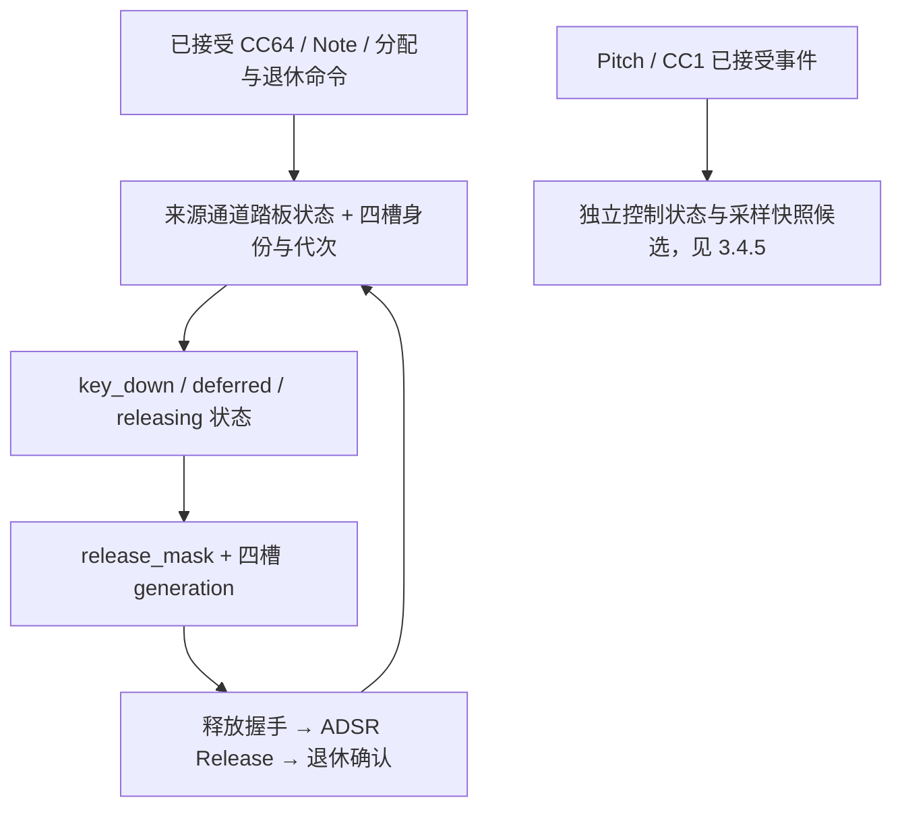
```mermaid
flowchart TD
    A["已接受 CC64 / Note / 分配与退休命令"] --> B["来源通道踏板状态 + 四槽身份与代次"]
    B --> C["key_down / deferred / releasing 状态"]
    C --> D["release_mask + 四槽 generation"]
    D --> E["释放握手 → ADSR Release → 退休确认"]
    E --> B
    F["Pitch / CC1 已接受事件"] --> G["独立控制状态与采样快照候选，见 3.4.5"]
```

**输入输出格式定义**

| 接口 / 数据 | 格式、含义与边界 |
|---|---|
| 命令输入 | `cmd_valid/ready`、`cmd_type[2:0]`、`cmd_slot[1:0]`、source/channel 各 4 位、note 7 位、control_value 12 位、generation 32 位；命令编号以合同包为准。 |
| 踏板编码 | 原始 CC64 经公共映射为 0～4095，阈值 2048；按来源/通道记录踩下状态。 |
| 释放输出 | `release_valid/ready`、`release_mask[3:0]`、`release_generations[127:0]`；每槽关联自己的 32 位分配代次。 |
| 观测输出 | `occupied_mask/key_down_mask/deferred_mask/releasing_mask` 各 4 位，分别表示占用、键按住、踏板保持、已开始释放。 |
| 连续控制 | Pitch/CC1 值的解析与合并见 3.2.2；它们与已消费的控制状态是不同层次，不共用踏板开关位。 |

**设计流程与交接约束**

NoteOff 到达时，若对应踏板踩下则标记 deferred；踏板松开后才提交待释放槽。松键或请求 Release 不立即清 occupied，须等包络完成与退休确认。槽被抢占/重用时更新 generation，避免旧释放命令误作用于新音。控制请求和释放结果都遵守握手保持规则。

**术语与概念解释**

| 名词 / 概念 | 含义与注意事项 |
|---|---|
| deferred | 琴键已松但踏板保持，推迟进入 Release。 |
| generation | 槽位每次分配的代次；旧释放通知不能作用于同槽新音符。 |
| Panic | 请求释放占用槽，等待真实退休；不同于直接异步复位清零。 |
| `release_mask` | 四位位图，某位为 1 表示请求对应声部进入释放；不是音符号或 MIDI 通道号。 |
| `key_down` / `occupied` | 前者表示键仍按住，后者表示槽仍在使用；松键后的踏板保持与 Release 阶段仍可能 occupied。 |
| 退休 | 包络真正完成且该代次不再需要输出后回收槽；不是收到 NoteOff 就立即删除声音。 |
| 二值踏板 | 仅区分踩下和松开，没有连续踏板深度对释放时长的半踏建模。 |

**代码文件作用简介**

| 文件（仓库相对路径） | 作用 |
|---|---|
| `code/rtl/input/sustain_control/sustain_controller.sv` | 按来源/通道保存踏板、四槽按键/deferred/releasing 和代次，握手请求释放。 |
| `code/rtl/board/sustain_control_contract_pkg.sv` | 延音命令编号与共享合同类型。 |
| `code/rtl/board/sustain_controller_ports.svh` | 控制器端口合同声明，供独立一致性核对。 |
| `code/rtl/board/polyphonic_event_router.sv` | 事件到分配器/延音控制器/包络的顺序路由、释放扫描与槽退休。 |

#### 3.3.4 本地缓存、公共 FIFO 与输入仲裁

| 项目 | 内容 |
|---|---|
| 模块职责 / 介绍 | 吸收突发消息并协调按键/MIDI 输入。 |
| 设计要点 / 流程 | 每源本地队列→双源轮转→32 项公共 FIFO；MIDI 内部连续控制采用 32 槽轮转。 |
| 输入输出 / 接口定义 | event_valid/data/ready；level/high_watermark/overflow。MAX_DISCRETE_BURST 默认 8。 |
| 代码位置 | `code/rtl/input/button_event_converter/button_event_converter.sv`、`code/rtl/input/midi_input/midi_event_parser.sv`、`code/rtl/common/performance_event_fifo.sv`、`code/tb/common/tb_performance_event_fifo.sv`、`code/tb/board/tb_midi_common_event_path.sv`、`code/tb/board/tb_midi_top_integration.sv` |
| 当前状态 | 控制已可发送且离散持续非空时，最多 8 次离散成功握手后锁定一次控制机会；控制 1 kHz 冷却从真实握手开始。反压不积攒额度，锁定数据稳定。 |

**模块设计框图**

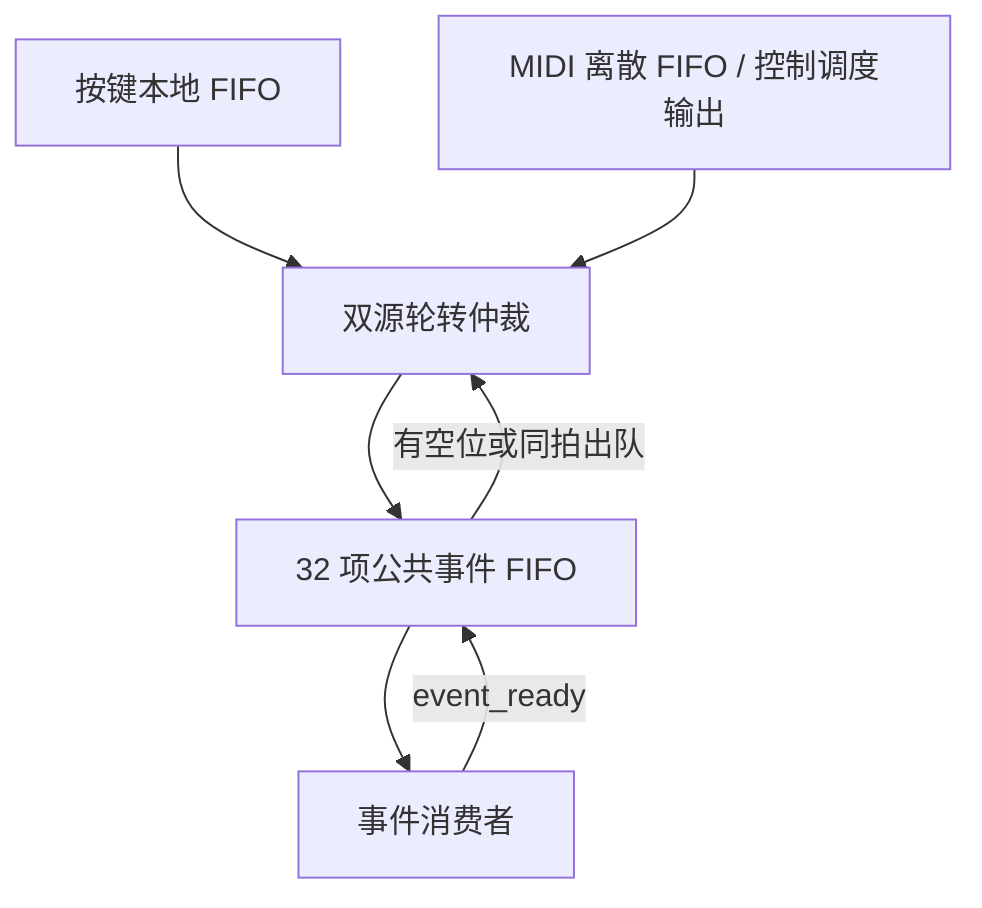
```mermaid
flowchart TD
    A["按键本地 FIFO"] --> C["双源轮转仲裁"]
    B["MIDI 离散 FIFO / 控制调度输出"] --> C
    C --> D["32 项公共事件 FIFO"]
    D --> E["事件消费者"]
    E -->|"event_ready"| D
    D -->|"有空位或同拍出队"| C
```

**输入输出格式定义**

| 接口 / 数据 | 格式、含义与边界 |
|---|---|
| 输入两路 | `button_valid/ready/data`、`midi_valid/ready/data`；data 各 64 位，同属系统时钟域。 |
| 输出一路 | `event_valid/ready/data`；每拍至多入队一个事件、出队一个事件。 |
| 容量 | `DEPTH=32`，本地按键默认 4、MIDI 离散默认 8；连续控制待发送槽不计入 FIFO 水位。 |
| 观测 | `event_fifo_level[15:0]` 与 `event_fifo_high_watermark[15:0]`；此公共模块没有独立丢弃计数端口。 |
| 队满条件 | 队满且本拍没有出队时不给输入 ready；队满但同拍成功出队时可接收一项，保持总占用不变。 |

**设计流程与交接约束**

两源同时有效时依据轮转优先级选一源，成功入队后把优先权让给另一源。公共队列通过反压阻止过量写入，真正无法暂停的外部输入由本地队列吸收；本地仍满时才可能丢事件。STAT 的 overflow 来自输入侧丢失汇总，不能把公共“满”直接当“已丢失”。

**术语与概念解释**

| 名词 / 概念 | 含义与注意事项 |
|---|---|
| 合并 | 未发送的同一来源/通道控制只保留最新值，NoteOff 不采用此规则。 |
| 公平性 | 持续 Note 流不能无限饿死已就绪控制事件。 |
| 两级 FIFO | 本地队列吸收不可反压串口，公共队列统一调度；深度不等于复音数。 |
| Round-robin | 在竞争输入间轮流分配机会；仅在成功传输时推进，避免反压期间虚假消耗优先权。 |
| 同拍出入队 | 读出旧队首并写入新事件可发生在同一沿；占用数按入队减出队更新。 |
| 水位 / 满 / 溢出 | 水位是存量，满表示没有闲位，溢出表示新事件实际丢失；三者不能互换。 |
| 32 槽控制轮转 | MIDI 内部选择通道控制项的调度，与外层按键/MIDI 两源轮转是两级不同仲裁。 |

**代码文件作用简介**

| 文件（仓库相对路径） | 作用 |
|---|---|
| `code/rtl/input/button_event_converter/button_event_converter.sv` | 按键边沿到统一事件的转换及本地缓存。 |
| `code/rtl/input/midi_input/midi_event_parser.sv` | 解析 MIDI 字节/running status，生成 Note 事件并缓存。 |
| `code/rtl/common/performance_event_fifo.sv` | 同时钟域双源仲裁、公共队列及当前/最高水位。 |
| `code/tb/common/tb_performance_event_fifo.sv` | 仲裁、队满、同拍出入队等独立自检。 |
| `code/tb/board/tb_midi_common_event_path.sv` | MIDI 到公共事件路径的联调测试。 |
| `code/tb/board/tb_midi_top_integration.sv` | 从顶层串行 MIDI 输入验证音符事件与单声部响应。 |

**2026-10-06 状态与版本补充：** 10月5日联合/深流水候选功能验证通过，但物理实现限时未收敛，均不采用；当前基线不被试验代码替代。V0199溢出音频36/视频33/丢3是视频32队列+1 mailbox合同，不等同公共音频FIFO丢失。

#### 3.3.5 面板按钮、音量与曲谱控制（隔离候选）

| 项目 | 内容 |
|---|---|
| 职责 | 将X4 III K1/B1～B6实测消息转为音量、音色和显示/曲谱控制。 |
| 设计流程 | K1 CC7用独立16通道最新值缓存，与Pitch/Mod共享1kHz成功握手冷却；按钮按source/channel/button保存状态，仅低→高触发一次，不因长按或松开重复。B4～B6不动作。 |
| 输入输出 | USB证据279条CC7、30条CC25～30；按下127/松开0，实测channel0。候选事件valid/ready进入私有控制及视频CDC，公共新命令7/8/9尚未发布。 |
| 当前状态 | V0185原CSV字节/字段核对，V0186隔离L2及关闭模式miter通过；生产parser/top未启用，无新整机STA/L6。K1映射/平滑数学仍为待M1意见提案。 |
| 边界 | 音频不被显示反压；有限显示队列溢出显式video_fault，暂停判定并等待共享复位恢复。暂停帧不得误判；自编8音练习不是正式歌曲。 |

**模块设计框图**

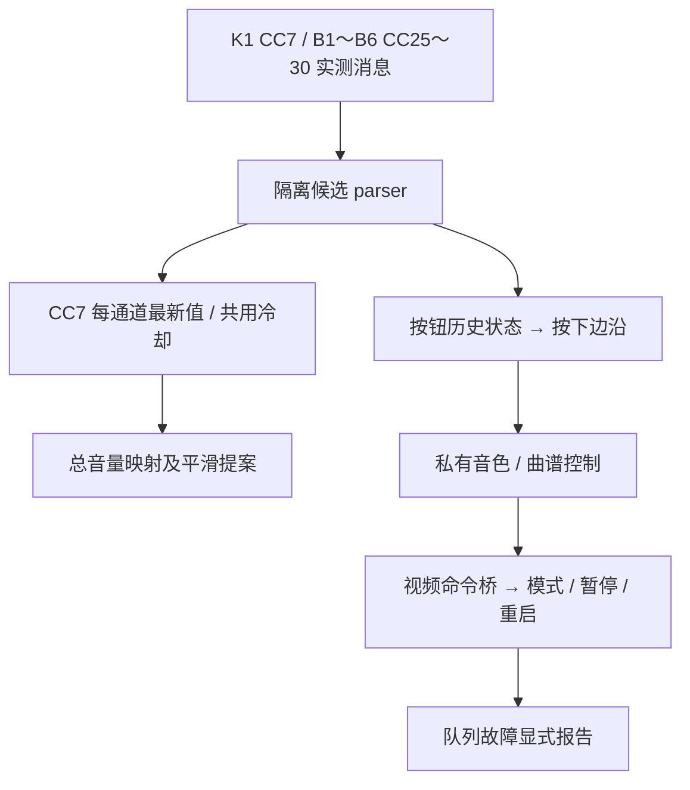
```mermaid
flowchart TD
    A["K1 CC7 / B1～B6 CC25～30 实测消息"] --> B["隔离候选 parser"]
    B --> C["CC7 每通道最新值 / 共用冷却"]
    B --> D["按钮历史状态 → 按下边沿"]
    C --> E["总音量映射及平滑提案"]
    D --> F["私有音色 / 曲谱控制"]
    F --> G["视频命令桥 → 模式 / 暂停 / 重启"]
    G --> H["队列故障显式报告"]
```

**输入输出格式定义**

| 接口 / 数据 | 格式、含义与边界 |
|---|---|
| MIDI 证据格式 | CC7 为 `Bn 07 vv`；CC25～30 的控制器字节为十六进制 `19～1E`；实测按钮按下 127、松开 0，channel 编码 0。 |
| 候选解析输出 | 复用事件 valid/ready；CC7 独立于 CC1 保存最新值，避免把音量变化误当调制深度。 |
| 按钮动作 | 按 source/channel/button 保存前值，只在低→高时动作；B4～B6 当前不分配动作。 |
| 控制协议 | 私有命令及公共候选编号 7/8/9 尚未正式发布，不可据此向生产核心发送自定控制消息。 |
| 显示故障 | 有限队列无法保留离散操作时置 `video_fault` 并暂停判定，按合同等待共享复位恢复。 |

**设计流程与交接约束**

面板路径当前是隔离候选：输入实测、解析验证、音量数学提案和正式音频接入是不同交付项。显示控制不能拉住正式音频 ready；按钮触发不能用任意屏蔽时间代替边沿语义。采样平滑和音量范围仍需算法签收，不把可运行候选写成正式功能。

**术语与概念解释**

| 概念 | 含义 |
|---|---|
| 瞬时按键 | 只在按下边沿触发一次动作，连续高电平不是连续触发；不擅自添加2ms屏蔽窗。 |
| 音量与力度 | 总音量作用于输出控制目标，Velocity是单音起音属性；CC7不能和CC1调制缓存混用。 |
| miter | 相同输入逐拍比较候选关闭模式与原实现，验证没有改变旧行为。 |
| 显示故障 | 明确报告队列溢出并停止错误判定，不能悄悄合并离散操作或阻塞音频。 |
| CC7 / CC1 | CC7 表示通道音量，CC1 表示 Modulation；MIDI 都是 Bn 消息，但控制器编号与消费算法不同。 |
| 前值检测 | 保存上次按钮状态，通过低→高识别一次按下；127 的重复上报不会重复触发。 |
| 音量平滑 | 将增益目标分多步接近以减小突变；具体步长和响应时间必须经算法确认。 |
| 私有协议 | 仅在指定候选内一致的编号/合同，不能未经发布就宣称兼容正式 v1.6 接口。 |

**代码文件作用简介**

| 文件 | 作用 |
|---|---|
| `code/tb/input/panel_verified_candidate/midi_event_parser.sv` | 隔离面板解析、按钮状态和CC7传输候选。 |
| `code/tb/input/panel_verified_candidate/midi_input_panel_candidate.sv` | 候选UART到面板解析封装。 |
| `code/tb/board/panel_verified_control_candidate/panel_master_volume_proposal.sv` | 总音量映射/平滑数学提案，非已批准生产算法。 |
| `code/tb/board/panel_verified_control_candidate/panel_score_transport.sv` | 曲谱模式、暂停/继续和重启控制。 |
| `code/tb/board/panel_verified_control_candidate/panel_visual_command_bridge.sv` | 显示离散命令跨域及故障状态。 |
| `code/tb/board/panel_verified_control_candidate/panel_demo_score.sv` | 自编有限练习谱数据。 |
| `code/scripts/run_panel_verified_candidate.py` | 输入/UART、曲谱/CDC、音量提案及反例/miter联合自检入口。 |

### 3.4 合成引擎：声部分配、音高、DDS、ADSR 与表情

#### 3.4.1 声部分配与释放管理

| 项目 | 内容 |
|---|---|
| 模块职责 / 介绍 | 为四个物理槽分配音符并回收/抢占。 |
| 设计要点 / 流程 | 联合身份查找→复用/空槽/相对 LRU→NoteOn；NoteOff 经延音控制后进入 Release，独立完成位回收。 |
| 输入输出 / 接口定义 | source_id/channel_id 各 4 位、midi_note[7:0]、release_done[3:0]；输出 allocated_slot/slot_valid 与 release_slot/release_target_valid。 |
| 代码位置 | `code/rtl/audio/voice_allocator_4.sv`、`code/rtl/board/polyphonic_event_router.sv` |
| 当前状态 | 旧 V0091 三项失败已修复并进入正式集成；V0137 有六类实物操作结果。T010主表已限定完成：四声部分配、释放、抢占及重触发；后续扩展另验。 |

**模块设计框图**

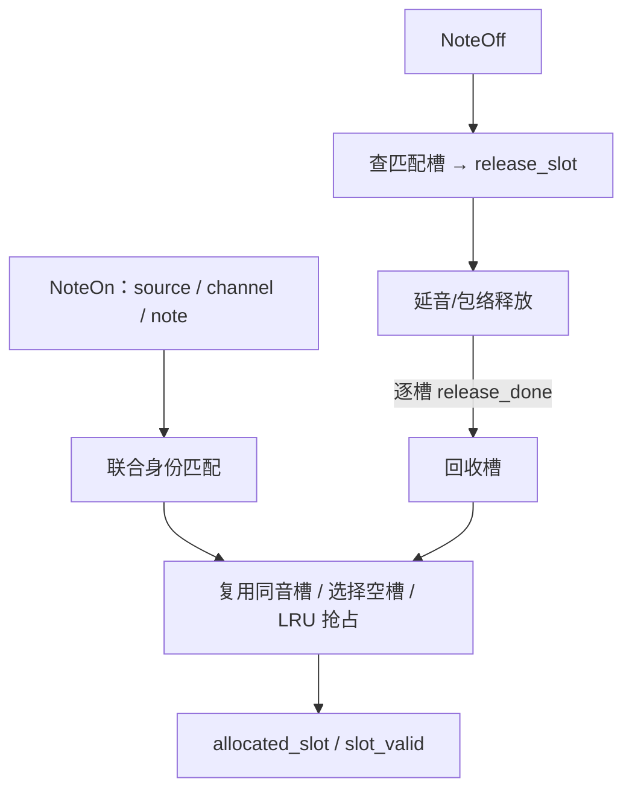
```mermaid
flowchart TD
    A["NoteOn：source / channel / note"] --> B["联合身份匹配"]
    B --> C["复用同音槽 / 选择空槽 / LRU 抢占"]
    C --> D["allocated_slot / slot_valid"]
    E["NoteOff"] --> F["查匹配槽 → release_slot"]
    F --> G["延音/包络释放"]
    G -->|"逐槽 release_done"| H["回收槽"]
    H --> C
```

**输入输出格式定义**

| 接口 / 数据 | 格式、含义与边界 |
|---|---|
| 时钟及命令 | `sys_clk/sys_rst_n`；`note_on/note_off` 为路由器生成的单拍通知，不直接接未经握手的外部串口事件。 |
| 身份输入 | `source_id[3:0]`、`channel_id[3:0]`、`midi_note[7:0]`；适配层 MIDI 有效值仍为 0～127。 |
| 分配结果 | `allocated_slot[1:0]`、`slot_valid`，有效时指出本次起音使用的 0～3 号槽。 |
| 释放结果 | `release_slot[1:0]`、`release_target_valid`，表示找到要释放的匹配槽，不等同立即空闲。 |
| 退休输入 | `release_done[3:0]` 每位对应一槽；由上层按当前身份/代次确认后处理。 |

**设计流程与交接约束**

同来源、通道和音符重触发优先复用匹配槽；没有匹配时使用空槽，四槽占满才按相对 LRU 顺序抢占。释放只匹配联合身份，因此其他通道同音不应互相松音。分配器输出槽选择，路由器负责与 generation、延音和包络通知配套，不可把孤立槽号跨事务复用。

**术语与概念解释**

| 名词 / 概念 | 含义与注意事项 |
|---|---|
| LRU | 按四槽相对使用顺序选老槽，当前 2 位相对序号不依赖旧 3 位计数回绕。 |
| 抢占 | 超出四声部时用新音符替换旧槽；旧音符后续松键不能杀死新音符。 |
| Release | 松键后的渐弱阶段，声部不立即空闲。 |
| 物理槽 | 存储一个活动音符相位、包络和身份的资源，四槽决定当前四复音上限。 |
| 同音重触发 | 同一身份再次起音时重用槽；包络从何处重新起音由包络模块定义。 |
| 联合身份匹配 | source、channel、note 全部一致才是同一音符，单独比较 note 会误释放其他输入。 |
| `slot_valid` | 本次分配结果有效的通知，不能当“该槽永久发声”的状态位。 |

**代码文件作用简介**

| 文件（仓库相对路径） | 作用 |
|---|---|
| `code/rtl/audio/voice_allocator_4.sv` | 四槽联合身份匹配、相对 LRU 抢占和逐槽释放完成处理。 |
| `code/rtl/board/polyphonic_event_router.sv` | 保持事件与分配结果，协调延音、释放和采样调度。 |

#### 3.4.2 音高查表与 FCW

| 项目 | 内容 |
|---|---|
| 模块职责 / 介绍 | 把 MIDI 音符号转换成采样域相位步长。 |
| 设计要点 / 流程 | 十二半音基表→八度移位→32 位 FCW；表情消费者将来叠加频率修正。 |
| 输入输出 / 接口定义 | note_number→phase_step/FCW，正式 DDS 每音频采样推进一次。 |
| 代码位置 | `code/rtl/common/note_pitch.sv`、`code/model/dds_model.py` |
| 当前状态 | 基础音高已进入四声部；不能混用 50 MHz 固定测试音 FCW 与 48 kHz 采样 FCW。 |

**模块设计框图**

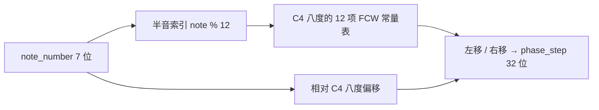
```mermaid
flowchart LR
    A["note_number 7 位"] --> B["半音索引 note % 12"]
    B --> C["C4 八度的 12 项 FCW 常量表"]
    A --> D["相对 C4 八度偏移"]
    C --> E["左移 / 右移 → phase_step 32 位"]
    D --> E
```

**输入输出格式定义**

| 接口 / 数据 | 格式、含义与边界 |
|---|---|
| 输入 | `note_number[6:0]`，0～127；69 为 A4，60 为 C4。 |
| 输出 | `phase_step[ACC_BITS-1:0]`，默认 32 位无符号，表示每个音频采样的相位增量。 |
| 参考关系 | `f=440×2^((note−69)/12)`，`FCW≈round(f×2^32/48000)`；A4=39370534。 |
| 实现形式 | 组合查 12 项预计算表，按八度作整数移位；移位量化与逐音符直接浮点舍入不必逐 LSB 相同。 |
| 参数限制 | `SAMPLE_RATE_HZ` 用于语义说明，表为固定常量，修改该参数不会自动重算表；换采样率须重新核定常量。 |

**设计流程与交接约束**

FCW 增大时相位每采样前进更多，音高升高；增加一个八度等价于步长翻倍。此模块没有时钟/ready 端口，消费者应在正确采样/音符锁存时点使用组合输出。32 位步长属于 48 kHz 音频采样口径，不能用于每个 50 MHz 时钟都更新相位的振荡器。

**术语与概念解释**

| 名词 / 概念 | 含义与注意事项 |
|---|---|
| 半音/音分 | 十二平均律相邻半音频率比 2^(1/12)，一半音 100 音分。 |
| 奈奎斯特频率 | 48 kHz 采样的一半为 24 kHz，谐波超出会折返混叠。 |
| `FCW` / `phase_step` | Frequency Control Word，即每次推进相位加上的整数；它不是频率 Hz 的直接整数值。 |
| 八度 | 频率翻倍为升高一八度，对应 MIDI 编号加 12；数字步长通常左移一位。 |
| 组合查表 | 输入改变后经组合路径得到结果，没有输出有效脉冲；时序收敛仍取决于后级锁存路径。 |
| 量化音高误差 | FCW 只能取整数，低音移位舍弃低位会产生很小的频率偏差，需按实际表核对。 |

**代码文件作用简介**

| 文件（仓库相对路径） | 作用 |
|---|---|
| `code/rtl/common/note_pitch.sv` | 12 半音常量表与八度移位，将音符号转换为 48 kHz 采样域相位步进。 |
| `code/model/dds_model.py` | 音符/频率/FCW 换算、波表振荡器及 PCM 参考渲染。 |

#### 3.4.3 DDS / 波表振荡器

| 项目 | 内容 |
|---|---|
| 模块职责 / 介绍 | 按相位累加和查表产生每槽周期波形。 |
| 设计要点 / 流程 | 采样使能→相位累加→表索引→同步 ROM→样本；V1 依据音高/力度/起音选择谐波表。 |
| 输入输出 / 接口定义 | dds：sys_clk/sys_rst_n/sample_tick/fcw→wt_sample；piano_dds 另含 note_on/velocity。 |
| 代码位置 | `code/rtl/audio/dds_oscillator.sv`、`code/rtl/audio/piano_dds_oscillator.sv`、`code/rtl/common/simple_voice.sv` |
| 当前状态 | 正式top已启用Program0 V1/1三角，初始为V1；正弦保留对照用途；V0132/V0142 已有模型和算法签收。V1 起音即时换表仍有重触发/抢占瞬态条件，不承诺全部相位连续。 |

**模块设计框图**

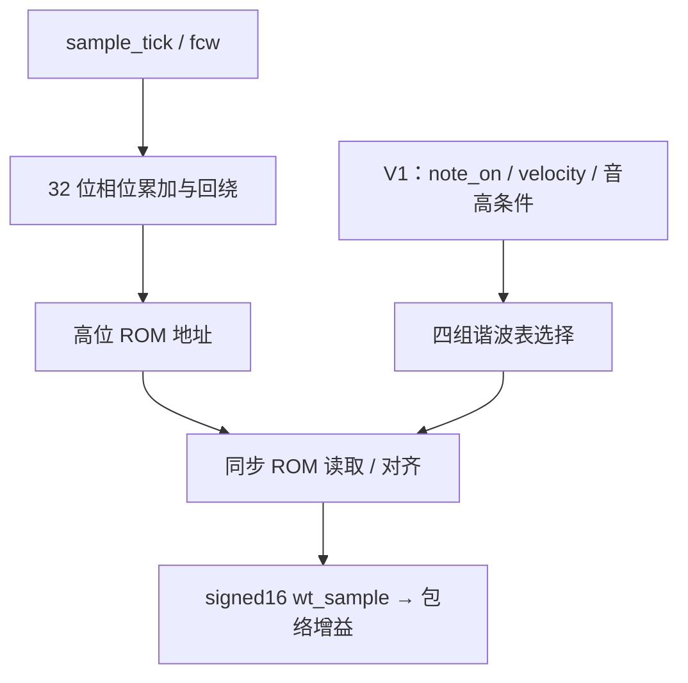
```mermaid
flowchart TD
    A["sample_tick / fcw"] --> B["32 位相位累加与回绕"]
    B --> C["高位 ROM 地址"]
    D["V1：note_on / velocity / 音高条件"] --> E["四组谐波表选择"]
    C --> F["同步 ROM 读取 / 对齐"]
    E --> F
    F --> G["signed16 wt_sample → 包络增益"]
```

**输入输出格式定义**

| 接口 / 数据 | 格式、含义与边界 |
|---|---|
| 正弦 DDS 输入 | `sys_clk/sys_rst_n`、`sample_tick`、`fcw[31:0]`；每次采样使能推进一次相位。 |
| V1 扩展输入 | `note_on`、`velocity[9:0]`；起音与力度参与亮度/波表选择。 |
| 波形输出 | `wt_sample` 为 signed16；未声明独立 valid 的 DDS 由银行按 ROM/采样流水线对齐后取值。 |
| 正弦 ROM | 1024×16 位；复用模块默认文件名含峰值 32767，正式路径需显式使用已核定幅度 ROM，不能依赖默认文件。 |
| V1 ROM | `piano_band_4x256_8191.mem`，四组 256 点；表组与相位地址共同定位样本。 |

**设计流程与交接约束**

相位推进、同步读表和后级取样之间存在拍序，不能在 sample_tick 同沿直接假定新地址数据已输出。V1 的换表和起音策略影响瞬态，即使相位没有清零，波形幅度仍可能突变。正式动态音色由银行控制，正弦、V1、三角的独立验证结论不可相互替代。

**术语与概念解释**

| 名词 / 概念 | 含义与注意事项 |
|---|---|
| DDS | 直接数字频率合成：相位步长控制音高，查表定义波形。 |
| 相位连续 | 改变音高时可保留相位，但更换幅度表仍可能产生采样差。 |
| 拍频 | 相近频率叠加造成慢速响度起伏，不必然是欠载。 |
| 相位累加器 | 用模 2^32 的计数表示一个周期中的位置；溢出回绕是正常周期行为。 |
| 同步 ROM | 地址在时钟沿被采样后数据才更新，读取具有延迟，需要与包络/请求代次对齐。 |
| 谐波亮度 | 高次谐波比例越高常听起来越明亮；力度可以改变波表选择，不只改变音量。 |
| `wt_sample` | 当前波表幅度样本，尚未经过包络和最终混音，不能直接当正式 PCM24 幅度。 |

**代码文件作用简介**

| 文件（仓库相对路径） | 作用 |
|---|---|
| `code/rtl/audio/dds_oscillator.sv` | 1024 点正弦 DDS，正式集成明确选用峰值 8192 ROM。 |
| `code/rtl/audio/piano_dds_oscillator.sv` | 四组 256 点 V1 谐波表、起音/力度亮度与相位回绕换表。 |
| `code/rtl/common/simple_voice.sv` | 历史单声部/对照实现，不再承担正式四声部核心。 |

#### 3.4.4 ADSR 包络

| 项目 | 内容 |
|---|---|
| 模块职责 / 介绍 | 控制每个声部起音、衰减、保持和释放幅度。 |
| 设计要点 / 流程 | 事件预计算步长→采样使能推进包络→四槽结果锁存，与波形和请求代次一起交付。 |
| 输入输出 / 接口定义 | note_on/off、velocity[9:0]、sample_tick→envelope_level[15:0]、state_out[2:0]；bank 输出四槽波形/包络/req_id。 |
| 代码位置 | `code/rtl/audio/adsr_piano_envelope.sv`、`code/rtl/board/polyphonic_envelope_bank.sv`、`code/scripts/run_adsr_pipeline_isolated.py`、`code/scripts/run_audio_visual_pipeline_compare.py` |
| 当前状态 | 已进入正式 V1+CC64；原算法和当前实现证据按 V0132/V0142 理解。V0153/V0154 新算术流水线为隔离研究/组合构建，尚非正式源码全面替换。 |

**模块设计框图**

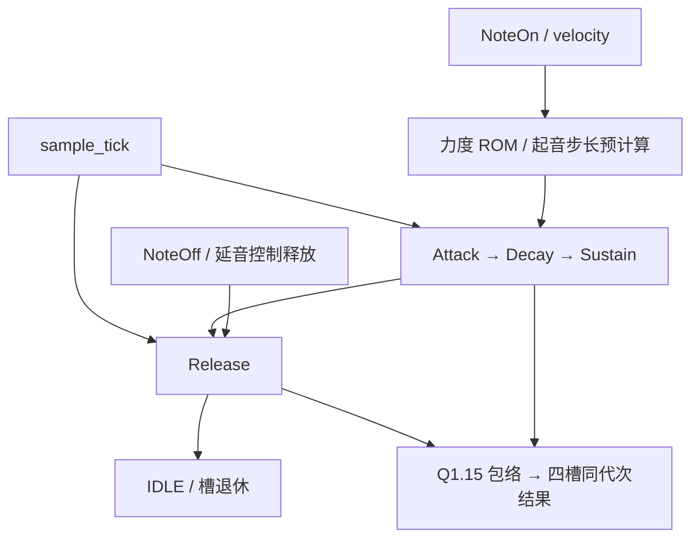
```mermaid
flowchart TD
    A["NoteOn / velocity"] --> B["力度 ROM / 起音步长预计算"]
    B --> C["Attack → Decay → Sustain"]
    D["NoteOff / 延音控制释放"] --> E["Release"]
    C --> E
    E --> F["IDLE / 槽退休"]
    G["sample_tick"] --> C
    G --> E
    C --> H["Q1.15 包络 → 四槽同代次结果"]
    E --> H
```

**输入输出格式定义**

| 接口 / 数据 | 格式、含义与边界 |
|---|---|
| 单槽输入 | `sys_clk`、低有效异步断言 `sys_rst_n`、单拍 `note_on/note_off`、`sample_tick`、10 位 `velocity`。 |
| 包络输出 | `envelope_level[15:0]`，有效范围 0～32767；数值除以 32768 得到近似增益。 |
| 调试状态 | `state_out[2:0]`：IDLE=0、ATTACK=1、DECAY=2、SUSTAIN=3、RELEASE=4；内部 LOAD_1/2 对外归入 ATTACK。 |
| 本版时长 | Attack 240 样本约 5 ms，Decay/Release 各 4800 样本约 100 ms，按 48 kHz 换算；Sustain 使用钢琴式缓慢衰减。 |
| 银行结果 | `result_envelopes[63:0]`、`result_waves[63:0]` 各四组 16 位；另携 `result_req_id[31:0]`、`result_occupied[3:0]`、四槽状态/FCW。 |

**设计流程与交接约束**

NoteOn 先查力度增益 ROM 并预计算阶段步长；音频使能驱动包络逐样本变化，普通 50 MHz 空拍不推进音色时间。该版重触发保留当前包络电平作为起点。四槽 bank 将相位、包络和请求身份一并锁存，并在结果背压时保持，避免新事件污染旧帧结果。

**术语与概念解释**

| 名词 / 概念 | 含义与注意事项 |
|---|---|
| ADSR | Attack 起音、Decay 衰减、Sustain 保持、Release 释音；IDLE 为空闲。 |
| 重触发 | 相同音符再次按下，需要定义起始幅度/相位，不能靠每次清零掩盖跳变。 |
| bank | 按四槽组织包络/波形调度，不等于新增时钟域。 |
| Attack / Decay | 起音上升到力度决定的峰值，再衰减到保持段水平；阶段时长按音频样本数衡量。 |
| Sustain 段 / Sustain 踏板 | ADSR 的 Sustain 是包络阶段，CC64 Sustain 是推迟松音的输入控制；两者不是同一个状态位。 |
| Q16 内部累加 | 内部保留比输出更多的小数位，使小幅度步进能够累积；最终取高位形成 Q1.15 输出。 |
| LOAD 阶段 | 为同步力度 ROM 读取留出的内部拍序，不应解释成新的音乐包络阶段。 |

**代码文件作用简介**

| 文件（仓库相对路径） | 作用 |
|---|---|
| `code/rtl/audio/adsr_piano_envelope.sv` | 钢琴式五状态包络及力度表/事件预计算。 |
| `code/rtl/board/polyphonic_envelope_bank.sv` | 四槽路由、DDS/包络采样和同代次结果保持。 |
| `code/scripts/run_adsr_pipeline_isolated.py` | 在隔离输出中生成/验证 ADSR 流水线候选。 |
| `code/scripts/run_audio_visual_pipeline_compare.py` | 比较音画候选与参考的音频引脚/样本行为，防止仅看时序而漏功能差异。 |

**2026-10-06 状态与版本补充：** V0198在真实40MHz捕获上ADSR±2LSB正例通过，但整套数学验收仍待返修；该结果不等于DDS相位、音质瞬态或板上无爆音签收。

#### 3.4.5 力度、滑音/弯音、颤音与延音映射

| 项目 | 内容 |
|---|---|
| 模块职责 / 介绍 | 将演奏控制转换为幅度、音高或音符生命周期。 |
| 设计要点 / 流程 | 力度已进入增益/包络；CC64 已进入释放管理；Pitch/Mod 先更新来源/通道状态，再按四槽快照计算 FCW。 |
| 输入输出 / 接口定义 | pitch_mod_fcw：signed12 bend、unsigned12 modulation、pitch_range[4:0]、base_fcw、sample_enable/note_on→fcw_out/fcw_valid；快照含 req_id、槽 identity/generation。 |
| 代码位置 | `code/rtl/audio/pitch_mod_fcw.sv`、`code/rtl/board/performance_control_state.sv`、`code/rtl/board/performance_control_snapshot.sv`、`code/scripts/run_pitch_mod_pipeline_candidate.py` |
| 当前状态 | V0152/V0155 独立数学/流水线已验；V0164/V0173 已推进到隔离实际 V1 银行和真实 UART→PCM 候选。V0175 正式 top 副本补丁预演通过，但未应用生产源码、新正式 STA/实物未做；不宣称正式键盘表情已验收。 |

**模块设计框图**

```mermaid
flowchart TD
    A["已接受 Pitch / CC1 / 范围事件"] --> B["source × channel 控制状态候选"]
    B --> C["请求时锁存四槽 identity / generation / 控制值"]
    C --> D["定点比例 LUT + LFO → 修正 FCW"]
    D --> E["独立四槽波形消费候选"]
    F["正式 Velocity"] --> G["力度 ROM / ADSR / 增益"]
    H["正式 CC64"] --> I["延音控制器 / Release 时机"]
```

**输入输出格式定义**

| 接口 / 数据 | 格式、含义与边界 |
|---|---|
| 独立 FCW 算法输入 | `base_fcw[31:0]`、signed12 `bend`、unsigned12 `modulation`、`pitch_range[4:0]`（0～24 半音）。 |
| 时序输入 | `sys_clk/sys_rst_n`、`sample_enable`、`note_on`；起音重启 LFO 相位，算法状态按采样推进。 |
| 输出 | `fcw_out[31:0]` 与 `fcw_valid`；原模块接口和隔离流水线候选延迟不同，不能混用。 |
| 定点限制 | bend −2048～2047，Mod 0～4095；默认 LFO 5 Hz、调制深度上限约 ±50 音分，FCW 限幅参数为 2^31。 |
| 控制快照 | 记录请求 id、槽身份和 generation；仅公共事件成功握手更新已接受状态，parser 待发值不得提前生效。 |

**设计流程与交接约束**

力度控制幅度，弯音改变基础频率，CC1 通过 LFO 形成周期音高变化，CC64 改变释放时机。几条路径的量纲和生命周期各不相同。Pitch/Mod 的算法与组合候选已有专项证据，但在本文基线仍需正式集成/同版时序及实物验收；Portamento 的音符间滑行不在当前 Pitch Bend 合同内。

**术语与概念解释**

| 名词 / 概念 | 含义与注意事项 |
|---|---|
| Pitch Bend | 相对基础音高的正负偏移，回中为 0。 |
| Mod/LFO | CC1 控制低频振荡引起的周期音高变化；默认数学 LFO 5 Hz。 |
| 快照 | 把本次样本使用的各槽身份与控制值固定，防止中途抢占混入旧代次。 |
| 流水线延迟 | 候选 E 接收，E+6 有效/E+7 消费；不等于原 pitch_mod_fcw 的单输出寄存接口延迟。 |
| `base_fcw` | 音符本身对应的步长；乘上弯音/颤音比例后才得到当前采样的修正步长。 |
| `pitch_range` | 满量程弯音对应的半音范围；相同 bend 值在不同范围下产生不同音高偏移。 |
| LFO | 低频振荡器，这里用于周期调制音高；5 Hz 表示每秒约五次变化，不是可闻基音。 |
| Portamento | 从一个音高按时间连续滑向另一个音高，需要独立目标与过渡规则，不能把所有弯音都称为此功能。 |

**代码文件作用简介**

| 文件（仓库相对路径） | 作用 |
|---|---|
| `code/rtl/audio/pitch_mod_fcw.sv` | 原 Pitch/Mod 定点比例 LUT、LFO 与 FCW 数学实现，独立验证。 |
| `code/rtl/board/performance_control_state.sv` | 按来源/通道保存已接受的 Pitch/Mod/范围控制状态。 |
| `code/rtl/board/performance_control_snapshot.sv` | 以共享读口串行形成四槽控制快照并保存请求/槽代次。 |
| `code/scripts/run_pitch_mod_pipeline_candidate.py` | 在隔离目录生成并验证 Pitch/Mod 流水线与四槽消费候选；产物未自动替换正式 FCW。 |

**2026-10-06 状态与版本补充：** 138K L冻结音画候选包含Pitch/Mod链路并已有V0197 L5；与60K正式音频主线部署状态分开。V0198完整DDS/FCW/phase反例检查未收口，实机弯音/颤音仍无新版L6。

### 3.5 混音与效果：宽位累加、限幅、延迟与音色

#### 3.5.1 多声部混音与饱和限幅

| 项目 | 内容 |
|---|---|
| 模块职责 / 介绍 | 四路有符号 PCM 合成为左右声道并报告削波。 |
| 设计要点 / 流程 | 波表×Q15 包络→定标 PCM24→32 位累加→24 位饱和→成功提交计数。 |
| 输入输出 / 接口定义 | voices_left/right[95:0]，各四路 PCM24；mixed_left/right[23:0] 与 clip_left/right/any。 |
| 代码位置 | `code/rtl/mixer/pcm_mixer_4voice.sv`、`code/rtl/board/voice_gain_q15_candidate.sv`、`code/rtl/common/pcm_clip_counter.sv` |
| 当前状态 | 已经正式集成；左右当前由同组 voices 驱动，为双单声道内容，不等于独立立体声声像。T023已限定完成：模型对照和正式PCM接入；新组合另验。 |

**模块设计框图**

```mermaid
flowchart TD
    A["每槽 signed16 波表 × unsigned16 包络"] --> B["signed33 乘积 → 算术右移 15"]
    B --> C["signed16 样本左移 8 → PCM24"]
    C --> D["左右各四路符号扩展到 32 位累加"]
    D --> E["饱和到 signed24 / clip_left、right"]
    E --> F["结果保持 → 成功提交才计 clip_count"]
```

**输入输出格式定义**

| 接口 / 数据 | 格式、含义与边界 |
|---|---|
| 单槽增益输入 | `wave_sample` signed16；`envelope[15:0]` 按无符号 Q1.15，合同限定 ≤32767。 |
| 单槽运算 | 乘积显式扩为 signed33，`product >>> 15` 向负无穷取整；取 signed16 后低位补 8 个零形成 PCM24。 |
| 混音输入 | `voices_left/right[95:0]` 各打包四路 24 位样本，第 i 槽使用 `[24*i +: 24]`，每路需按 signed24 解释。 |
| 混音输出 | `mixed_left/right` signed24，范围 −8388608～8388607；`clip_left/right/any` 为是否发生饱和的标志。 |
| 提交计数 | 保持/重试期间不增加 clip_count；同一组左右 PCM 成功提交且任一声道削波时加一次。 |

**设计流程与交接约束**

宽位累加保存多声部相加的增长位，再执行明确上下限比较，防止截断回绕。增益模块为组合算术，外围银行与保持器负责时序对齐。D028 的单声部幅度余量依赖正确 ROM 和包络范围；换成满幅 ROM 不能靠后端饱和代替重新定标。当前左右使用同组声部，属于双单声道输出。

**术语与概念解释**

| 名词 / 概念 | 含义与注意事项 |
|---|---|
| 余量 | 为多声部叠加预留幅度空间；D028 单声部峰值约满幅四分之一。 |
| 饱和 | 超范围限制在最大/最小数，避免整数回绕产生反向跳变。 |
| 符号扩展 | 扩位时复制符号位，保证负样本扩成 32 位后仍为负；补零会产生巨大正偏置。 |
| floor-Q15 | 乘积算术右移 15 位，负数向负无穷取整；与加半 LSB 后四舍五入是不同算法。 |
| PCM24 定标 | 本版 16 位增益样本补 8 个低零位进入 24 位通路，扩大数字刻度，不增加原波形有效精度。 |
| 削波标志 | 表示超范围后执行了饱和；没有削波不自动证明声音无点击、无欠载或无失真。 |

**代码文件作用简介**

| 文件（仓库相对路径） | 作用 |
|---|---|
| `code/rtl/mixer/pcm_mixer_4voice.sv` | 四路/双声道宽位累加和 PCM24 饱和标志。 |
| `code/rtl/board/voice_gain_q15_candidate.sv` | 波形与包络相乘、floor-Q15 算术右移及定标后输出 PCM；虽名 candidate，已由正式 core 实例化。 |
| `code/rtl/common/pcm_clip_counter.sv` | 对成功提交且 clip_any 的样本组计数，饱和并复位清零。 |

#### 3.5.2 延迟效果器

| 项目 | 内容 |
|---|---|
| 模块职责 / 介绍 | 对混音 PCM 加入延迟回声、干湿混合和反馈；已有独立 RTL，尚未接生产音频链路。 |
| 设计要点 / 流程 | 环形缓存读历史；dry/wet/feedback 各乘积先 floor 算术右移 15 位，再相加并饱和 PCM24；输入/参数在采样使能时锁存，算法 E→E+2 输出。 |
| 输入输出 / 接口定义 | delay_effect：50 MHz sys_clk、低有效异步复位、sample_enable、signed PCM24 pcm_in、delay_samples[15:0]、unsigned Q0.15 dry_gain/wet_gain/feedback[14:0]→pcm_out/pcm_valid；DEPTH 为 2 的幂，默认 1024。 |
| 事务接口 | G 候选 request_valid/ready、id32、monoPCM24 与参数→result_valid/ready、id32/monoPCM24；单在途，背压保持。cancel 丢弃结果并排空旧计算，但不回滚已接受样本的历史；reset 才清历史。 |
| 当前状态 | T028 进行中；V0169 独立 L2/L3 已签收。G/H 候选V0177/V0178已分别签收，I的50MHz修正V0181已签收，未进入生产 core/commit/bank；参数切换无爆音、正式资源/STA 与实物未验。 |
| 容量边界 | V0181已核对修正后的三档20ns/50MHz实际综合证据，独立L4合同通过；1024/4096/16384对应BSRAM2/6/24、RAM16SDP1 64/256/1024。DSP汇总unknown，每档MULTALU27X18原语3。未PnR/整机STA，500ms未实现。 |

**模块设计框图**

```mermaid
flowchart TD
    A["采样使能锁存 PCM / dry / wet / feedback"] --> B["环形 RAM 读取旧历史 d"]
    A --> C["dry × x"]
    B --> D["wet × d"]
    C --> E["各乘积先右移 15 → 相加饱和 → pcm_out"]
    D --> E
    B --> F["feedback × d → 右移 15"]
    F --> G["加当前输入 x → 饱和 → 写回 RAM"]
    G --> B
```

**输入输出格式定义**

| 接口 / 数据 | 格式、含义与边界 |
|---|---|
| 算法输入 | `pcm_in` signed24、`sample_enable`；低有效异步断言复位，50 MHz 时钟，按音频采样使能锁定输入和参数。 |
| 控制参数 | `delay_samples[15:0]`；`dry_gain/wet_gain/feedback[14:0]` 为无符号 Q0.15，范围 0～32767。 |
| 算法输出 | `pcm_out` signed24，`pcm_valid` 为结果有效；算法路径 E 接受、E+2 输出，不带下游 ready。 |
| 存储地址 | `rd_ptr=(wr_ptr−delay_samples低地址位) mod DEPTH`，DEPTH 为 2 的幂；delay=0 读到上一整圈同地址旧值。 |
| 事务候选 G | request/result 各自 valid/ready，携带 id32、单路 PCM24 和锁存参数；单在途并支持取消排空。 |

**设计流程与交接约束**

设 x 为当前输入、d 为读出的历史样本，Q(g,s)=floor(g×s/32768)，则 `输出=sat24(Q(dry,x)+Q(wet,d))`，`写回=sat24(x+Q(feedback,d))`。两项乘积先分别截断，再相加，不能先求和后统一移位。声音结束后继续输入零样本推进历史以保留尾音；cancel 不回滚已接受输入的历史，reset 才清除历史。

**术语与概念解释**

| 名词 | 解释 |
|---|---|
| 干湿比 | 原声 dry 与历史回声 wet 的增益组合；Q0.15 最大 32767，略小于 1。 |
| 反馈 | 将历史样本按增益写回环形缓存，形成多次回声；必须做饱和和边界验证。 |
| delay=0 | 当前合同表示整 DEPTH 圈旧历史，不是真零延迟或旁路；默认 1024 点/48 kHz 为约 21.333 ms。 |
| 尾音 | 所有声部释放后仍可能有缓存回声，需要继续输入零样本推进，不能立刻清空效果。 |
| 取消与复位 | cancel 只取消事务可见结果，保留已接受样本对历史的影响；reset 清历史，二者不可混用。 |
| mono effect | 当前候选效果只处理一路混音再复制左右，不能称独立立体声效果。 |
| 环形缓存 | 固定容量 RAM 的地址到末端后回绕；写指针表示当前历史位置，不代表无限音频存储。 |
| Q0.15 | 增益整数除以 32768，32767 约等于 0.99997；最大值不是精确 1。 |
| 延迟容量 | N 点在 48 kHz 下约为 N/48000 秒；1024 点约 21.333 ms，不能宣传为 500 ms。 |
| 单在途事务 | 前一次请求未完成/排空前不接受下一次；ready 表示真实接受能力，不是算法采样脉冲。 |

**代码文件作用简介**

| 文件 | 作用 |
|---|---|
| `code/rtl/audio/delay_effect.sv` | 已签收独立定点延迟 RTL、环形缓存与反馈/饱和。 |
| `code/model/delay_effect_fixed.py` | 定点算法参考，口径以当前合同为准。 |
| `code/model/generate_delay_vectors.py` | 生成延迟自检向量。 |
| `code/tb/audio/tb_delay_effect.sv` | 独立算法原始自检。 |
| `code/scripts/run_m3_delay_acceptance.py` | 独立整数参考、生命周期和故障反例验收入口。 |
| `code/tb/board/m3_delay_transaction_candidate/m3_delay_transaction_adapter.sv` | G 候选：锁定参数/id、结果背压和取消排空。 |
| `code/tb/board/m3_delay_transaction_candidate/oracle.py` | 独立递推历史与事务期望值。 |
| `code/scripts/run_m3_delay_transaction_candidate.py` | 运行两深度 G 候选和行为反例。 |
| `code/tb/board/m3_delay_pcm_acceptance/tb_delay_pcm.sv` | H：实际银行、混音、效果和原帧缓存连接测试。 |
| `code/tb/board/m3_delay_pcm_acceptance/scoreboard.py` | 核对混音、反馈历史、PCM、帧代次和欠载。 |
| `code/scripts/run_m3_delay_pcm_acceptance.py` | H 接线验收和捕获数据检查入口。 |
| `code/tb/board/m3_delay_memory_probe/m3_delay_memory_probe.sv` | I：保持真实输入输出的缓存容量综合探针。 |
| `code/tb/board/m3_delay_memory_probe/test_report.py` | 对时钟/器件/资源缺失与异常报告进行检查器自检。 |
| `code/scripts/run_m3_delay_memory_probe.py` | 三档综合、原始报告身份保存和合同校验；V0181已签收修正运行原报告；独立综合不代替整机STA。 |

#### 3.5.3 音色配置与切换

| 项目 | 内容 |
|---|---|
| 模块职责 / 介绍 | 定义波形/谐波结构及选择时点。 |
| 设计要点 / 流程 | 正式路由按来源/通道保存Program0 V1/1三角选择，在下一次NoteOn锁槽；旧音不跟随。独立timbre_oscillator的正弦/三角接口保留，不应与正式V1/三角策略混淆。 |
| 输入输出 / 接口定义 | timbre_oscillator 输入 fcw、timbre_select、note_on/off、sample_tick；输出 sample_out/sample_valid；采样 E→E+3。 |
| 代码位置 | `code/rtl/audio/timbre_oscillator.sv`、`code/rtl/audio/piano_dds_oscillator.sv` |
| 当前状态 | V0184已完成动态双音色正式数字/L5；8237Logic/4593Reg/24DSP/16BSRAM，Fmax50.064MHz、Setup+0.026/Hold+0.001ns。未新版L6，映射政策未获M1签收，不能当稳定烧录包。用户 10 月 2 日保留 V1；pop_repair 下 V2/V3 为隔离研究，不是当前正式替代品。 |

**模块设计框图**

```mermaid
flowchart TD
    A["MIDI Cn program"] --> B["离散事件 CTRL_VOICE_SELECT"]
    B --> C["路由器按来源/通道保存 Program 0 或 1"]
    C --> D["下一次 NoteOn 分配时锁定槽音色"]
    D --> E["V1 钢琴表 / 三角表 → 包络与混音"]
    F["已经发声的其他槽"] --> G["保留原音色直到生命周期结束"]
```

**输入输出格式定义**

| 接口 / 数据 | 格式、含义与边界 |
|---|---|
| MIDI 输入 | `Cn pp`，一数据字节，pp 原样 0～127；解析器不做“第几个音色”的加一转换。 |
| 正式控制事件 | `EVENT_CONTROL_CHANGE`、`control_id=CTRL_VOICE_SELECT=5`、`control_value=pp`；source/channel 保留。 |
| 正式选择策略 | Program0=V1、Program1=三角；其他号忽略。状态按来源/通道保存，新 NoteOn 时锁存到槽。 |
| 独立振荡器接口 | `timbre_oscillator` 的 `timbre_select` 1 位选择正弦/三角，输入 fcw32、note_on/off、sample_tick，输出 signed16 `sample_out/sample_valid`。 |
| 接口边界 | 独立模块的 0=正弦与正式 Program0=V1 不同；应看实例组合，不能按相同数值直接等同。 |

**设计流程与交接约束**

Program 作为离散事件与 Note 保序，因此 Program→Note 的顺序决定新槽选择。改变通道配置不立即重写旧槽，避免按住的音被中途切换；重触发行为随下一次 NoteOn 锁存。独立 `timbre_oscillator` 的 E→E+3 数据有效时序不代表整个正式 V1 银行同样只延迟三拍。

**术语与概念解释**

| 名词 / 概念 | 含义与注意事项 |
|---|---|
| 音色 | 相同基频下由谐波组成和随时间变化决定的听感。 |
| NoteOn 锁存 | 新音开始时确定该音音色，避免按住音随配置立即变化。 |
| 回绕换表/即时换表 | 相位回绕更新与 NoteOn 即时选择是不同场景，后者仍需说明瞬态条件。 |
| Program 编号 | MIDI 线缆上的 0～127 原始数；某些设备界面显示为 1～128，必须区分显示编号与实际字节。 |
| 槽音色 / 通道配置 | 通道配置是下一次起音的默认选择，槽音色是该音生命周期内锁存的选择。 |
| 音色策略签收 | 确认 Program 与具体波形的产品含义；RTL 可运行不等于该映射已经获得算法负责人确认。 |
| 波形与包络 | 波表决定周期内形状，包络决定随时间的幅度；仅换波形不等于完整乐器音色建模。 |

**代码文件作用简介**

| 文件（仓库相对路径） | 作用 |
|---|---|
| `code/rtl/audio/timbre_oscillator.sv` | 独立正弦/三角振荡器，保持释放相位与 NoteOn 音色锁存。 |
| `code/rtl/audio/piano_dds_oscillator.sv` | 正式 V1 钢琴式谐波音色实现。 |

**本轮正式接入文件**

| 文件 | 作用 |
|---|---|
| `code/rtl/board/electronic_piano_top.sv` | 显式启用DYNAMIC_TIMBRE_ENABLE，正式端口不扩展。 |
| `code/rtl/board/polyphonic_event_router.sv` | 按来源/通道存储Program选择，并向新NoteOn槽传递。 |
| `code/rtl/board/polyphonic_envelope_bank.sv` | 四槽音色锁存和V1/三角波采样调度。 |
| `code/scripts/run_t027_midi_program_top.py` | 真实50MHz/31250 UART Program到PCM/串行端口自检。 |
| `code/scripts/run_t027_dynamic_bank.py` | 四槽动态音色、旧音保持与频谱对照。 |
| `code/scripts/run_t027_dynamic_core.py` | 动态音色到PCM的核心回归。 |
| `code/build/electronic_piano.gprj` | 正式双音色源和ROM构建清单，当前模式对应16 BSRAM门禁。 |

### 3.6 音频串行发送：PCM 交付、位宽转换与 LSBJ

#### 3.6.1 PCM 样本交付与帧缓存

| 项目 | 内容 |
|---|---|
| 模块职责 / 介绍 | 保证左右样本、削波标志和请求代次一致交付。 |
| 设计要点 / 流程 | 帧请求→计算结果锁存→代次匹配/握手→帧缓存→下一播放边界；迟到结果作废，缺样保持。 |
| 输入输出 / 接口定义 | sample_req/req_id、result_valid/ready/result_req_id、左右 PCM/clip；输出播放 PCM、commit_pulse 和计数。 |
| 代码位置 | `code/rtl/board/polyphonic_pcm_commit.sv`、`code/rtl/audio_out/pcm_result_hold.sv`、`code/rtl/audio_out/pcm_frame_buffer.sv` |
| 当前状态 | 正式 core 已接入；V0126 显式 commit_pulse 修复综合后耗时统计信号被优化的问题。T055 仍进行中，现有逐帧行为不等于所有负载上板通过。 |

**模块设计框图**

```mermaid
flowchart TD
    A["i2s_tx 完整帧 frame_tick"] --> B["帧缓存更新 req_id / 检查 calc_ready"]
    B --> C["sample_req → 核心计算"]
    C --> D["同代次 PCM + clip → pcm_result_hold"]
    D --> E["pcm_valid/ready 成功提交 → pending"]
    E --> F["下一播放边界取样 / 无新样本则保持上一组"]
    F --> G["LSBJ 播放"]
```

**输入输出格式定义**

| 接口 / 数据 | 格式、含义与边界 |
|---|---|
| 请求 | `sample_req` 单拍、`sample_req_id[31:0]`；frame_tick 推进代次，仅 calc_ready 时发请求。 |
| 计算结果 | result_valid/ready、result_req_id32、左右 signed24、clip_any；保持器拒绝不匹配的旧结果并保持当前有效结果。 |
| 提交接口 | `pcm_valid/ready`、`pcm_req_id[31:0]`、`pcm_left/right`；不是直接接 i2s_tx 的旧 `ready`。 |
| 缓存与播放 | 一组 pending 左右样本及 held 上一组样本；`play_left/right` 为正式播放源。 |
| 计数 | frame/request/commit/underrun 各 uint32；请求 id 用于代次识别，与饱和统计计数用途不同。 |

**设计流程与交接约束**

frame_tick 分支优先建立新一代请求并消费已提交样本；同一边界的迟到数据不能偷渡为新代次。未拿到第一组有效播放数据前输出静音；开始播放后若边界缺样，保持上一组并累计欠载。左右、clip 与 id 必须整体保存，背压时不能只保持样本而让标志或身份变化。

**术语与概念解释**

| 名词 / 概念 | 含义与注意事项 |
|---|---|
| 原子提交 | 左右声道及 clip 属于同一请求，不能分别更新。 |
| 欠载保持 | 缺样重复上一有效帧；缺少首个有效样本时保持静音。 |
| `req_id` | 样本计算事务的 32 位代次，区分新请求与迟到结果；不是 MIDI 音符身份。 |
| pending / held | pending 是已收到但等待播放边界的数据，held 是最近实际保持的播放样本。 |
| 欠载 | 播放需要新样本时没有及时有效结果；保持上一样本可维持串行时序，但声音仍可能失真。 |
| 取消旧代次 | 新帧到来后旧计算结果不再拥有提交资格，防止迟到的样本错配到下一帧。 |

**代码文件作用简介**

| 文件（仓库相对路径） | 作用 |
|---|---|
| `code/rtl/board/polyphonic_pcm_commit.sv` | 正式请求调度、混音结果保持、帧提交与显式 commit_pulse。 |
| `code/rtl/audio_out/pcm_result_hold.sv` | 反压下保持同代次 PCM/clip，拒绝不匹配的旧结果。 |
| `code/rtl/audio_out/pcm_frame_buffer.sv` | 暂存下一帧并管理重复播放和欠载。 |

**2026-10-06 状态与版本补充：** V0195正常5849握手对应5848完整立体声帧，差值来自首尾未配对半槽，不是丢帧。诊断第14/15/16采用帧保持旧值并各增欠载，第17帧恢复；数学/串行子证据不等于模拟音质。

#### 3.6.2 24 位到 16 位转换与 LSBJ 发送

| 项目 | 内容 |
|---|---|
| 模块职责 / 介绍 | 把内部 PCM 发给板载 PT8211。 |
| 设计要点 / 流程 | PCM24 舍入/饱和→16 位右对齐→每声道 32 BCLK 槽串行发送。 |
| 输入输出 / 接口定义 | 3.072 MHz BCLK、48 kHz WS；WS 低=右，高=左；DAC 在 BCK 上升沿采样，数据按发送器时序在下降沿更新。 |
| 代码位置 | `code/rtl/audio_out/i2s_tx.sv` |
| 当前状态 | v1.4 纠正旧左右相反与末位偏一拍；T005 数字自检、实际主声道映射和发声限定完成。残音、Vpp/专业模拟指标未全验。 |

**模块设计框图**

```mermaid
flowchart TD
    A["左右 signed PCM24"] --> B["显式符号扩展 + 128 偏置 → 右移 8 → 饱和"]
    B --> C["帧边界锁存左右 DAC16"]
    D["50 MHz 相位累加"] --> E["BCLK 翻转使能 / 64 位帧计数"]
    C --> F["每声道 32 位槽 / 末 16 位有效"]
    E --> F
    F --> G["BCLK、WS、DIN → PT8211"]
    E --> H["frame_tick"]
```

**输入输出格式定义**

| 接口 / 数据 | 格式、含义与边界 |
|---|---|
| PCM 输入 | `valid`、signed24 `pcm_left/right`；内部同组锁存，不能在左右半帧之间更换成不同请求。 |
| 位宽转换 | `biased=sign_extend(pcm)+128`，`shifted=biased >>> 8`，再限幅至 −32768～32767；中间保留 25 位避免正端进位溢出。 |
| DAC 样本编码 | 16 位补码，`0000`=0、`7FFF`=32767、`8000`=−32768；按 MSB 先发送。 |
| 物理帧 | 64 个 BCLK 为一双声道帧，每声道占 32 个 BCLK；有效样本在半帧后 16 位，LSB 对齐末端。 |
| 引脚时序 | BCLK 约 3.072 MHz、WS 约 48 kHz；WS 低=右、高=左，DIN 在下降沿更新，DAC 上升沿采样。 |
| 交付脉冲 | `frame_tick` 表示完整帧边界；`ready` 保留直接输入旧语义，不能用它替代 PCM 帧缓存的事务 ready。 |

**设计流程与交接约束**

加 128 后右移是当前指定舍入口径，恰好半 LSB 的负数也按该公式处理，不应另换成“远离零舍入”。LSBJ 的对齐判定必须以物理 WS 翻转和采样沿为准；不要因模块名叫 i2s_tx 就采用 Philips I2S 的延一位规则。BCLK 是输出时序，内部状态仍由 50 MHz 和使能推进。

**术语与概念解释**

| 名词 / 概念 | 含义与注意事项 |
|---|---|
| LSBJ | 最低有效位与半帧末端对齐的格式，不能按 Philips I2S 延一位解码。 |
| 物理 WS 边界 | 以实际引脚翻转确定左右半帧，不能用复位后的内部计数猜测。 |
| MSB / LSB | 分别是最高/最低有效位；UART 数据通常 LSB 先传，本 DAC 音频样本按 MSB 先传，不能混用。 |
| 半帧 / 完整帧 | 半帧只含一个声道，完整帧包括左右两声道；48 kHz 表示每秒左右样本组数。 |
| 舍入偏置 | 转 PCM24 到 PCM16 前加半个目标 LSB（128），改善截断误差；之后仍必须饱和。 |
| 右对齐 | 有效字的最低位靠半帧末端，前面空余位不属于额外音频精度。 |

**代码文件作用简介**

| 文件（仓库相对路径） | 作用 |
|---|---|
| `code/rtl/audio_out/i2s_tx.sv` | 相位累加产生 BCLK 使能、PCM 舍入饱和、PT8211 物理串行移位。 |

**2026-10-06 状态与版本补充：** V0195复核11696左右比较和15个舍入/饱和边界，LSBJ错位及旧帧采用反例被拒收。i2s_tx名称不改变PT8211实际LSBJ格式；新138K板级DAC输出尚未验收。

### 3.7 状态观测与自证诊断

#### 3.7.1 系统状态计数与 UART 发送

| 项目 | 内容 |
|---|---|
| 模块职责 / 介绍 | 提供真实状态与故障可观测性。 |
| 设计要点 / 流程 | 真实计数源→快照→ASCII 行→UART；正常模式输出 STAT，诊断路径可输出 DIAG。 |
| 输入输出 / 接口定义 | 七个 uint32 字段见 2.1；状态输出 U15 115200 8N1。 |
| 代码位置 | `code/rtl/common/uart_tx.sv`、`code/rtl/audio_out/pcm_frame_buffer.sv`、`code/rtl/board/electronic_piano_top.sv`、`code/rtl/board/uart_status_reporter.sv`、`code/rtl/common/system_status_counters.sv`、`code/tb/board/tb_uart_status_reporter.sv`、`code/tb/board/tb_uart_status_baud.sv`、`code/tb/board/tb_uart_status_diag.sv`、`code/tb/common/tb_system_status_counters.sv`、`code/rtl/common/pcm_clip_counter.sv`、`code/tb/common/tb_pcm_clip_counter.sv`、`code/scripts/run_t025_clip_counter_sim.ps1`、`code/tb/board/tb_t025_stat_chain.sv`、`code/scripts/run_t025_stat_chain_sim.ps1` |
| 当前状态 | 正式七字段已接入、真实 CSV 已取得；旧周期 0 数据与后续修复分开。T025 额外功能/专门补验暂停，必要故障诊断保留。 |

**模块设计框图**

```mermaid
flowchart TD
    A["声部状态 / 公共队列 / 输入丢失 / PCM 提交"] --> B["实时统计与饱和计数"]
    B --> C["约 250 ms 锁存七字段 snapshot"]
    C --> D["字段名 + 0x + 八位十六进制 + CRLF"]
    D --> E["uart_tx：115200 8N1 → U15"]
    E --> F["2.1 上位机解析与 CSV"]
```

**输入输出格式定义**

| 接口 / 数据 | 格式、含义与边界 |
|---|---|
| 快照输入 | 七个 `[31:0]` 字段，名称和量纲见 2.1；队列内部 16 位水位在顶层扩展到 32 位。 |
| 上报参数 | `CLK_HZ=50_000_000`、`BAUD=115200`、`REPORT_CYCLES=CLK_HZ/4`；时钟和复位同系统域。 |
| 行格式 | `STAT active_voice_count=0x00000004 ... max_processing_cycles=0x00000384`，每字段输出八位十六进制，末尾 CR（0x0D）+LF（0x0A）。省略号只用于此处说明，实际行七字段齐全。 |
| 输出端口 | `tx` 为串口线、`report_busy` 为整行发送忙；串行字节由独立 UART 发送器提供位时序。 |
| 模式差异 | `CLIP_COUNT_VALID=0` 时输出 DIAG，并为未知 clip 字段输出非数字占位；不能冒充七数字 STAT。 |

**设计流程与交接约束**

整行发送前锁存全部字段，期间即使真实计数变化也继续发送同一快照。周期峰值从请求到有效提交统计，新请求取消旧代次；clip 只在成功提交时加一次，输入 overflow 用饱和相加汇总。状态是低频观测，不会逐事件记录每个错误发生的精确时刻。

**术语与概念解释**

| 名词 / 概念 | 含义与注意事项 |
|---|---|
| high watermark | 队列历史峰值，用于发现瞬时拥塞。 |
| 快照一致性 | 整行使用锁存值，避免串行发送期间不同字段来自不同更新时刻。 |
| ASCII 十六进制 | `0x00000004` 是可读字符序列，串口传输长度远大于一个二进制 32 位值。 |
| CRLF | 回车和换行两个控制字符，帮助接收端确定文本行结束；不是有效状态字段。 |
| `report_busy` | 串行化整行期间的忙状态，不是音频核心正在计算的指示。 |
| 饱和汇总 | 输入侧多个丢失计数相加超 uint32 时保持最大值，防止汇总回绕成小值。 |

**代码文件作用简介**

| 文件（仓库相对路径） | 作用 |
|---|---|
| `code/rtl/common/uart_tx.sv` | 参数化 UART 字节发送器。 |
| `code/rtl/audio_out/pcm_frame_buffer.sv` | 帧请求、代次校验、待发送/上一样本缓存及欠载计数。 |
| `code/rtl/board/electronic_piano_top.sv` | 集成按键/MIDI、公共 FIFO、正式四声部、帧请求、PCM 缓冲、状态诊断及板级端口；另保留固定音诊断。 |
| `code/rtl/board/uart_status_reporter.sv` | 锁存并格式化七字段状态，按配置选择 STAT/DIAG。 |
| `code/rtl/common/system_status_counters.sv` | 汇总输入丢失计数并测量请求到成功提交的周期峰值。 |
| `code/tb/board/tb_uart_status_reporter.sv` | 发送内容、快照稳定、复位恢复检查。 |
| `code/tb/board/tb_uart_status_baud.sv` | 50 MHz 下串口位周期及整行长度检查。 |
| `code/tb/board/tb_uart_status_diag.sv` | 验证 DIAG 前缀和未知削波计数占位。 |
| `code/tb/common/tb_system_status_counters.sv` | 验证周期峰值与溢出饱和汇总。 |
| `code/rtl/common/pcm_clip_counter.sv` | 仅在有效PCM成功提交且clip_any时饱和加1；双声道算一组。 |
| `code/tb/common/tb_pcm_clip_counter.sv` | 真实帧缓存握手、削波和异常提交57项自检。 |
| `code/scripts/run_t025_clip_counter_sim.ps1` | 独立削波计数联合测试。 |
| `code/tb/board/tb_t025_stat_chain.sv` | 测试PCM经真实混音/保持/计数后到UART RX逐字节STAT的黑盒验证。 |
| `code/scripts/run_t025_stat_chain_sim.ps1` | 独立STAT链路15项断言入口。 |

#### 3.7.2 UART RX 与外部回传探针

| 项目 | 内容 |
|---|---|
| 模块职责 / 介绍 | 隔离检查引脚电平、UART 接收和回传。 |
| 设计要点 / 流程 | 外部输入→独立接收/回显探针；不参与正式音频合成。 |
| 输入输出 / 接口定义 | R17 输入、诊断 R18/T18 回传；具体约束依对应工程。 |
| 代码位置 | `code/rtl/board/uart_rx_probe.sv`、`code/rtl/board/uart_echo_probe.sv`、`code/rtl/common/uart_rx.sv`、`code/rtl/common/echo_fifo.sv`、`code/constraints/uart_rx_probe.cst`、`code/constraints/uart_echo_probe.cst` |
| 当前状态 | V14 为板载接口驱动路径，正式 MIDI 采用 R17；诊断成功不替代所有 MIDI 控制的音频消费者验证。 |

**模块设计框图**

```mermaid
flowchart TD
    A["R17 probe_rx"] --> B["A：115200 UART RX"]
    A --> C["B：31250 UART RX"]
    B --> D["字节 FIFO → A UART TX / R18"]
    C --> E["字节 FIFO → B UART TX / T18"]
    B --> F["接收 / 帧错 / 丢弃统计 → U15 诊断"]
    C --> F
```

**输入输出格式定义**

| 接口 / 数据 | 格式、含义与边界 |
|---|---|
| 探针输入 | `probe_rx` 为 R17、3.3 V 逻辑，`sys_clk=50 MHz`，低有效复位；只用于对应独立工程。 |
| A/B 参数 | `BAUD_A=115200`、`BAUD_B=31250`、`REPORT_MS=250`；同一输入由两个接收器观察，不代表输入同时满足两种波特率。 |
| 回显输出 | `echo_tx_a`=R18、`echo_tx_b`=T18，按对应接收速率发回正确接收的字节。 |
| 字节缓存 | echo FIFO 默认 8 位数据、深度 8；wr_en 写入，rd_en 且非空时弹出，队首直通读出。 |
| 诊断输出 | U15 报告统计；音频输出在探针工程中不承担正常合成，不能把探针 fs 当正式演奏 fs。 |

**设计流程与交接约束**

先验证电平和共地，再核对 UART 位周期、原始字节、FIFO 丢弃和回显顺序。发送与接收存在相位/波特率偏差，缓存吸收短暂积压，但不能消除无限长输入的速率差。CH340 注入与真实键盘 DIN 是不同输入源，两种记录应分别保存。

**术语与概念解释**

| 名词 / 概念 | 含义与注意事项 |
|---|---|
| 探针工程 | 临时可观测小工程，使用独立顶层/约束定位故障。 |
| 回显 | 收到字节后原样送出，可核对传输但不能证明合成效果。 |
| FWFT | First Word Fall Through，非空时队首字节立即可读，读使能表示消费当前字节而非请求下一拍返回。 |
| `drop_count` | FIFO 无空间而未保存的新字节数量；非零意味着回显序列不完整，不能只看收到了一些字节。 |
| 波特率误差 | 两端位时间略有不同，长数据流可累积相位差；8N1 匹配还不足以证明零丢失。 |
| 输入取证 | 记录线缆上实际发出的内容，不能由人工注入正确字节推断键盘 DIN 输出一定正确。 |

**代码文件作用简介**

| 文件（仓库相对路径） | 作用 |
|---|---|
| `code/rtl/board/uart_rx_probe.sv` | 比较候选 RX 路径并输出诊断报告。 |
| `code/rtl/board/uart_echo_probe.sv` | 外部 RX 双波特率接收、回传及报告。 |
| `code/rtl/common/uart_rx.sv` | 参数化 UART 字节接收与忙/帧错报告。 |
| `code/rtl/common/echo_fifo.sv` | 小型 FWFT 字节 FIFO，记录无法写入的丢弃次数。 |
| `code/constraints/uart_rx_probe.cst` | RX 探针的引脚和电气约束。 |
| `code/constraints/uart_echo_probe.cst` | 外部回传探针的引脚和电气约束。 |

#### 3.7.3 复音数自证测试模式

| 项目 | 内容 |
|---|---|
| 模块职责 / 介绍 | 证明真实并行且可闻的独立振荡器数量。 |
| 设计要点 / 流程 | 规划选择已知不同频率纯正弦→真实硬件输出→FFT/活跃计数/采样率交叉证明。 |
| 输入输出 / 接口定义 | 测试频率集合/配置→PCM/实物采集/谱峰报告；正式模式仍待 T052。 |
| 代码位置 | `code/model/generate_test_mode_reference.py` |
| 当前状态 | T052进行中；V0183原RTL实际run失败，出现相位错拍、ROM峰值/累加位宽和事务合同缺口，待M1在原新增范围返修。没有功能签收/正式接入/现场FFT；旧模型WAV不能替代自证。 |

**模块设计框图**

```mermaid
flowchart TD
    A["已知不同基频 / 活跃 mask / 样本请求"] --> B["规划四个独立正弦相位状态"]
    B --> C["已验幅度 ROM / 宽位 mixer / PCM 事务"]
    C --> D["真实 FPGA 串行与模拟输出采集"]
    D --> E["FFT 基频 + 槽活跃数 + 采样率联合证明"]
    F["Python 参考向量"] --> E
```

**输入输出格式定义**

| 接口 / 数据 | 格式、含义与边界 |
|---|---|
| 当前可用参考输入 | 固定频率集合、采样率、长度与幅度，送入 `generate_test_mode_reference.py` 生成预期正弦叠加。 |
| 候选 RTL 合同 | 应保留真实 sample_req/id、mask、取消和结果背压语义；尚未完成正式接口签收，不把图示当新冻结端口。 |
| 参考输出 | HEX/WAV/频谱，表示预期算法结果；实际自证还需要 FPGA 同版捕获数据。 |
| 验收数据 | 4096 结果等专项覆盖、独立相位/基频、PCM 编码、无静音伪通过及会失败的行为反例。 |

**设计流程与交接约束**

自证需选择能区分的基频，防止把一个非正弦波的多个谐波当作多个振荡器。切换活跃 mask 或频率时，输出应随硬件输入响应，结合构建身份排除预录。当前 T052 仍有相位、幅度、累加位宽和事务缺口，图示属于验收结构，不声明候选已签收。

**术语与概念解释**

| 名词 / 概念 | 含义与注意事项 |
|---|---|
| 独立声部 | 各有独立音高/相位和生命周期，不以一个波形的谐波充数。 |
| 非预录证明 | 把输入变化与 FPGA 实时合成输出联系起来。 |
| 基频 / 谐波 | 基频是一个周期波形的最低基本频率，谐波是其整数倍；多个谐波不等于多个独立声部。 |
| 活跃 mask | 位图指定哪些测试声部参与；应与真实 PCM 变化对应，不能只改变显示计数。 |
| 采样率证据 | 确认输出时间尺度，错误的采样率会把所有频率一起缩放。 |
| 自证闭环 | 配置、硬件响应、采集与独立分析能相互追溯；仅参考 WAV 或 UART 活跃数都不完整。 |

**代码文件作用简介**

| 文件（仓库相对路径） | 作用 |
|---|---|
| `code/model/generate_test_mode_reference.py` | 生成自证用纯正弦参考数据，不能代替实际硬件测试模式。 |

**返修重点：** 复用已验DDS与32位mixer、显式8192 ROM、覆盖4096结果和真实PCM握手/代次/mask/cancel/反压，并用可编译行为反例验证门禁。T033另属架构评估：初稿需补II（发起间隔）、latency（结果延迟）、每槽状态、ROM端口和最短1041周期帧的guard/deadline；目前不授权8/32声部RTL。

### 3.8 可视化：事件跨域、画面、曲谱与独立 HDMI 原型

| 项目 | 内容 |
|---|---|
| 模块职责 / 介绍 | 将已接受事件和曲谱转换为键态、音符条及命中效果。 |
| 设计要点 / 流程 | 事件副本/控制状态→CDC→键态/曲谱追踪→扫描坐标/RGB→HDMI；显示不能反压音频。 |
| 输入输出 / 接口定义 | 系统域事件与视频域 valid/ready、frame_start、像素坐标→RGB/同步；候选另有 TMDS 串行域。 |
| 代码位置 | `code/rtl/input/visualizer/visual_hit_flash.sv`、`code/rtl/input/visualizer/visual_live_state.sv`、`code/rtl/input/visualizer/visual_scene_renderer.sv`、`code/rtl/input/visualizer/visual_score_tracker.sv`、`code/rtl/input/visualizer/m3_visualizer.sv`、`code/rtl/board/audio_visual_display_probe.sv`、`code/rtl/common/visual_event_bridge.sv`、`code/rtl/common/visual_control_bridge.sv`、`code/rtl/common/visual_mailbox_cdc.sv`、`code/rtl/common/video_scan_timing.sv`、`code/rtl/board/hdmi_link_probe.sv`、`code/scripts/prepare_audio_visual_probe.py`、`code/scripts/prepare_adsr_visual_combo.py` |
| 当前状态 | V0144 固定蓝屏有限实屏；V0150 上飘条有限通过、下落闪光失败。V0154 严格到线闪光+隔离 ADSR/计数组合同版 L5 通过，15772 Logic/5989 Reg/24 DSP/8 BSRAM，sys 50.599 MHz/Setup +0.237 ns；最新组合未 L6、未覆盖正式音频源码。 |

**模块设计框图**

```mermaid
flowchart TD
    A["系统域已接受演奏事件副本"] --> B["visual_event_bridge / 有限队列"]
    B --> C["跨域邮箱 → 视频域事件"]
    C --> D["实时键态 / 曲谱 tracker / 命中闪光"]
    E["pixel_x、pixel_y、frame_start"] --> D
    D --> F["RGB / 有效区 / 同步 → TMDS / HDMI"]
    B --> G["丢失计数 / video_desync，不反压音频"]
```

**输入输出格式定义**

| 接口 / 数据 | 格式、含义与边界 |
|---|---|
| 系统输入 | `accepted_valid` 与 64 位 `accepted_data`，为已成功接受事件的副本；桥没有要求音频等待的 ready 输出。 |
| 跨域输出 | `video_valid/ready/data`，另有 `visual_drop_count[31:0]`、水位和 `video_desync`；使用 sys_clk/video_clk 各自复位条件。 |
| 扫描时序 | `pixel_x/y[15:0]`、data_enable、hsync/vsync、frame_start；默认有效区 640×480，总计 800×525 扫描周期。 |
| 曲谱条目 | `score_note_id[15:0]`、note 7 位、命中帧号/持续帧数默认 32 位、velocity 10 位、valid/ready。 |
| 画面输出 | `rgb_r/g/b[7:0]`，每像素各 8 位；经过候选 HDMI 编码/串行链路才成为引脚波形。 |

**设计流程与交接约束**

键态和曲谱按视频帧推进，扫描器按像素推进。当前像素已扫描过时，后来的命中状态不能追改已输出画面；严格到线闪光需同时考虑事件帧和空间位置。跨域队列有限，发生丢失必须标记失同步，不能继续假装音符状态准确。25 MHz 像素候选按 800×525 约 59.52 Hz，不把名义 60 Hz 当精确测量值。

**术语与概念解释**

| 名词 / 概念 | 含义与注意事项 |
|---|---|
| CDC | 跨时钟域同步，事件通过桥/队列传输，不裸跨多位总线。 |
| frame_start | 视频帧边界；不同于音频 frame_tick。 |
| 严格到线闪光 | 命中位置和事件时刻满足规则才闪；扫描已过位置不能回画，下一可见时刻可能已衰减。 |
| 音画共存 | 同一码流同时运行；分开声音/画面通过不自动证明共存稳定。 |
| 消隐 / 有效区 | 扫描周期含前肩、同步和后肩，只有有效区像素显示内容；640×480 不是完整扫描周期数。 |
| TMDS | HDMI 数字视频传输所用编码/串行链路，RGB 正确不等于差分引脚时序已验证。 |
| `video_desync` | 显示侧事件流可能不完整的状态，提示画面不能再可靠代表音频事件。 |
| 曲谱帧号 | 音符计划到达的相对视频时间索引，区别于音频 req_id 和 UART 电脑时间戳。 |

**代码文件作用简介**

| 文件（仓库相对路径） | 作用 |
|---|---|
| `code/rtl/input/visualizer/visual_hit_flash.sv` | 严格命中线触发和随时间衰减的闪光状态。 |
| `code/rtl/input/visualizer/visual_live_state.sv` | 实时键态、按住底部音符条和松键上飘状态。 |
| `code/rtl/input/visualizer/visual_scene_renderer.sv` | 根据扫描位置与场景状态生成颜色。 |
| `code/rtl/input/visualizer/visual_score_tracker.sv` | 曲谱音符下落、匹配及状态追踪。 |
| `code/rtl/input/visualizer/m3_visualizer.sv` | 组合实时/曲谱/绘制模块的画面顶层。 |
| `code/rtl/board/audio_visual_display_probe.sv` | 独立音画共存候选顶层，非正式电子琴 top 自动替换。 |
| `code/rtl/common/visual_event_bridge.sv` | 系统到视频域的演奏事件副本桥和丢失/失同步观测。 |
| `code/rtl/common/visual_control_bridge.sv` | 将显示控制状态交付至视频域。 |
| `code/rtl/common/visual_mailbox_cdc.sv` | 跨域邮箱与握手同步，避免多位状态直接跨时钟。 |
| `code/rtl/common/video_scan_timing.sv` | 生成像素坐标、有效区和扫描同步。 |
| `code/rtl/board/hdmi_link_probe.sv` | 独立固定图形 HDMI 链路顶层。 |
| `code/scripts/prepare_audio_visual_probe.py` | 准备独立音画候选的源文件、约束与构建输入。 |
| `code/scripts/prepare_adsr_visual_combo.py` | 在隔离工程组装 ADSR/计数与视觉组合候选。 |

**更新：** V0171 在包含 Pitch/Mod 的新音画组合中只替换 de68038 parser，得到 sys 50.043 MHz、Setup +0.017 ns、Hold 报告 0.000 ns，工具 L5 通过但工程余量不足。19534 Logic/8674 Reg/46 DSP/20 BSRAM，T028 未接入。V0154 的旧较大余量不可用于新组合；最新候选仍无实屏 L6。

**2026-10-06 状态与版本补充：** V0199正常/溢出各6完整帧、504万像素和9676 PCM联合证据签收。仿真使用DVI边界stub，125MHz未参与判定，不能宣称真实TMDS/显示器已验证。V0197完整STA是另一证据层，最新实屏仍待。

## 4. 板级音频输出与交互外设

### 4.1 Tang Mega 60K + NEO Dock

| 项目 | 内容 |
|---|---|
| 模块职责 / 介绍 | 提供 FPGA、时钟、电源和板载 DAC/功放连接。 |
| 设计要点 / 流程 | Gowin 构建→JTAG/SRAM 配置→已核定引脚连接外设。 |
| 输入输出 / 接口定义 | 器件 GW5AT-LV60PG484AC1/I0；IDE PBG484A/Device Version B；主时钟 50 MHz。 |
| 代码位置 | `code/constraints/electronic_piano.cst` |
| 当前状态 | 已有正式音频上板结果；T006/T018 当前按用户决定忽略，不应重新列为待采购阻塞；T030 两板验收也已忽略。 |

**模块设计框图**

```mermaid
flowchart TD
    A["选定供电 / 电源管理"] --> B["Tang Mega 60K 核心板 + NEO Dock"]
    C["50 MHz 晶振 / 复位 / USB-JTAG"] --> B
    D["U187 MIDI → R17"] --> B
    B --> E["PT8211 / NS4263 音频"]
    B --> F["U15 状态串口 / 候选 HDMI"]
```

**输入输出格式定义**

| 接口 / 数据 | 格式、含义与边界 |
|---|---|
| 目标器件 | GW5AT-LV60PG484AC1/I0，项目核定 IDE PBG484A / Device Version B；以工程及板卡事实一致为准。 |
| 时钟与复位 | 50 MHz 输入和外部低有效复位；信号位置按正式 CST，不按其他型号示例推断。 |
| 输入电平 | R17 为 LVCMOS33；演奏按键使用各自已核定 Bank 电平，不能把全部 GPIO 一律视为 3.3 V。 |
| 供电选项 | 板卡资料允许双 USB 5 V、12 V DC 或满足 ≥3.6 V / ≥600 mA 条件的锂电方案；实际按实物配置选，不表示同时并接。 |
| 配置输入 | USB/JTAG 下载选定 fs 到 SRAM；设备识别、ROM 和约束身份与记录一致后再做实物验收。 |

**设计流程与交接约束**

核心板承担 FPGA 运算，底板提供电源、接口和音频外围。硬件拓扑见 1.1，逐引脚表见 5.2；接线核查从供电、时钟、复位到信号电平逐级进行。开发工具器件名与实物完整料号存在不同命名层次，不能按字符串略有不同就擅自换器件。

**术语与概念解释**

| 名词 / 概念 | 含义与注意事项 |
|---|---|
| SRAM 下载 | 配置易失 FPGA 电路，与最终 Flash 固化不同。 |
| 封装名称 | 料号 PG484A 与 IDE PBG484A 属不同命名层次，遵循已核定工程。 |
| I/O Bank | 共用电压条件的一组引脚，电平标准须匹配该 Bank 供电；相邻连接器引脚不一定同电压。 |
| 核心板 / 底板 | 核心板包含 FPGA 等核心器件，底板引出并连接外围；球位编号和连接器针号是不同坐标。 |
| JTAG | 配置与调试访问通道，不是 MIDI 消息或 PCM 音频协议。 |
| 易失配置 | SRAM 下载断电后消失；烧录成功与重启自动恢复是不同验证项目。 |

**代码文件作用简介**

| 文件（仓库相对路径） | 作用 |
|---|---|
| `code/constraints/electronic_piano.cst` | 正式十个引脚的位置、电平、上拉约束。 |

**2026-10-06 状态与版本补充：** 新增138K C候选平台，目标GW5AST-LV138PG484AC1/I0，60K保留回退。现有拓扑和引脚说明属于60K已记录连接，迁移必须由M3确认实际138K板型、Dock、Bank、电平和接线；不按旧图自动移接。V0200仍未烧录。

### 4.2 PT8211-S DAC

| 项目 | 内容 |
|---|---|
| 模块职责 / 介绍 | 把数字双声道 PCM 转成模拟音频。 |
| 设计要点 / 流程 | BCK/WS/DIN→16 位 LSBJ 解码→模拟输出。 |
| 输入输出 / 接口定义 | WS 低右/高左，BCK 上升沿采样；串行源见 3.6.2。 |
| 代码位置 | `code/rtl/audio_out/i2s_tx.sv` |
| 当前状态 | 主声道映射和发声有 T005 限定实证，残音/精密幅度未全验。 |

**模块设计框图**

```mermaid
flowchart LR
    A["FPGA BCLK / WS / DIN"] --> B["PT8211-S：16 位 LSBJ 接收"]
    B --> C["左右数模转换"]
    C --> D["板载模拟线路 / 功放与耳机路径"]
```

**输入输出格式定义**

| 接口 / 数据 | 格式、含义与边界 |
|---|---|
| 数字引脚来源 | BCLK=Y17、WS/LRCK=AB17、DIN=AA16；此处给 FPGA 球位，芯片脚号与连接器另查硬件资料。 |
| 数据格式 | 16 位有符号补码、MSB 先传、LSB 对齐半帧末端；有效数据位置见 3.6.2。 |
| 采样边沿 | BCK 上升沿采样 DIN；WS 低对应右声道、高对应左声道。 |
| 采样率关系 | 当前每帧 64 BCLK，约 3.072 MHz / 64 = 48 kHz；数据格式不是由文件名 i2s_tx 决定。 |
| 模拟输出 | 对应左右通道模拟信号；实际 Vpp、噪声、串扰依供电、负载和板级路径测量，不能由 PCM 满幅直接宣称。 |

**设计流程与交接约束**

先用数字采样验证左右单独激励和位对齐，再观察模拟输出。样本 0 表示数字零点，不保证外部测量端绝对 0 V；模拟偏置与交流耦合需按板卡电路理解。不能直接用 DAC 线路输出驱动无源扬声器。

**术语与概念解释**

| 名词 / 概念 | 含义与注意事项 |
|---|---|
| DAC | 数模转换；数字字正确不保证模拟接线和幅度全部正确。 |
| 串扰 | 非活动声道残留另一声道信号，须与数字左右映射错误区分。 |
| 数字满幅 / 模拟幅度 | 数字满幅是最大编码值，模拟输出电压还取决于 DAC、电源和后级增益。 |
| 声道映射 | 左右数字字到模拟接口的对应关系，需单声道测试，双通道同音难发现接反。 |
| 零点偏置 | 模拟信号的直流基线，可能由芯片和耦合网络决定，与数字负数编码不同。 |
| LSB 对齐 | 最低位落在指定半帧结束位置；错一位会造成幅度/符号异常。 |

**代码文件作用简介**

| 文件（仓库相对路径） | 作用 |
|---|---|
| `code/rtl/audio_out/i2s_tx.sv` | 为 PT8211 提供正确物理格式的数字数据。 |

### 4.3 NS4263 功放与使能

| 项目 | 内容 |
|---|---|
| 模块职责 / 介绍 | 放大 DAC 信号驱动对应板载输出。 |
| 设计要点 / 流程 | 复位关闭功放，复位释放后按顶层控制开启。 |
| 输入输出 / 接口定义 | pa_en 低有效：0 开、1 关；由 rst_sync_n 相关逻辑控制。 |
| 代码位置 | `code/rtl/board/electronic_piano_top.sv` |
| 当前状态 | 实际发声已确认；喇叭演示按现行安排，未测专业模拟指标不填写数值。 |

**模块设计框图**

```mermaid
flowchart TD
    A["PT8211 模拟信号"] --> B["NS4263 功率放大"]
    B --> C["底板指定扬声器输出"]
    D["复位同步 / 顶层控制"] --> E["pa_en：AB16，低有效"]
    E --> B
```

**输入输出格式定义**

| 接口 / 数据 | 格式、含义与边界 |
|---|---|
| 模拟输入 | 来自板载 DAC 的模拟音频；没有 MIDI 字节或 PCM 数字字段。 |
| 使能输入 | FPGA `pa_en` 位于 AB16；0 开启、1 关闭，复位阶段关闭。 |
| 输出 | 板载功率输出连接规定扬声器负载；耳机使用底板指定 3.5 mm 接口，不混用接线。 |
| 增益与负载 | 由实物板卡配置、供电及负载共同决定；没有已核定测量时不填写额定输出功率或 THD 数值。 |

**设计流程与交接约束**

复位控制避免系统未稳定时持续放大未知信号，但不能仅凭使能逻辑就宣称不存在启动爆音。检查“无声”时依次核对复位、pa_en 极性、DAC 数字数据、模拟输入和扬声器路径。使用板载差分功率输出时，应按电路接法测量，不能把未知端子直接接地。

**术语与概念解释**

| 名词 / 概念 | 含义与注意事项 |
|---|---|
| 使能极性 | 低有效意味着拉低开启，不能按高有效外设习惯连接。 |
| 线路输出/功率输出 | DAC 线路输出不能直接驱动无源扬声器，扬声器使用功放对应接口。 |
| 功率放大 | 提供驱动扬声器所需电压/电流能力，与 DAC 负责数模转换的作用不同。 |
| 静音控制 | 关闭后级放大，不代表 FPGA 停止计算或串行链路停止发送。 |
| 启动瞬态 | 上电、解除复位、切换使能或偏置变化造成的短暂输出，需实物观测。 |
| 负载 | 后级连接的扬声器/耳机等电气对象，阻抗不同会改变电流与输出表现。 |

**代码文件作用简介**

| 文件（仓库相对路径） | 作用 |
|---|---|
| `code/rtl/board/electronic_piano_top.sv` | 板级功放使能与复位连接。 |

### 4.4 扬声器 / 耳机与音频测量

| 项目 | 内容 |
|---|---|
| 模块职责 / 介绍 | 观察实际声音及必要性能证据。 |
| 设计要点 / 流程 | 绑定 .fs 身份和条件→输入动作/采集→区分数字与模拟响应。 |
| 输入输出 / 接口定义 | 听感、波形/音频/日志输入→限定测试结论。 |
| 代码位置 | `code/model/analysis_tool.py` |
| 当前状态 | V0141 仅数字延迟；V0157/D037 暂免模拟实测并阶段收口，非 ≤10 ms 板级通过。耳机残音及专业 SNR/THD 深究已暂缓；现场要求证据时恢复对应测量。 |

**模块设计框图**

```mermaid
flowchart TD
    A["已确认 fs / 接线 / 增益 / 负载"] --> B["指定输入动作或测试音"]
    B --> C["数字探针 + 模拟音频采集"]
    C --> D["听感 / 波形 / FFT / 起止点测量"]
    D --> E["限定结论 + 原始记录 + 未验项"]
```

**输入输出格式定义**

| 接口 / 数据 | 格式、含义与边界 |
|---|---|
| 测试输入 | 音符、力度、踏板或固定测试音；记录动作、码流版本和测试模式。 |
| 音频采集 | 波形或音频文件须注明采样率、位深、测量端点、增益、负载和时长。 |
| 延迟记录 | 同步测量输入起点与模拟输出终点；数字串行字完成时间只能作为数字链路结果。 |
| 听感记录 | 描述限定动作下有无可重复点击、断音、挂音，不把“听起来正常”写成精密指标合格。 |
| 交付结果 | 原始采集文件、波形/谱图和条件说明；按当前 D037 暂免项保留“未测”状态。 |

**设计流程与交接约束**

同一声道单音、左右分离激励、四音叠加、快速重触发、踏板保持及复位恢复分别定位不同问题。测量应保留原始幅度，避免自动归一化遮住削波。数字验证、听感操作和精密模拟仪器测量是不同证据层次，结论只覆盖实际执行的范围。

**术语与概念解释**

| 名词 / 概念 | 含义与注意事项 |
|---|---|
| 端到端延迟 | 必须写明输入起点和模拟输出终点，数字完整字只是其中一种边界。 |
| 听感结果 | 能支持特定操作未复现问题，不等于量化噪声/失真或任意输入保证。 |
| Vpp | 波形最高与最低电压之差，需写明探头倍率和测量位置，不能用数字 PCM 值直接代替。 |
| SNR / THD | 信噪比和总谐波失真，分别关注噪声与谐波非线性；需合适信号、采集链和计算方法。 |
| 削顶 / 点击 | 削顶是持续超量程被限幅，点击常来自瞬态跳变；两者可有不同根因。 |
| 暂免测量 | 当前阶段不要求执行，不等同指标已经合格；需要竞赛证据时应恢复相应实测。 |

**代码文件作用简介**

| 文件（仓库相对路径） | 作用 |
|---|---|
| `code/model/analysis_tool.py` | 音频/频谱分析工具；分析结果取决于实际输入数据和测量条件。 |

### 4.5 X4 III 键盘、踏板与 MIDI 接收电路

| 项目 | 内容 |
|---|---|
| 模块职责 / 介绍 | 提供音符、力度、延音和其他控制输入。 |
| 设计要点 / 流程 | DIN OUT→隔离/整形→R17；USB 路径供电脑记录与交叉观察。 |
| 输入输出 / 接口定义 | 31250 baud MIDI；Note、CC64、CC1、Pitch、Program 消息按解析器规则转换。 |
| 代码位置 | `code/rtl/input/midi_input/midi_input.sv` |
| 当前状态 | 真实力度/延音已有指定码流结果；最新 Program/Pitch/Mod 输入支持不代表正式音频效果已验收。T036 仍进行中。 |

**模块设计框图**

```mermaid
flowchart TD
    A["X4 III 琴键 / Pitch / Mod / SUS"] --> B["DIN OUT"]
    B --> C["U187 DIN INPUT / 光耦"]
    C --> D["白线 UART_TX → R17 / 黑线逻辑侧 GND"]
    D --> E["3.2.2 串行接收适配"]
    A --> F["USB → 电脑监视器，独立取证路径"]
    G["独立稳定 5 V"] -->|"U187 红线"| C
```

**输入输出格式定义**

| 接口 / 数据 | 格式、含义与边界 |
|---|---|
| 键盘消息 | NoteOn/Off、Velocity、Pitch、CC1、CC64 和可配置 Program；每种实际输出需按设备设置与抓包核实。 |
| DIN 链路 | 标准 MIDI 电流环到 U187 DIN INPUT；不直接连接 FPGA GPIO。 |
| U187 逻辑侧 | 白线 UART_TX → R17（J9-8/J14-5）；黑线 → GND（J9-3/4 或 J14-12）；红线稳定 5 V，黄色 UART_RX 当前不接。 |
| 电平与速率 | 逻辑侧核对 3.3 V，串行 31250 baud、8N1、空闲高；J14-11 是 5 V，不可误当 GND。 |
| 踏板语义 | CC64 原始值 ≥64 开、<64 关；实际踏板极性和键盘设置需记录，不能默认任意踏板即插即用。 |
| USB 路径 | 由电脑 MIDI 驱动读取消息，与 DIN/隔离模块/R17 有不同物理链路；分别归档证据。 |

**设计流程与交接约束**

先核对 U187 接口和电平，再用逻辑分析仪对照操作采集原始字节，最后用同版正式码流验证听感/状态。U187 自带其他功能不代表本项目依赖其合成音频，正式声音由 FPGA 生成。输入能发某控制消息只证明消息源存在，不证明下游音频算法已接入。

**术语与概念解释**

| 名词 / 概念 | 含义与注意事项 |
|---|---|
| 隔离整形 | 将 MIDI 电流环转换为适合 FPGA 的逻辑信号；核对极性/3.3 V 电平。 |
| 半踏 | 连续踏板位置对应连续效果；当前 CC64 使用二值阈值，未实现半踏。 |
| DIN OUT / DIN INPUT | 键盘发送口与模块接收口的方向关系，OUT 应连对端 INPUT；不是两路都接 FPGA 的输出。 |
| Grove 线色 | 当前 U187 文档约定红电源、黑地、白 TX、黄 RX；以实物型号和资料核实，不能套用于任意模块。 |
| 电流环 / 逻辑电平 | DIN 用电流传输，FPGA 用相对本地地的电压判 0/1，需要隔离接收电路转换。 |
| 逻辑侧共地 | U187 UART 输出与 FPGA 要有共同电压参考；不能据此旁路 DIN 侧光耦隔离。 |

**代码文件作用简介**

| 文件（仓库相对路径） | 作用 |
|---|---|
| `code/rtl/input/midi_input/midi_input.sv` | UART 接收与 MIDI 事件解析的输入封装。 |

## 5. 系统级接口与接线索引

### 5.1 层间接口

| 层间 | 接口/现状 |
|---|---|
| 输入→事件 | 64 位 valid/ready；本地 FIFO 与公共 32 项 FIFO |
| 事件→声部 | 联合身份、槽代次、CC64 释放握手；不接收任意未实现控制作为音频效果 |
| 声部→PCM | 四槽波形/包络→Q15 增益→PCM24→32 位累加/24 位饱和 |
| PCM→DAC | 同请求代次/原子左右提交→16 位 LSBJ，WS 低右/高左 |
| 状态→电脑 | 正常模式七字段 STAT；固定测试音可用 DIAG |
| 事件→显示 | 副本/CDC；独立音画候选，不阻塞音频 |

### 5.2 当前正式工程引脚

| 信号 | 球位 | IO 标准 / 电压 | 用途 |
|---|---|---|---|
| `sys_clk` | V22 | LVCMOS33 / 3.3 V | 50 MHz 晶振 |
| `sys_rst_n` | AA13 | LVCMOS15 / 1.5 V | 低有效复位 |
| `key_n[0]` | AB13 | LVCMOS15 / 1.5 V | A4 输入 |
| `key_n[1]` | Y12 | LVCMOS15 / 1.5 V | C5 输入 |
| `i2s_bclk` | Y17 | LVCMOS33 / 3.3 V | DAC BCK |
| `i2s_lrck` | AB17 | LVCMOS33 / 3.3 V | DAC WS |
| `i2s_din` | AA16 | LVCMOS33 / 3.3 V | DAC DIN |
| `pa_en` | AB16 | LVCMOS33 / 3.3 V | 低有效功放使能 |
| `midi_rx` | R17 | LVCMOS33 / 3.3 V，PULL=UP | MIDI 隔离整形后的 31250 baud 输入 |
| `uart_tx` | U15 | LVCMOS33 / 3.3 V | 正常模式 STAT / 固定测试音 DIAG |

`pa_en=0` 开功放，`pa_en=1` 关功放；当前由 `~rst_sync_n` 驱动。复位/按键为 1.5 V 域，不能把所有 GPIO 都当作 3.3 V。DAC 线路输出不能直接驱动无源扬声器。

### 5.3 外部输入诊断边界

正式 MIDI 使用 R17，V14 仍不作为外接 MIDI 输入。诊断 R18/T18 不占正式 top。R17 对应 J14 第 5 脚或 J9 第 8 脚，地为 J14 第 12 脚或 J9 第 3/4 脚；J14 第 11 脚是 5 V，不能作地。实物连接仍应核对方向、电平和原理图；上述引脚表仅覆盖正式音频工程，不替代 HDMI 候选约束。

## 6. 验证证据、当前边界与下一步

| 范围 | 记录 | 已有结果 | 限定 |
|---|---|---|---|
| 正式四声部与真实 STAT | V0121 | 四声部、DDS/ADSR/混音/代次提交已进入正式顶层；L2/L3 和正式 L5 通过。4730 Logic、2573 FF、24 DSP、8 BSRAM，Fmax 50.929 MHz。 | 这是 54774f1 版本；后续音色及音画候选分别核算，不把该资源表套用于所有版本。 |
| 串口真实 CSV | V0125/V0126 | 真实采集 525 行、约 122.54 秒；活跃数 0～4，削波/溢出/欠载为 0；上位机连接、七字段解析显示、保存已限定验收。 | 该批 CSV 的处理周期为 0，后续 eb64f3f 显式引出提交脉冲修复；不能用旧 CSV 证明修复后的硬件周期值。 |
| 四声部、力度、释音、抢占 | V0137 | eb64f3f 指定码流的六类现场操作通过，T024 在该范围标完成。 | M3 文字实物回报，未附原始录音；不是新音色、延音或任意新版的整体通过。 |
| CC64 延音 | V0138 | b60d99c 正弦+CC64 码流的踏板保持、松踏板释放、仍按住键保持、抢占及复位等五类操作通过。 | 二值踏板，非半踏；不得将不同码流的结果拼成一次整机全验。 |
| V1 钢琴音色+延音 | V0132/V0142/V0145 | 083a07e 正式 L5：6424 Logic、3473 Reg、24 DSP、8 BSRAM，Fmax 51.404 MHz，Setup +0.547 ns；M1 原 V1 算法签收已收到，M3 指定码流演奏子项通过。 | 保留 NoteOn 即时换表/抢占瞬态条件、低音和弦拍频反馈；不是全部相位无爆音或动态音色切换通过。 |
| 正弦/三角双音色 | V0139 | 独立真实 RTL/TB 和模型对照已接收。 | 该记录为历史独立验证；最新 V0184 已正式接入 Program0 V1/1三角，数字/L5通过，尚未新版上板。 |
| Pitch/Mod | V0140/V0152/V0155 | 输入映射、来源/通道状态、四槽快照和独立流水线数学消费者已有验证；V0155 四槽独立 L5 Fmax 59.572 MHz。 | 未接正式 DDS FCW 消费路径；不能写成实机弯音/颤音效果已完成。 |
| 显示 | V0144/V0150/V0154 | 固定蓝屏有照片与 OSD；指定音画候选的上飘条部分实屏通过；严格到线闪光+ADSR/计数组合独立 L5 通过，sys Fmax 50.599 MHz、Setup +0.237 ns。 | 旧候选下落闪光实屏失败；新组合尚未同版实屏验收，未覆盖正式音频源码，不能报全音画 L6。 |
| 数字延迟与 T031 | V0141/V0157 | 11 个 NoteOn 数字场景最大首字节起点到完整 R/L 输出字为 1.11470/1.12512 ms；T031 按 D037 暂免模拟测量、阶段收口。 | 不是模拟端到端 ≤10 ms 实测；官方要求未获豁免，当前不再派模拟补测，现场要求证据时恢复。 |
| 10 月 3 日输入更新 | 2fdc313/3d6430e | 连续控制有界调度默认最多 8 次离散握手后提供控制机会；Program Change 已转换为公共音色选择事件。 | 仓库记录为输入侧自检范围；不是音频消费者接入、整机 PnR 或实物音色切换验收。 |

下一步围绕选定演示版本完成必要控制/显示消费者与同版验证，推进 T052 和材料证据；已有四声部、力度、延音和 T026 子项复用。D037 已暂停模拟延迟实测，当前不重复派发；现场要求证据时恢复。T025 额外补验、泛化优化及提前最终冻结按用户安排暂缓。

### 最近两轮进展（截至2026-10-05 / 50e496e）

| 范围 | 最新结果 | 验收边界 |
|---|---|---|
| Pitch/Mod 实际音频候选 | V0164 已接入隔离四声部 V1 银行；V0173 复核真实 UART→四槽→PCM 原始证据，2484 个正常 PCM、2 个夹具提交、17 场景、8 身份及故障反例 | 候选 L2/L3；不是生产部署或实物通过。V0175 正式 top 副本补丁预演已通过，8 文件补丁尚未应用，新正式 STA 未做 |
| MIDI 仲裁与组合时序 | de68038 缩短轮转仲裁路径；V0171 同约束单源替换后 sys Fmax 35.878→50.043 MHz，Setup −7.872→+0.017 ns，Hold 报告 0.000 ns | 🟠 工具 L5 通过，但未达 +0.5 ns 工程目标，Hold 没有严格正余量；19534 Logic、8674 Reg、46 DSP、20 BSRAM。T028 不在该工程，不能给它预留未经测量的预算 |
| T028 独立算法 | V0169 正式接收 delay_effect.sv；独立 76776 周期/17134 输出、4166 次 delay0 圈历史及反例通过 | 看板已从待开始改为进行中。M1 独立模块交付收口，不代表整个 T028 完成 |
| 延迟事务与 PCM 连接 | 877cc9f：G 候选两深度 27054 拍/4863 接受；6b10a8e：H 连接实际银行、混音、mono 效果和原 PCM 提交/帧缓存，覆盖尾音、反馈、取消、复位 | V0177/V0178已分别复核签收隔离 L2/L3；不改生产 core/bank；单声道效果复制左右，不是独立立体声效果 |
| 延迟容量综合 | V0181：1024/4096/16384 三档实际 20ns/50MHz 综合证据已复核签收；Logic740/2397/8978、FF103/105/107、BSRAM2/6/24、RAM16SDP1 64/256/1024，每档MULTALU27X18为3 | 🟢 独立L4合同子项收口；DSP汇总unknown，未PnR/整机STA/上板，500ms未实现；旧100MHz失败不覆盖修正结果 |
| 来源审计 | V0174 核对 47 输入、7 ROM、2 隐式头文件并保留原始哈希 | 加密 DVI IP 内部依赖不可检查，完整来源 audit 未通过；文件哈希一致不等于内部依赖全审计通过 |
| 正式动态双音色（V0184 / 7803ce8） | Program0=钢琴V1、Program1=三角；对应来源/通道下一次 NoteOn 锁存，旧音保持、其他程序号忽略。正式 UART→PCM 数字测试及 Gowin run all 通过 | 8237 Logic/4593 Reg/24 DSP/16 BSRAM，Fmax50.064 MHz、Setup+0.026/Hold+0.001 ns；余量极薄，未与 Pitch/Mod、效果器、音画组合，未新 L6，不作为稳定烧录包 |
| 延迟 G/H/I（V0177/V0178/V0181） | G/H 隔离事务与 PCM 证据已签收；I 修正为实际20 ns/50 MHz，三档原综合证据和来源复核通过 | I 子项收口，旧100 MHz失败保留历史；整体 T028、最终DEPTH、正式接入/参数平滑/整机STA/上板仍待 |
| 面板控制（V0185/V0186） | 核对K1 CC7与B1～B6 CC25～30共309条USB原始消息；隔离瞬时按键、音量传输、曲谱/CDC控制候选通过专项仿真 | USB证据非DIN/FPGA L6；新公共命令未发布，音量数学提案未批准，未改生产parser/top，B4～B6不动作 |
| 复音自证 T052（V0183） | 离线初交已收到；Python检查可复现，原RTL实际运行失败，发现相位错拍、ROM/累加位宽/事务合同缺口 | 🔴 进行中待M1按原范围返修，未签收功能、未接正式、未现场FFT |
| 扩容 T033（V0187） | 架构预算初稿和6个模型自检可复现 | 🟠 周期/II/状态/ROM端口/真实资源假设及deadline不完整；架构和档位未批准，第二阶段RTL未授权 |
| 有限优化试验（V0182） | 音频控制分拍候选功能与时序工具通过 | Setup+0.017→+0.011 ns，收益目标未达，候选不采用；不能把工具无违例当优化成功 |

以上均为本次读取仓库已有记录，未在本次文档更新中重新运行仿真、综合、PnR 或实物测试。G/H 已分别按 V0177/V0178、I 已按 V0181 复核收口；V0173“尚未开工”和旧100MHz失败属于历史，不再是当前结论。子项签收不等于正式集成。

### 最新证据（2026-10-06 / f92b195）

| 范围 | 最新证据与结果 | 当前边界 |
|---|---|---|
| 138K L 精确工程 | V0196/V0197，3615ce1/a0cb805/5d5b6ac：56输入冻结，9份RTL副本仅适配路径；Gowin完整构建400.923秒退出0 | 🟢 L5；Setup+1.279、Hold0、Recovery+0.706、Removal+0.331 ns，违例端点0；18823 Logic/8669 Reg/46 DSP/20 BSRAM。不是L6 |
| PCM串行与启动 | V0195，128ed89/51cf4b7：5848完整立体声帧、11696左右比较、正常零欠载；3帧注入欠载及恢复、启动/失锁场景已复核 | 🟢 L2/限定L3；不是PT8211模拟输出实测；T055整体未关闭 |
| 音画联合子系统 | V0199，189c489/bf7f296：504万像素、6300行、9676 PCM；正常6/6事件，溢出音频36/视频33/丢3，符合队列合同 | 🟢 L2/限定L3；DVI边界stub、125MHz未参与判定，无真实TMDS/实屏/板测 |
| SRAM发布准备 | V0200，e3a29ca/f92b195：14受控文件、目录与ZIP独立复验；默认只验证，SRAM operation2，不含Flash操作 | 🟠 仅准备完成；programmed/jtag_scanned/flash_modified均false，发布包在原构建机忽略目录，Git拉取不等于本机已有该包 |
| M1音频数学验收 | V0198，c28d046：2488请求/2487提交、ADSR±2LSB及PCM范围通过 | 🔴 整包未签收；MODEL_DIR、缺文件反例失败，23损坏样例仅拒绝15个；DDS/phase等仍漏检 |
| T033第二版 | V0190：7自检可运行，但deadline只查II、状态量/混音位宽/ROM端口与容量估算有缺口 | 🟠 原范围返修；不授权更大声部RTL或将预算视为实测资源 |
| 60K有限优化 | V0188/V0189/V0191/V0192及route A/B：联合与深流水功能有通过证据，但PnR/综合限时未完成；route改善仅0.028ns | 🟠 候选未采用，保留60K回退；不重复宣称优化成功 |

## 7. 依据、维护规则与本次更新

本次整体更新了四声部/CC64/V1/真实 STAT、PT8211 物理格式、Pitch/Mod 独立候选、Program Change、有界调度和音画分层证据；保留七字段解释、波表/FCW 概念、框图与每个列出代码文件的作用简介。移除已被修复覆盖的旧当前阻塞，历史版本仍由 Git 和发布备份追溯。

### 7.1 依据与追溯

- [模块接口规范](../fpga-electronic-piano/code/docs/模块接口规范.md)：v1.6 与历史格式修订。
- [验证记录](../fpga-electronic-piano/code/docs/验证记录.md)：重点 V0121～V0200。
- [任务看板](../fpga-electronic-piano/code/docs/任务看板.md)：状态及限定范围。
- [当前状态](../fpga-electronic-piano/code/docs/当前状态.md)：最新安排与集成边界。
- [技术决策记录](../fpga-electronic-piano/code/docs/技术决策记录.md)：受控变更与 D037。
- [正式顶层](../fpga-electronic-piano/code/rtl/board/electronic_piano_top.sv)、[音频核心](../fpga-electronic-piano/code/rtl/board/polyphonic_audio_core.sv)：实际实例关系。
- [MIDI 模块说明](../fpga-electronic-piano/code/rtl/input/midi_input/README.md)：10 月 3 日有界调度及 Program Change。

### 7.2 文件覆盖与维护边界

各模块代码表逐文件解释本次涉及的实现、参考和常用工具，源码路径在发布前逐项核验。仓库另有大量历史测试、隔离研究与生成物，不能把其存在解释为正式集成；V2/V3 的 pop_repair 研究不改变当前 V1 主线。本文不修改源码、受控接口或原始验收记录。
